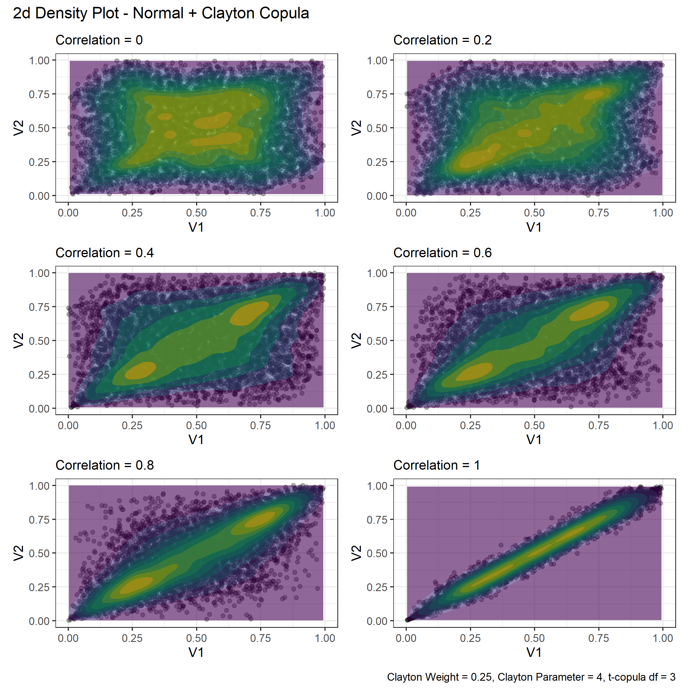

```{r setup, include=FALSE}
knitr::opts_knit$set(root.dir = getwd())
knitr::opts_chunk$set(echo = TRUE, fig.width=10, fig.height=8, out.height='80%', out.width='80%')
rm(list = ls()) # Clean your environment:
gc()
```

# Simulating Asset Returns

This is the README for Nathan Potgieter's financial econometrics project, in which a framework the Monte Carlo simulation of asset markets is developed.

## Aim
The aim of this project is to develop a general and easy to use Monte Carlo simulation package that generates asset return data, with a prespecified correlation structure and dynamic dependencies. Ideally the user will be able to adjust a "leverage" parameter, which will determine the markets left-tail dependency, and in turn effect likelihood of entering a "crisis period" characterized by extreme joint drawdowns. 

Elliptical copulas are used to induce the correlation in the simulated data, while Archmedian copulas are used induce greater left-tail dependencies.

The data will also be simulated to exhibit volatility clustering, this is accomplished by utilizing an ARIMA(p,q) + APGARCH(q,p) model, the parameters of which can be adjusted to induce alternative risk characteristics. Various ARIMA(p,q) + APGARCH(q,p) structures can be called on to induce mean and variance persistence.

## Monte Carlo Framework
The Monte Carlo simulation routine involves the following steps:

This example generates 252 days worth of returns, for 50 Assets across N markets.

1. Draw a series of 252 random uniformly distributed numbers (corresponding to 252 trading days), across a set of 50 variables (or 50 assets), from a multivariate distribution with a given correlation matrix. 
    + This is accomplished using Euclidean (Gaussian or t-copula) and Archmediean copula's and can easily be done using the rcopula function. 
2. Convert the uniformly distributed marginal distributions into something that more resembles the distribution of asset returns. For example one could convert them into normal or skewed-generalized t distributions. 
    + This is done the same way one would convert p-values into test statistics using the dnorm() and dsgt() functions respectively.
3. The next step is to induce mean and variance persistence to the series, by plugging them into a ARIMA(p,q) + GARCH(q,p) equation as innovations. 
    + If the parameters are set accordingly the resulting series should resemble asset returns. 
4. The final step is to repeat the first 3 steps N times to generate an ensemble of asset markets, each with the same prespecified structure. 

#### Loading Packages
```{r loading packages}
library(pacman)
p_load(tidyverse, copula, fGarch, lubridate, forecast, bizdays, sgt, glue)
p_load(tbl2xts)
```

# The Set up
## Generating Ad Hoc Covarience matrix

In this section I developed a simple function that allows the user to easily generate a correlation matrix with a desired cluster structure. This will be used as a key input when simulating our financial markets.  Note that the majority of the code was written by Nico Katzke. The function is located in the gen_corr.R code file. 

### gen_corr's arguments 

1. N - is the number of assets in the universe

2. Clusters - a character string specifying the type of cluster structure. Available options are "none", for a correlation matrix with no clusters, "non-overlapping" for a correlation matrix with number one layer of clusters, and "overlapping" for a correlation  matrix with Num_Layers and Num_clusters per layer.

3. Num_Clusters - if Clusters is equal to "non-overlapping" or "none" then Num_Clusters is an integer value specifying the number of clusters. If Clusters = "overlapping" then Num_Clusters must be a vector of length equal to Num_Layers specifying the number of clusters per layer. 

4. Num_Layers - an integer value between 1 and 4, specifying the number of cluster layers. Only needed of using "overlapping" clusters. 


```{r gen_corr}
#Co-Varience matrix generatimg function

gen_corr <- 
  function(N = 50, Clusters = c("none", "non-overlapping", "overlapping") , Num_Clusters = NULL, Num_Layers = NULL){
    
Grps <- Num_Clusters
#set.seed(123)
    
if(Clusters == "none"){
    # Unclustered covariance matrix
    Sigma <- diag(N)
    for (i in 1:N) for (j in 1:N) Sigma[i,j] <- 0.9^abs(i-j)
    Sigma <- propagate::cor2cov(Sigma, runif(N, 1, 5))
    corr <- cov2cor(Sigma)
} else

if(Clusters == "non-overlapping"){
    #----------------------
    # distinct non-overlapping clusters:
    #----------------------
    
    if(is.null(Num_Clusters)) stop("Please provide a valid Num_Clusters argument when using Overlapping clusters")
    
    
    Sigma <- matrix(0.9, N, N)
    diag(Sigma) <- 1

    
for (i in 1:Grps) {
      ix <- seq((i-1) * N / Grps + 1, i * N / Grps)
      Sigma[ix, -ix] <- 0.0001                       #think about
    }
    Sigma <- propagate::cor2cov(Sigma, runif(N, 1, 5))
    corr <- cov2cor(Sigma)
} else
  
if(Clusters == "overlapping"){
    #----------------------
    # distinct overlapping clusters:
    #----------------------
  
  if(is.null(Num_Layers)|Num_Layers<2){
      stop("Please provide a valid Num_Layers argument when using Overlapping clusters")
      }else
  if(length(Num_Clusters) != Num_Layers){
      stop("Please provide a Num_Clusters argument with length equal to Num_Layers")
  }
    
  
    Sigma <- matrix(0.9, N, N)
    diag(Sigma) <- 1

    for (i in 1:Grps[1]) {
      ix <- seq((i-1) * N / Grps[1] + 1, i * N / Grps[1])
      Sigma[ix, -ix] <- 0.7
    }
    if(Num_Layers>=2){
        for (i in 1:Grps[2]) {
          ix <- seq((i-1) * N / Grps[2] + 1, i * N / Grps[2])
          Sigma[ix, -ix] <- 0.5
        } }
    if(Num_Layers>=3){
        for (i in 1:Grps[3]) {
      ix <- seq((i-1) * N / Grps[3] + 1, i * N / Grps[3])
      Sigma[ix, -ix] <- 0.3
        } }
    if(Num_Layers>=4){
        for (i in 1:Grps[4]) {
      ix <- seq((i-1) * N / Grps[4] + 1, i * N / Grps[4])
      Sigma[ix, -ix] <- 0.15
        } } 
    }

    Sigma <- propagate::cor2cov(Sigma, runif(N, 1, 5))  #Is this necessary???
    corr <- cov2cor(Sigma)

return(corr)

  }

```

Demonstrating the use of gen_corr
```{r using gen_corr}
source("code/gen_corr.R")
gen_corr(N = 60, Clusters = "overlapping", Num_Layers = 4, Num_Clusters = c(10,5,3,2)) %>% ggcorrplot::ggcorrplot(title = "Overlapping Clusters", hc.order = TRUE)

```

## Generating a Dataset of Emperical Correlation Matrix's

I now use S&P500 data since 1/01/2000 to  sample correlation matrices that will be used to train CorrGAN and can be used as inputs in the simulation. 

#### Getting SNP 500 data since 2000
- See "code/SNP_data.R" to see how the SNP_data.Rda file was created.
```{r SNP_data, eval=FALSE, echo=TRUE}
p_load(tidyverse, tidyquant, lubridate)
source("code/impute_missing_returns.R")

# save current system date to a variable
today <- Sys.Date()
# subtract 90 months from the current date
#date <- today %m+% months(-90)
date <- as.Date("2000-01-01")

# Getting all tickers in SP500
stock_list <- tq_index("SP500") %>%
    arrange(symbol) %>%
    mutate(symbol = case_when(symbol == "BRK.B" ~ "BRK-B",
                              symbol == "BF.B" ~ "BF-B",
                              TRUE ~ as.character(symbol))) %>%
    pull(symbol)

# This function gets the data for a ticker and date
get_data <- function(ticker = "AAPL", from){
    df <- tq_get(ticker, from = from) %>% mutate(symbol = rep(ticker, length(date)))
    return(df)
}

SNP_data <-
    1:length(stock_list) %>% map(~get_data(ticker = stock_list[[.]], from = date)) %>% bind_rows()
save(SNP_data, file = "data/SNP_data.Rda")

#Calculating and imputing missing returns
SNP_returns <- left_join(
    SNP_data %>%
        group_by(symbol) %>%
        arrange(date) %>%
        mutate(return = log(adjusted/dplyr::lag(adjusted))) %>%
        dplyr::filter(date>first(date)) %>%
        select(date, symbol, return) %>%
        spread(symbol, return) %>%
        impute_missing_returns(impute_returns_method = "Drawn_Distribution_Own") %>% #Imputing missing returns
        gather(symbol, return, -date) %>%
        group_by(symbol) %>%
        mutate(sd = sd(return, na.rm = T)*sqrt(252)) %>%  # calculate annualized SD
        ungroup(),
    SNP_data %>%
        select(date, symbol, volume, adjusted),
    by = c("date", "symbol")
)
save(SNP_returns, file = "data/SNP_returns.Rda")
```

#### Partisioning SNP Data into Rally, Normal and Stressed Markets
- See "code/get_training_data.R" to see how the training data sets were generated.
The data set is build to contain 3 classes of correlation matrices, defined as follows: 

- ‘stressed market’: A market is ‘stressed’ whenever the equi-weighted basket of stocks has a Sharpe below -0.5 over the year of study (252 trading days).

- ‘rally market’: A market is ‘rallying’ whenever the equi-weighted basket of stocks under has a Sharpe above 2 over the year of study (252 trading days).

- ‘normal market’: A market is ‘normal’ whenever the equi-weighted basket of stocks under has a Sharpe in-between -0.5 and 2 over the year of study (252 trading days).

Note that this methodology is consistent with that used in https://marti.ai/qfin/2020/02/03/sp500-sharpe-vs-corrmats.html.

```{r sharp, eval=FALSE, echo=TRUE}
load("data/SNP_data.Rda")
source("code/impute_missing_returns.R")

library(pacman)
p_load(tidyverse, furrr, PerformanceAnalytics, tbl2xts, rmsfuns, lubridate, fitHeavyTail)

# Imputing missing values
SNP_returns <- left_join(
    SNP_data %>%
        group_by(symbol) %>%
        arrange(date) %>%
        mutate(return = log(adjusted/dplyr::lag(adjusted))) %>%
        dplyr::filter(date>first(date)) %>%
        select(date, symbol, return) %>%
        spread(symbol, return) %>%
        impute_missing_returns(impute_returns_method = "Drawn_Distribution_Own") %>% #Imputing missing returns
        gather(symbol, return, -date) %>%
        ungroup(),
    SNP_data %>%
        select(date, symbol, volume, adjusted),
    by = c("date", "symbol")
)
#Freeing up memory
rm(SNP_data)
gc()

#This function generates random portfolios with option to supply sharp ratio
gen_random_port <- function(dim = 100, sharp = TRUE){
    #list of Assets from which sample
    symbols <- SNP_returns %>%
        dplyr::filter(date==first(date)) %>%
        pull(symbol)
    dim <- dim
    sample_symbols <- sample(symbols, dim)

    #Dates from which to sample
    dates <- SNP_returns %>%
        dplyr::filter(symbol == "A") %>%
        select(date)
    indx <- sample.int(nrow(dates) - 252, 1)
    start_date <- dates[indx,]
    end_date <- dates[indx + 252,]
    sample_dates <- dates %>% dplyr::filter(date >= start_date[[1]] &
                   date <= end_date[[1]]) %>% pull()

    if(sharp == FALSE){
        training_data <- list(dates = list(sample_dates),
                              symbols = list(sample_symbols)) %>% as_tibble()
    }else
        if(sharp == TRUE){
            #setting rebalance months
            RebMonths <- c(1,4,7,10)
            EQweights <-
                SNP_returns %>%
                dplyr::filter(symbol %in% sample_symbols &
                                  date %in% sample_dates) %>%
                select(date, symbol, return) %>%
                mutate(Months = as.numeric(format(date, format = "%m")),
                       YearMonths = as.numeric(format(date, format = "%Y%m"))) %>%
                dplyr::filter(Months %in% RebMonths) %>%
                group_by(YearMonths, Months, symbol) %>%
                dplyr::filter(date == last(date)) %>%
                ungroup() %>%
                group_by(date) %>%
                mutate(weight = 1/n()) %>%
                select(date, symbol, weight) %>%
                spread(symbol, weight) %>% ungroup() %>%
                tbl_xts()

            # Return wide data
            Returns <-
                SNP_returns %>%
                dplyr::filter(symbol %in% sample_symbols &
                                  date %in% sample_dates) %>%
                select(date, symbol, return) %>%
                spread(symbol, return) %>% tbl_xts()

            #calculating portfolio returns
            EW_RetPort <- rmsfuns::Safe_Return.portfolio(Returns,
                                               weights = EQweights, lag_weights = TRUE,
                                               verbose = TRUE, contribution = TRUE,
                                               value = 100, geometric = TRUE)
            Sharp <- SharpeRatio(EW_RetPort$returns, FUN="StdDev", annualize = TRUE)

            training_data <- list(dates = list(sample_dates),
                                  symbols = list(sample_symbols),
                                  sharp = Sharp[1]) %>% as_tibble()
    }

}
#------------------------------------------
#First I generate the labeled training data
#------------------------------------------

#Generating N random portfolios, with Sharp ratio's.
plan(multiprocess)
training_data_sharp <-
    1:10000 %>% future_map(~gen_random_port(dim = 50), .progress = TRUE) %>% reduce(bind_rows)
save(training_data_sharp, file = "data/training_data_sharp.Rda")

load("data/training_data_sharp.Rda")

# Separating by sharp ratio into market types.
stressed_market <- training_data_sharp %>% dplyr::filter(sharp < -0.05) %>% select(-sharp)

rally_market <- training_data_sharp %>% dplyr::filter(sharp > 0.2) %>% select(-sharp)

normal_market <- training_data_sharp %>% dplyr::filter(sharp >= -0.5 & sharp <= 0.2) %>% select(-sharp)

#This function gathers the SNP data corresponding to the portfolios described above
get_market_data <- function(index_df, i){
        SNP_returns %>%
        select(date, symbol, return) %>%
            dplyr::filter(symbol %in% index_df$symbols[[i]] &
                       date %in% index_df$dates[[i]])
}

#Separating portfolio by sharp ratio
stressed_market_data <- 1:nrow(stressed_market) %>% map(~get_market_data(stressed_market, .x))

rally_market_data <- 1:nrow(rally_market) %>% map(~get_market_data(rally_market, .x))

normal_market_data <- 1:nrow(normal_market) %>% map(~get_market_data(normal_market, .x))

#Calculating correlations
calc_cor <- function(df, i){
    df[[i]] %>% select(date, symbol, return) %>%
        spread(symbol, return) %>% select(-date) %>%
        fitHeavyTail::fit_mvt() %>% .$cov %>% cov2cor()
}

stressed_market_corr <- 1:length(stressed_market_data) %>% map(~calc_cor(stressed_market_data, .x))

rally_market_corr <- 1:length(rally_market_data) %>% map(~calc_cor(rally_market_data, .x))

normal_market_corr <- 1:length(normal_market_data) %>% map(~calc_cor(normal_market_data, .x))

#Joining and saving datasets
labeled_training_data <- list(stressed_market = stressed_market_corr,
                              rally_market = rally_market_corr,
                              normal_market = normal_market_corr)
save(labeled_training_data, file = "data/labeled_training_data.Rda")

rm(stressed_market)
gc()

#------------------------------------------
#Now to generate unlabeled training data
#------------------------------------------

plan(multiprocess)
training_data_indx <-
    1:10000 %>% future_map(~gen_random_port(dim = 50, sharp = FALSE), .progress = TRUE) %>% reduce(bind_rows)

market_data <- 1:nrow(training_data) %>% future_map(~get_market_data(training_data, .x), .progress = TRUE)

training_data <- 1:length(market_data) %>% map(~calc_cor(market_data, .x))


save(training_data, file = "data/training_data.Rda")


```

#### An Example of Each Correlation Matrix Type

```{r showing some training data, echo=FALSE}
load("data/labeled_training_data.Rda")

labeled_training_data$rally_market[[2]] %>% 
  ggcorrplot::ggcorrplot(title = "Rally Market", hc.order = TRUE)
labeled_training_data$normal_market[[2]] %>% 
  ggcorrplot::ggcorrplot(title = "Normal Market", hc.order = TRUE)
labeled_training_data$stressed_market[[2]] %>% 
  ggcorrplot::ggcorrplot(title = "Stressed Market", hc.order = TRUE)

```

# Step 1: Draw a series of random uniformly distributed numbers across a set of variables with a specified dependence structure.

## Generating Random Draws with Numerous Copula Functions

### Elliptal copulas

Elliptal copulas such as the Gaussian and the student t copulas, allow us to specify a correlation matrix before randomly selecting observations from the multivariate distribution. Doing so allows one to produce random draws of uniformly distributed variables, that contain the correlation structure and joint distribution specified by the copula. The chunk of code below demonstrates this functionality. 

```{r Elliptal Copulas, warning=FALSE}
#loading copula package
pacman::p_load(copula)

#generating corr  matrix object
corr <- gen_corr(N = 50, Clusters = "overlapping", Num_Layers = 3, Num_Clusters = c(10, 5, 2))

#generating copula objects   
Ncop <- ellipCopula(family = "normal", dispstr = "un", param = P2p(corr), dim = 50)
Tcop <- ellipCopula(family = "t", dispstr = "un", param = P2p(corr), dim = 50)

#generating 252 random draws for each of the N variables
set.seed(123)
rn <- rCopula(copula = Ncop, n = 252)
rt <- rCopula(copula = Tcop, n = 252)

#Checking if the correlation structure was maintained
p_load(patchwork)
# Original corr
p1 <- ggcorrplot::ggcorrplot(corr, hc.order = TRUE) + 
  labs(title = "Input Correlation Matrix") +
  scale_x_discrete(labels = NULL) + scale_y_discrete(labels = NULL) +
  theme(legend.position = "bottom")
# corr from random draws form norm and t copula
p2 <- fitHeavyTail::fit_mvt(rn) %>% .$cov %>% cov2cor() %>% 
  ggcorrplot::ggcorrplot(hc.order = TRUE) + 
  labs(subtitle = "Normal Copula") +
  scale_x_discrete(labels = NULL) + scale_y_discrete(labels = NULL) +
  theme(legend.position = "none")

p3 <- fitHeavyTail::fit_mvt(rt) %>% .$cov %>% cov2cor() %>% 
  ggcorrplot::ggcorrplot(hc.order = TRUE) + 
  labs(subtitle = "T-Copula") +
  scale_x_discrete(labels = NULL) + scale_y_discrete(labels = NULL) +
  theme(legend.position = "none")

p_load(printr)
summary(rn)

p1
#Notice that the underlying correlation structure has, for the most part, been maintained.
# Some Noise has been introduced
(p2+p3) + plot_annotation(title = "Output Correlation Matrices") +
  plot_layout(guides='collect') &
  theme(legend.position='bottom')  


```

### Archimedean Copulas

Unfortunately, Elliptal copulas cannot be calibrated to exhibit varying co-movements within the tails of the distribution. Therefore, in this section we examine some properties of Archimedean copulas. 

Archimedean copulas such as the Clayton, Frank, Gumbel and Joe exhibit increased dependence at the tails of the multivariate distribution. In this section we will examine the Clayton copula due to it  exhibiting enhanced left-tail dependencies. Other copulas will not be examined, since the Clayton copula is currently the only Archimedean copula, in the copula package, that allows random sampling from multivariate distributions with Dim > 2. 

We will also have a look at the hybrid BB1-BB6 which in which exhibit increased dynamic dependencies in both tails. 

```{r Archimedean copula}
# first look at at dim=2 to get understanding of what parameter tning does

#Clayton Copula
claycop <- archmCopula(family = "clayton", param = 2, dim = 2)
Ncop <- ellipCopula(family = "normal", dispstr = "un", param = 0.5, dim = 2)
# rCopula(251, claycop)

#note how left tail dependence increases with the parameter
persp(claycop, main = "Clayon Copula" , dCopula, zlim = c(0, 15), theta = 18)
persp(Ncop, main = "Normal Copula" , dCopula, zlim = c(0, 15), theta = 18)

# Compairing Clayton with Normal copula
bind_rows(rCopula(5000, copula = claycop) %>% as_tibble() %>% mutate(copula = "claycop"),
          rCopula(5000, copula = Ncop) %>% as_tibble() %>% mutate(copula = "normal")) %>% 
  ggplot(aes(x=V1,y=V2)) +
        geom_point(alpha=0.5) +
        geom_density_2d_filled(alpha=0.7) +
        facet_wrap(~copula, nrow = 1) +
        labs(title = "2D kernal Density - Clayton vs Normal Copula",
             caption = "Clayton parameter = 2, Normal correlation = 0.5") +
        theme_bw() +
        theme(legend.position = "bottom") 

#Note that the Gumbel and Joe copulas must be rotated 180 degrees to exhibit greater left tail dependence
#Gumbel Copula
# gumcop <- archmCopula(family = "gumbel", param = 4, dim = 2) %>% rotCopula()

#note how right tail dependence > left tail dependence; tail dependence increase with the parameter value.
# persp(gumcop, dCopula, zlim = c(0, 10))
# rCopula(1000, copula = gumcop) %>% plot()

#Joe copula
#joecop <- archmCopula(family = "joe", param = 3, dim = 2) %>% rotCopula()

#note how right tail dependence > left tail dependence;tail dependence increase with the parameter value at rate < gumbel
#persp(joecop, dCopula, zlim = c(0, 10))
#rCopula(1000, copula = joecop) %>% plot()


#looking at some hybrid copulas
#Galambos
#galcop <- evCopula(family = "galambos", param = 2, dim = 2) %>% rotCopula()
#persp(galcop, dCopula, zlim = c(0, 10))
#rCopula(1000, galcop) %>% plot()

```

## Generating Hybrid Copulas

Tawn's (1988) Theorem: Shows that a copula is a convex set and every convex combination of existing copula functions is again a copula. 

Thus, if  $C_1(U_N)$  and  $C_2(U_N)$  are multivariate copula's of dimension N and $w$ is a weighting variable between 0 and 1, then 

<center> $$C(U_N)=w.C_1(U_N)+(1-w)C_2(U_N)$$ </center>

is a unique copula. Therefore, a hybrid copula ( $C(U_N)$ ) can be created by linearly weighting a Elliptical and Archimedean copula of the same dimension. 

See "Extreme Dependence Structures and the Cross-Section of Expected Stock Returns" page 8 & 9. 

## Some 2D Hybrid Copulas.

```{r hybrid, eval=FALSE, include=FALSE}
#this chunk takes very long to knit due to large graph size; consider using {eval=FALSE, include=FALSE}
#Plotting Function
plot_hy_cop <- function(corr, df, clayton_param, w1, subtitle){
  
  #Elliptical  Copulas
  Tcop <- ellipCopula(family = "t", dispstr = "un", param = corr, dim = 2, df = df)
  
  #left tail dependence copulas
  claycop <- archmCopula(family = "clayton", param = clayton_param, dim = 2)

  #Generating Random Draws
  data <- (1-w1)*rCopula(10000, Tcop) + w1*rCopula(10000, claycop)
  colnames(data) <- glue::glue("V{1:ncol(data)}")
  data <- as_tibble(data)
  
  #Plotting 2D Density
  data %>% ggplot(aes(x=V1, y=V2)) +
    geom_point(alpha = 0.3) +
    geom_density_2d_filled(alpha = 0.6) +
    coord_cartesian(xlim = c(0,1), ylim = c(0,1)) +
    theme_bw() +
    labs(subtitle = subtitle) +
    theme(legend.position = "none")
}

#looking at different weights
library(patchwork)
set.seed(123)

#setting and attaching defalt parameters
params <- list(cor = 0.1, df = 3, clayton_param = 4, w1 = 0.25)
attach(params)

p1 <- seq(0,1, length.out = 6) %>% map(~plot_hy_cop(corr = cor, df = df,
                                                    clayton_param = clayton_param, w1 = .x,
                                                    subtitle = glue("Clayton Weight = {.x}")))
plot_1 <- (p1[[1]]|p1[[2]])/(p1[[3]]|p1[[4]])/(p1[[5]]|p1[[6]]) + 
  plot_annotation(title = "2d Density Plot - Normal + Clayton Copula",
                  caption = glue("Clayton Parameter = {clayton_param}, Correlaltion = {cor}, t-copula df = {df}"))

p2 <- seq(0,1, length.out = 6) %>% map(~plot_hy_cop(corr = .x, df = df,
                                                    clayton_param = clayton_param, w1 = w1,
                                                    subtitle = glue("Correlation = {.x}")))
plot_2 <- (p2[[1]]|p2[[2]])/(p2[[3]]|p2[[4]])/(p2[[5]]|p2[[6]]) + 
  plot_annotation(title = "2d Density Plot - Normal + Clayton Copula",
                  caption = glue("Clayton Weight = {w1}, Clayton Parameter = {clayton_param}, t-copula df = {df}"))

p3 <- seq(1,1000, length.out = 6) %>% map(~plot_hy_cop(corr = cor, df = df,
                                                    clayton_param = .x, w1 = w1,
                                                    subtitle = glue("Clayton Parameter = {.x}")))
plot_3 <- (p3[[1]]|p3[[2]])/(p3[[3]]|p3[[4]])/(p3[[5]]|p3[[6]]) + 
  plot_annotation(title = "2d Density Plot - Normal + Clayton Copula",
                  caption = glue("Clayton Weight = {w1}, Correlaltion = {cor}, t-copula df = {df}"))

p4 <- seq(1,30, length.out = 6) %>% map(~plot_hy_cop(corr = cor, df = .x, 
                                                     clayton_param = clayton_param, w1 = w1,
                                                     subtitle = glue("T Copula df = {.x}")))
plot_4 <- (p4[[1]]|p4[[2]])/(p4[[3]]|p4[[4]])/(p4[[5]]|p4[[6]]) + 
  plot_annotation(title = "2d Density Plot - Normal + Clayton Copula",
                  caption = glue("Clayton Weight = {w1}, Clayton Parameter = {clayton_param}, Correlaltion = {cor}"))

ggsave(plot_1, filename = "plots/plot_1.png", width = 8, height = 8)
ggsave(plot_2, filename = "plots/plot_2.png", width = 8, height = 8)
ggsave(plot_3, filename = "plots/plot_3.png", width = 8, height = 8)
ggsave(plot_4, filename = "plots/plot_4.png", width = 8, height = 8)

```




However, remember that each variable is currently uniformly distributed.
```{r echo=FALSE, warning=FALSE}
rCopula(10000, copula = claycop) %>% as_tibble() %>% gather(Key, Value) %>% 
  ggplot(aes(x = Value, fill = Key)) +
  geom_histogram(bins = 30) +
  xlim(c(0,1)) +
  facet_wrap(~Key, nrow = 2) +
  labs(title = "Hiostogram", subtitle = "Variables are Uniformly Distrinuted") +
  theme_bw() +
  theme(legend.position = "none")

```

# Step 2: Converting the uniformly distributed variables to something that better resembles the distribution of asset returns.

## Looking at options for marginal distributions

Due to convenience, it has become standard to use the normal, or student-t distribution when simulating asset returns.

However, after reading up on numerous possible marginal distributions, I decided that the the Skewed generalized t distribution is the most appropriate as it allows for the most flexibility. Note that I will also include functionality to induce the marginals to be uniformly distributed. 

In fact, the SGT distribution nests 12 common probability distribution functions (pdf). The tree diagram below indicates how one can set the SGT parameters to achieve the desired pdf. 


### The skewed generalizd t distribution with different parameters
The code below demonstrates how the p, q and $\lambda$ functions influence the SGT distribution.
```{r, echo=FALSE}
library(pacman, tidyverse)
p_load(sgt)
#-----------------------------------------
#Looking at the Skewnes parameter in sgt distribution
#-----------------------------------------

x <- seq(-4, 4, length=100)
hx <- dnorm(x)

degf <- -c(seq(0,0.45,length = 4))
colors <- c("red", "blue", "darkgreen", "gold", "black")
labels <- c(glue::glue("Param = {degf}"), "normal")

plot(x, hx, type="l", lty=2, xlab="x value",
  ylab="Density", main="Comparison of SGD Distributions with different lambda's", ylim = c(0,0.5))

for (i in 1:4){
  lines(x, dsgt(x,lambda = degf[i]), lwd=2, col=colors[i])
}

legend("topright", inset=.05, title="Distributions",
  labels, lwd=2, lty=c(1, 1, 1, 1, 2), col=colors)

#-----------------------------------------
#now looking at p and q parameters (kurtosis) with lambda = 0.2
#-----------------------------------------

#altering p
x <- seq(-4, 4, length=100)
hx <- dnorm(x)

degf <- c(seq(1.01,2,length = 4))
colors <- c("red", "blue", "darkgreen", "gold", "black")
labels <- c(glue::glue("Param = {degf}"), "normal")

plot(x, hx, type="l", lty=2, xlab="x value",
  ylab="Density", main="Comparison of SGD Distributions with different p parameters", ylim = c(0,0.8))

for (i in 1:4){
  lines(x, dsgt(x,p = degf[i]), lwd=2, col=colors[i])
}

legend("topright", inset=.05, title="Distributions",
  labels, lwd=2, lty=c(1, 1, 1, 1, 2), col=colors)

#altering q
x <- seq(-4, 4, length=100)
hx <- dnorm(x)

degf <- round(c(seq(1.5,4,length = 4)), digits = 2) 
colors <- c("red", "blue", "darkgreen", "gold", "black")
labels <- c(glue::glue("Param = {degf}"), "normal")

plot(x, hx, type="l", lty=2, xlab="x value",
  ylab="Density", main="Comparison of SGD Distributions with different q parameters", ylim = c(0,0.8))

for (i in 1:4){
  lines(x, dsgt(x,q = degf[i]), lwd=2, col=colors[i])
}

legend("topleft", inset=.05, title="Distributions",
  labels, lwd=2, lty=c(1, 1, 1, 1, 2), col=colors)
```

```{r cleaning workspace, include=FALSE}
rm(list =ls())
gc()

```

### Calibrating the SGT with Architypal Low, Medium and High Risk Assets

We now look at data on each share in the S&P500 over the last 90 months. The shares with the top 5% highest annualized SD's are used to model an archetypal high risk asset, shares with the 5% lowest annualized SD's are used to model an archetypal low risk asset, while shares with SD between the 45th and 55th percentile are used to model the medium risk asset. 
- See "code/SNP_data.R" to see how the SNP_data.Rda file was created. 

```{r partisioning by risk}
load("data/SNP_returns.Rda")

high_vol <-
  SNP_returns %>% 
  dplyr::filter(date==last(date)) %>% 
  arrange(desc(sd)) %>% 
  group_by(date) %>% 
  slice_max(., order_by = sd, prop = 0.1 ) %>%  #select top 10% SD's
  pull(symbol)

low_vol <-
  SNP_returns %>% 
  dplyr::filter(date==last(date)) %>% 
  arrange(sd) %>% 
  slice_min(., order_by = sd, prop = 0.1) %>% #select bot 10% SD's
  pull(symbol)

medium_vol <-
  SNP_returns %>% 
  dplyr::filter(date==last(date)) %>% 
  arrange(sd) %>% 
  group_by(date) %>% 
  dplyr::filter(sd>=quantile(sd, probs = 0.45, na.rm = T) &
                  sd<=quantile(sd, probs = 0.55, na.rm = T)) %>% 
  pull(symbol)
```

# Plotting low, medium and high risk returns.

```{r Plotting returns, echo=FALSE}

p_load(patchwork)
p1 <- SNP_returns %>% 
  mutate(Risk = 
           ifelse(symbol %in% high_vol, "High Risk",
                  ifelse(symbol %in% low_vol, "Low Risk",
                         ifelse(symbol %in% medium_vol, "Medium Risk", "Other")))) %>% 
  dplyr::filter(Risk != "Other") %>% 
  ggplot(aes(x = return, fill = Risk, color = Risk)) +
  geom_density(alpha = 0.2, position = "identity", na.rm = TRUE, show.legend = TRUE) +
  coord_cartesian(xlim = c(-0.06,0.06)) +
  xlab(NULL) +
  theme_bw() +
  theme(legend.position = "none") 
p2 <- p1 + 
  labs(subtitle = "Left-Tail") +
  coord_cartesian(xlim = c(-0.2,-0.05), ylim = c(0,2)) +
  xlab("Return") +
  theme(legend.position = "bottom", legend.title = element_blank())

p1/p2 + plot_annotation(title = "Distribution of Annualized Returns", 
                        caption = "Yahoo Data")

```

### Estimating SGT

- See "code/filter_resid.R" to see how filtered residuals (garch.Rda) was obtained.
- See "code/estimate_sgt.R" to see how the parameters of the sgt were estimated. 

```{r estimate sgt}
load("data/garch.Rda")

estimate_sgt <- function(df, start = NULL){
  x <- df[[1]]
  X.f <- X ~ x
  if(is.null(start)) start <- list(mu = 0, sigma = 0.03, lambda = -0.02, p = 1.5, q = 2.25)
  result <- sgt.mle(X.f = X.f, start = start, finalHessian = "BHHH")
  summary(result)
}

# High Vol stocks
df <- resid_high_vol %>% 
  dplyr::mutate(date = unique(SNP_returns$date)) %>% 
  gather(symbol, return, -date) %>% 
  dplyr::filter(date>first(date)) %>% 
  select(return)

#start <- list(mu = -0.0001957195, sigma = 0.04217965, lambda = -0.0062424590, p= 1.452239, q = 2.058042)
 # sgt_high_vol <- estimate_sgt(df, start = start)
 # save(sgt_high_vol, file = "data/sgt_high_vol.Rda")
load(file = "data/sgt_high_vol.Rda")

# Low Vol stocks
df <- resid_low_vol %>% 
  mutate(date = unique(SNP_returns$date)) %>% 
  gather(symbol, return, -date) %>% 
  dplyr::filter(date>first(date)) %>% 
  select(return)

 # sgt_low_vol <- estimate_sgt(df)
 # save(sgt_low_vol, file = "data/sgt_low_vol.Rda")
load(file = "data/sgt_low_vol.Rda")


#Medium Vol stocks
df <- resid_medium_vol %>% 
  mutate(date = unique(SNP_returns$date)) %>% 
  gather(symbol, return, -date) %>% 
  dplyr::filter(date>first(date)) %>% 
  select(return)

 # sgt_medium_vol <- estimate_sgt(df)
 # save(sgt_medium_vol, file = "data/sgt_medium_vol.Rda")
load(file = "data/sgt_medium_vol.Rda")

```


```{r plotting marginal distributions, echo=FALSE}
# Plot distribution function
kde_plot <- function(df, sgt_pars, fill, title = NULL, subtitle = NULL, 
                     caption = NULL, xlim, ylim, xlab = NULL, ylab = NULL){
  df %>% 
  gather(symbol, ret) %>% 
  ggplot(aes(x = ret)) +
  geom_density(fill = fill, alpha = 0.7, position = "identity", show.legend = FALSE) +
  stat_function(fun = function(x) dsgt(x, 
                                       mu = sgt_pars$mu, 
                                       sigma = sgt_pars$sigma,
                                       lambda = sgt_pars$lambda,
                                       p = sgt_pars$p,
                                       q = sgt_pars$q),
                color = "black", linetype = "dotdash", size = 1, position = "identity") +
  labs(title = title, 
       subtitle = subtitle, 
       x = xlab, y=ylab,
       caption = caption) +
   coord_cartesian(xlim = xlim,
                  ylim = ylim)  +
  theme_bw()
}

#Plotting 
p_load(patchwork)
#high_vol_plot
sgt_pars <- sgt_high_vol$estimate %>% as.list()
sgt_pars <- list(mu = 0, sigma = 1.5e-02 , lambda = -4.020744e-02,
                 p = 1.929499e+00, q = 5.802265e+00)

p1 <- kde_plot(resid_high_vol, sgt_pars, 
         fill = "red", 
         xlim = c(-0.15,0.15),
         ylim = NULL)

p2 <- kde_plot(resid_high_vol, sgt_pars, 
         fill = "darkred", 
         xlim = c(-0.4,-0.15),
         ylim = c(0, 0.125),
         xlab = "Filtered Returns")
p1/p2 + plot_annotation(title = "Density of High Volitility Return's", 
                        subtitle = "with overlayed SGT function",
                        caption = "Yahoo Data")


#low vol plot
sgt_pars <- sgt_low_vol$estimate %>% as.list()
p1 <- kde_plot(resid_low_vol, sgt_pars, 
         fill = "green", 
         xlim = c(-0.1,0.1),
         ylim =  NULL)

p2 <- kde_plot(resid_low_vol, sgt_pars, 
         fill = "darkgreen", 
         xlim = c(-0.15,-0.05),
         ylim =  c(0,0.15),
         xlab = "Filtered Returns")
p1/p2 + plot_annotation(title = "Density of Low Volitility Return's", 
                        subtitle = "with overlayed SGT function",
                        caption = "Yahoo Data")


#medium vol plot
sgt_pars <- sgt_medium_vol$estimate %>% as.list()
p1 <- kde_plot(resid_medium_vol, sgt_pars, 
         fill = "orange", 
         xlim = c(-0.1,0.1),
         ylim =  NULL)

p2 <- kde_plot(resid_medium_vol, sgt_pars, 
         fill = "darkorange", 
         xlim = c(-0.25,-0.07),
         ylim =  c(0,0.15),
         xlab = "Filtered Returns")
p1/p2 + plot_annotation(title = "Density of Medium Volitility Return's", 
                        subtitle = "with overlayed SGT function",
                        caption = "Yahoo Data")
```

```{r include=FALSE}
rm(list = ls()) # Clean your environment:
gc()
```


## Simulating Innovations
This section introduces the sim_inno function, which is designed to carry out the first two steps of this Monte Carlo framework.

### sim_inno

The function below generates randomly distributed numbers from a hybrid t and/or clayton copula.
Need to think about how to calibrate df and claycop parameters. 

Arguments

- Corr this is a correlation matrix used as the parameter for the elliptical copula
- elliptal_copula family name of elliptal copula. Default is to use "t", but "norm" is also accepted
- df_ellip a positive integer specifying the degrees of freedom for the student t elliptical copula. Only required when using elliptal_copula = "t".
- left_cop_param a positive integer specifying the parameter of the __Clayton__ copula. 
- left_cop_weight a value between 0 and 1 corresponding to the weight assigned to the left copula, when generating random draws from a hybrid copula.
- marginal_dist a character string specifying the marginal distribution of the simulated data. Must be "norm" or "t", with the default generating uniformly distributed marginals.
- df_marginal_dist a positive integer specifying the degrees of freedom parameter of the "t" distributed marginals. 
- marginal_dist_model a list containing the parameters of the marginal distribution. 


```{r sim_inno function}
sim_inno <- function(corr, 
                     elliptal_copula = c("norm", "t"), 
                     T = 252,
                     df_ellip = NULL,
                     left_cop_param = 5,
                     left_cop_weight = 0,
                     marginal_dist = NULL,
                     marginal_dist_model = NULL,
                     sd_md = NULL) {
  
  N <- nrow(corr)
  T <- T + 5   # extra room for GARCH to use later
  Cor <- P2p(corr)

# specifying  Copula's
# elliptical
  if (elliptal_copula == "t") {
    # warning
    if (is.null(df_ellip)) stop('Please supply a valid degrees of freedom parameter when using elliptal_copula = "t".')
    
    Ecop <- ellipCopula(family = elliptal_copula, dispstr = "un", df = df_ellip,
                        param = Cor, dim = N)
    
    } else
      if (elliptal_copula == "norm") {
        
        Ecop <- ellipCopula(family = "norm", dispstr = "un", param = Cor, dim = N)
      
    } else 
      stop("Please supply a valid argument for elliptal_copula")

# Left-cop (Archemedian copula)
  if (left_cop_weight != 0) {
    Acop <- archmCopula(family = "clayton", param = left_cop_param, dim = N)
  }
  
#generating random (uniformly distributed) draws from hybrid copula's
  if (left_cop_weight<0|left_cop_weight>1) stop("Please provide a valid left_cop_weight between 0 and 1")   
  
  if (left_cop_weight==0) {
    data <- rCopula(T, Ecop)
 } else
   if(left_cop_weight==1) {
     data <- rCopula(T, Acop)
 } else
   data <- left_cop_weight*rCopula(T, Acop) + (1-left_cop_weight)*rCopula(T, Ecop)
   
  #naming and converting data to tibble
  colnames(data) <- glue::glue("Asset_{1:ncol(data)}")
  data <- as_tibble(data)
    
#Converting Uniform marginal distributions to norm or sgt. 
 if (marginal_dist=="norm") {
   if (is.null(marginal_dist_model)) {
     marginal_dist_model = list(mu=0, sigma = 1)
   } else
     mu <- marginal_dist_model$mu
     sigma <- marginal_dist_model$sigma
     data <- data %>% map_df(~qnorm(.x, mean = mu, sd = sigma))
     return(data)
   } else
     if(marginal_dist=="sgt") {
       if (is.null(marginal_dist_model)) 
         stop('Please supply a valid marginal_dist_model when using marginal_dist="sgt".')
       mu <- marginal_dist_model$mu
       sigma <- marginal_dist_model$sigma
       lambda <- marginal_dist_model$lambda
       p <- marginal_dist_model$p
       q <- marginal_dist_model$q
       data <- data %>% 
         map_df(~qsgt(.x, mu =  mu, sigma = sigma, lambda = lambda, p = p, q = q))
       return(data)
       }
}

```

### Testing sim_inno

```{r sim_inno test, fig.width=10, fig.height=10, fig.align=TRUE}
# Sourcing function, loading data and setting seed
source("code/sim_inno.R")
source("code/gen_corr.R")
load("data/sgt_low_vol.Rda")
set.seed(872154)

Corr <- gen_corr(N = 50, Clusters = "overlapping", Num_Layers = 3, Num_Clusters = c(10,5,2))
# ----------------------------------------
# Simulating data with marginal_dist="sgt"
# ----------------------------------------
sgt_pars <- as.list(sgt_low_vol$estimate)
data_sgt <- sim_inno(corr = Corr, 
                 elliptal_copula = "t",
                 df_ellip = 4,
                 left_cop_param = 10,
                 left_cop_weight = 0,
                 marginal_dist = "sgt",
                 marginal_dist_model = sgt_pars,
                 T = 500)
colnames(data_sgt) <- glue::glue("V{1:ncol(data_sgt)}")

# ----------------------------------------
# Simulating data with marginal_dist="norm"
# ----------------------------------------
data_norm <- sim_inno(corr = Corr, 
                 elliptal_copula = "t",
                 df_ellip = 4,
                 left_cop_param = 10,
                 left_cop_weight = 0,
                 marginal_dist = "norm",
                 marginal_dist_model = list(mu = 0, sigma = 0.02311859),
                 T = 500)
colnames(data_norm) <- glue::glue("V{1:ncol(data_norm)}")

# ------------------------
# Plotting Simulated Data
# ------------------------

# First: Note how the correlation matrix has been maintained
data_sgt %>% fitHeavyTail::fit_mvt() %>% .$cov %>% cov2cor() %>% ggcorrplot::ggcorrplot()

# Plotting SGT data
data_sgt %>% gather(key, value, -V1) %>% 
    mutate(Cluster = case_when( key %in% c("V2","V3","V4","V5") ~ "First Cluster",
                                key %in% c("V6","V7","V8","V9","V10") ~ "Second Cluster",
                                key %in% c("V11","V12","V13","V14","V15") ~ "Outside Cluster")) %>% 
    na.omit() %>% 
    ggplot(aes(x = V1, y = value)) +
    geom_point(alpha=0.4) +
    geom_density_2d_filled(alpha = 0.7, bins = 10) +
    facet_wrap(~Cluster, nrow = 3, 
               scales = "free_y") +
    theme_bw() +
    labs(title = "2D Density plot of SGT Distributed Data")

# Plotting Normally distributed data
data_norm %>% gather(key, value, -V1) %>% 
    mutate(Cluster = case_when( key %in% c("V2","V3","V4","V5") ~ "First Cluster",
                                key %in% c("V6","V7","V8","V9","V10") ~ "Second Cluster",
                                key %in% c("V11","V12","V13","V14","V15") ~ "Outside Cluster")) %>% 
    na.omit() %>% 
    ggplot(aes(x = V1, y = value)) +
    geom_point(alpha=0.4) +
    geom_density_2d_filled(alpha = 0.7, bins = 10) +
    facet_wrap(~Cluster, nrow = 3, 
               scales = "free_y") +
    theme_bw() +
    labs(title = "2D Density plot of Normally Distributed Data")

```

# Step 3: Introducing Volitility Persistence 
 
The simulated innovations do not yet demonstrate the mean and/or volatility persistence observed in real asset return series, hence why I refer to them as innovations.
```{r archlm}
p1 <- ggAcf(data_sgt$V1) + theme_bw() + labs(title = "ACF of Innovations")
p2 <- ggAcf(data_sgt$V1^2) + theme_bw() + labs(title = "ACF of Squared Innovations")
p <- p1 / p2 
p + plot_annotation(title = "No Significant Persistence in Mean or Volatility")
```

In this step I introduce autocorrelation and volatility using an AR(p,q) + APGARCH(q,p) model. 

- "The leptokurtosis, clustering volatility and leverage effects characteristics of financial time series justifies the GARCH modelling approach. The non-linear characteristic of the time series is used to check the Brownian motion and investigate into the temporal evolutionary patterns. The nonlinear methods of forecasting and signal analysis are gaining popularity in stock market because of their robustness in feature extraction and classification." source: https://towardsdatascience.com/garch-processes-monte-carlo-simulations-for-analytical-forecast-27edf77b2787

## sim_garch
This function introduces mean and variance persistence by plugging in the numbers generated by the sim_inno function as innovations in the GARCH process.
Note that most of code was borrowed from fGarch's garchspec and garchsim functions. 

```{r sim_garch}

sim_garch <- function(model= list(), innovations, simple = TRUE){
    
    #default parameters for garch model  
    default <- list(omega = 1e-06, 
                    alpha = 0.1,
                    gamma = NULL, 
                    beta = 0.8, 
                    mu = 0,   #changed form NULL to 0
                    ar = NULL, 
                    ma = NULL, 
                    delta = 2)
    
    default[names(model)] <- model
    model <- default   
    
    #obtaining parameters and lag orders from model object
    mu <- model$mu 
    ar <- model$ar
    ma <- model$ma
    omega <-  model$omega
    alpha <- model$alpha
    gamma <- model$gamma
    beta <- model$beta
    delta <- model$delta
    deltainv <- 1/delta
    order.ar <- length(ar)
    order.ma <- length(ma)
    order.alpha <- length(alpha)
    order.beta <- length(beta)
    max.order <- max(order.ar, order.ma, order.alpha, order.beta)
    n <- length(innovations) - 5
    
    if(max.order>5)stop("Please supply a volitility model with max order less than or equal to 5")
    
    #Generating innovations
    z_length <- n + max.order
    z <- c(innovations)[1:z_length]  #must change this later
    
    h <- c(rep(model$omega/(1 - sum(model$alpha) - sum(model$beta)), 
               times = max.order), rep(NA, n))    #sd's
    
    y <- c(rep(model$mu/(1 - sum(model$ar)), times = max.order), rep(NA, n))  #garch simulations
    m <- max.order
    
    #simulating GARCH  
    eps <- h^deltainv * z  #this part often breaks depending on GARCH parameters chosen
    
    for (i in (m + 1):(n + m)) {
        h[i] = omega + sum(alpha * (abs(eps[i - (1:order.alpha)]) - 
                                        gamma * (eps[i - (1:order.alpha)]))^delta) + 
            sum(beta * h[i - (1:order.beta)])  
        
        eps[i] = h[i]^deltainv * z[i]
        y[i] = mu + sum(ar * y[i - (1:order.ar)]) + sum(ma * 
                                                            eps[i - (1:order.ma)]) + eps[i]
    }
    
    if(simple == TRUE) {
        data <- y[(m + 1):(n + m)] #removes burn in data
    } else {
        data <- tibble(z = z[(m + 1):(n + m)], 
                       sigma = h[(m + 1):(n + m)]^deltainv, 
                       y = y[(m + 1):(n + m)])
    }
}

```

## Demonstrating sim_garch

Note that:
- volatility clusters and significant autocorrelation appear in the series after it is processed through the sim_garch function. 
- sim_garch is a deterministic function.  

```{r}
source("code/sim_inno.R")
load("data/garch.Rda")
set.seed(32156454)

inno <- sgt::rsgt(n = 10001, lambda = -0.0143, p = 1.6650, q = 1.9095)
#Parameters from Statistics and Data Analysis for Financial Engineering pg.421-423
model <- list(mu = 0.000002,        
              omega = 0.000005, #key unconditional volatility parameter
              alpha = 0.098839, 
              beta = 0.899506, 
              ar = 0.063666,
              ma = NULL,
              gamma = 0.12194,
              delta = 1.85)
# Introducing Mean and Var Persistence
return <- sim_garch(model, inno, simple = TRUE)

p_load(patchwork)
p1 <- inno %>% as_tibble() %>% ggplot(aes(x=1:length(inno), y=value)) +
  geom_line() + theme_bw() + labs(subtitle = "Random Draws From SGT Distribution", x = "", y = "Innovations")

p2 <- return %>% as_tibble() %>% ggplot(aes(x=1:length(return), y=value)) +
  geom_line() + theme_bw() + labs(subtitle = "Same Random Draws After sim_garch", x = "", y = "Returns")
  
p1/p2 + plot_annotation(title = "SGT Innovations vs APGARCH Returns")

p1 <- ggAcf(inno^2)+ theme_bw()+ labs(title = "ACF of Squared Innovations")
p2 <- ggAcf(return^2) + theme_bw() + labs(title = "ACF of Squared Returns")
p1/p2

```

# Steps 1, 2 and 3: Simulating an Asset Market

The code below uses the sim_inno and sim_garch functions to simulate 500 days of returns for a market of 20 assets. 

```{r sim market, fig.height=8, fig.width=10, warning=FALSE}
source("code/gen_corr.R")
source("code/sim_inno.R")

set.seed(123)

# toy corr matrix
# corr <- gen_corr(N = 20, Clusters = "none", Num_Layers = 3, Num_Clusters = c(2,4,5))   

# Empirical Correlation matrix
load("data/labeled_training_data.Rda")
set.seed(1234)
corr <- labeled_training_data$stressed_market[[1]]
dim <- sample(1:nrow(corr), size = 20)
corr <- corr[dim,dim]

# marginal distribution parameters (for SGT)
sgt_pars <- list(sigma = 1, lambda = -0.04140381, p = 1.880649, q = 1.621578)

inno <- sim_inno(corr = corr, 
         elliptal_copula = "t",
         df_ellip = 4,
         left_cop_param = 2,
         left_cop_weight = 0.01,
         marginal_dist = "sgt",
         marginal_dist_model = sgt_pars,
         T = 500)

#getting empirical parameters
load("data/coef.Rda")

model <- coef %>% select_if(is.numeric) %>% map_df(mean)

#Parameters from Statistics and Data Analysis for Financial Engineering pg.421-423
model <- list(mu = 0.000002,        
              omega = 0.000005, #key unconditional volatility parameter
              alpha = 0.098839, 
              beta = 0.899506, 
              ar = 0.063666,
              ma = NULL,
              gamma = 0.12194,
              delta = 1.85)


#Making Simdat tidy
simdat <- inno %>% map_dfc(~sim_garch(model, .x))

tidy_simdat <- simdat %>%  mutate(date = 1:nrow(simdat)) %>% 
  gather(key = Asset, value = Return, -date)

#Correlation matrix of GARCH sim data
#simdat %>% spread(key = Asset, value = Return) %>% select(-date) %>% cor() %>% corrplot::corrplot()

#generating and plotting Cum returns
tidy_simdat %>%  
  arrange(date) %>% 
  group_by(Asset) %>%
  mutate(Cum_Return = cumprod(1 + Return)*100) %>%
  ggplot() + geom_line(aes(x=date, y=Cum_Return, color = Asset)) +
  facet_wrap(~Asset) +
  labs(title = "Cumulative Returns",
       subtitle = "500 Trading Days Across 20 Assets") +
  theme_bw() +
  theme(legend.position = "none") 


tidy_simdat %>% ggplot() +
  geom_line(aes(x=date,y=Return, color = Asset)) +
  facet_wrap(~Asset) +
  labs(title = "Returns",
       subtitle = "500 Trading Days Across 20 Assets") +
  theme_bw() +
  theme(legend.position = "none")

```

## Prototype: sim_asset_market Function

```{r, fig.height=8, fig.width=12}
source("code/gen_corr.R")
source("code/sim_inno.R")
sim_asset_market <- function(corr, 
                             T = 500,
                             mv_dist = "t", 
                             mv_df = 3,
                             left_cop_weight = 0,
                             left_cop_param = 4,
                             marginal_dist = "norm", 
                             marginal_dist_model = NULL,         # may want to change to a list
                             ts_model = NULL 
                             ) {    
        #Simulating innovations
        inno <- sim_inno(corr = corr, 
                 elliptal_copula = mv_dist,
                 df_ellip = mv_df,
                 left_cop_param = left_cop_param,
                 left_cop_weight = left_cop_weight,
                 marginal_dist = marginal_dist,
                 marginal_dist_model = sgt_pars,
                 T = T) 
        
        #Applying sim_garch to each column in simdat
        simdat <- inno %>% map_dfc(~sim_garch(ts_model, .x))
        
        #adding a date column
        start_date <- Sys.Date()
        all_days <- seq(start_date, start_date %m+% 
                         lubridate::days( ceiling( T*(1+(3/7))) ), by = 1)
        weekdays <- all_days[!weekdays(all_days) %in% c('Saturday','Sunday')][1:T]
        
        #Creating final df
        simdat %>% 
          mutate(date = weekdays, .before = `Asset_1`) %>% 
          gather(key=Asset, value = Return, -date)
}

```


# Step 4: Simulating an Ensemble of Asset Markets

Now lets use the sim_asset_market above to the first MC simulation.
- 

```{r monte carlo, fig.height=10, fig.width=12}
#Emperical Corr matrix
load("data/labeled_training_data.Rda")

set.seed(2121354)
corr <- labeled_training_data$stressed_market[[1]]
dim <- sample(1:nrow(corr), size = 20)
corr <- corr[dim,dim]
ggcorrplot::ggcorrplot(corr, hc.order = TRUE)

#Parameters from Statistics and Data Analysis for Financial Engineering pg.421-423
ts_model <- list(mu = 0,        
              omega = 0.0000025, #key unconditional volatility parameter
              alpha = 0.098839, 
              beta = 0.899506, 
              ar = 0.063666,
              ma = NULL,
              gamma = 0.12194,
              delta = 1.85)

# Simulating N markets
N <- 50
# How can I speed this up?
mc_data <- 1:N %>% 
  map(~sim_asset_market(corr, T = 500,ts_model)) %>% 
  reduce(left_join, by = c("date","Asset")) 

# Setting appropriate column names
colnames(mc_data) <- c("date", "Asset", glue::glue("Universe_{1:(ncol(mc_data)-2)}"))

# making data tidy: This is how I want my final output to look. 
mc_data <- mc_data %>% gather(Universe, Return, c(-date, -Asset))

# Plotting reasults
mc_data %>% 
  group_by(Asset, Universe) %>% 
  arrange(date) %>% 
  mutate(cum_ret = cumprod(1 + Return)*100) %>% 
  ggplot() +
  geom_line(aes(x = date, y = cum_ret, color = Universe), size = 1, alpha = 0.5) + 
  facet_wrap(~Asset, scales = "free_y") + 
  labs(title = "Ensemble of Cumulative Returns",
       subtitle = "50 Realizations for a Market of 20 Assets") +
  theme_bw()+
  theme(legend.position = "none") 

```

## mc_market
arguemnts:
- corr
- N
- T
-


... additional arguments passed onto sim_asset_market

```{r mc_market}
source("code/gen_corr.R")
source("code/sim_inno.R")
source("code/sim_asset_market.R")
mc_market <- function(corr, 
                      N = 100, 
                      T = 252, 
                      mv_dist = "t",
                      mv_df = 3,
                      left_cop_weight = 0,
                      left_cop_param = 4,
                      marginal_dist = "norm",
                      marginal_dist_model = NULL,         # may want to change to a list
                      ts_model = list(),
                      parallel = FALSE,
                      ...) {
  if (parallel == FALSE) {
    mc_data <- 1:N %>% 
      map(~sim_asset_market(corr, 
                            T = 500,
                            mv_dist,
                            mv_df,
                            left_cop_weight,
                            left_cop_param,
                            marginal_dist,
                            marginal_dist_model,
                            ts_model)) %>% # Must add additional arguments
      reduce(left_join, by = c("date","Asset"))
} 
  colnames(mc_data) <- c("date", "Asset", glue("Universe_{1:(ncol(mc_data)-2)}"))
  
  mc_data %>% gather(Universe, Return, c(-date, -Asset))
}
```

