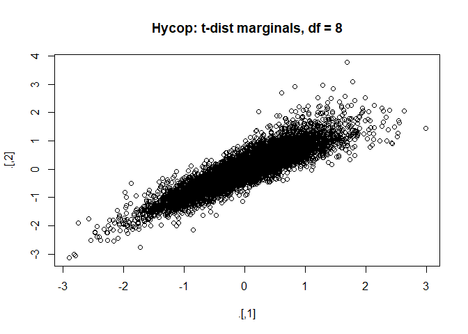

README
================

# INTRO

This is the README file for Nathan Potgieter’s financial econometrics
project.

## Aim

The aim of this project is to develop a general and easy to use Monte
Carlo package that generates asset return data with a prespecified
correlation matrix adn various other risk factors.These factors include
a leverage parameter that determines the likelihood of joint drawdowns,
as well as the parameters of a ARIMA(p,q) + GARCH(q,p) process.
Elliptical copulas are used to induce the correlation in the simulated
data, while Archmedian copulas are used to adjust the likelihood of
joint drawdowns.

``` r
library(pacman)
p_load(tidyverse, copula)
```

# Generating Covarience matrix

In this section I developed a simple function that allows the user to
easily generate a covarience matrix with the desired cluster structure.
Note that the majority of the code was writen by Nico Katzke. The
function is located in the gcVar.R code file.

### gcVar’s arguments

1.  N - is the number of assets in the universe

2.  Clusters - a character string specifying the type of cluster
    structure. Available options are “none”, for a correlation matrix
    with no clusters, “non-overlapping” for a correlation matrix with
    number one layer of clusters, and “overlapping” for a correlation
    matrix with Num\_Layers and Num\_clusters per layer.

3.  Num\_Clusters - if Clusters is equal to “non-overlapping” or “none”
    then Num\_Clusters is an integer value specifying the number of
    clusters. If Clusters = “overlapping” then Num\_Clusters must be a
    vector of length equal to Num\_Layers specifying the number of
    clusters per layer.

4.  Num\_Layers - an integer value between 1 and 4, specifying the
    number of cluster layers. Only needed of using “overlapping”
    clusters.

<!-- end list -->

``` r
#Co-Varience matrix generatimg function

gcVar <- 
  function(N = 50, Clusters = c("none", "non-overlapping", "overlapping") , Num_Clusters = NULL, Num_Layers = NULL){
    
Grps <- Num_Clusters
#set.seed(123)
    
if(Clusters == "none"){
    # Unclustered covariance matrix
    Sigma <- diag(N)
    for (i in 1:N) for (j in 1:N) Sigma[i,j] <- 0.9^abs(i-j)
    Sigma <- propagate::cor2cov(Sigma, runif(N, 1, 5))
    corr <- cov2cor(Sigma)
} else

if(Clusters == "non-overlapping"){
    #----------------------
    # distinct non-overlapping clusters:
    #----------------------
    
    if(is.null(Num_Clusters)) stop("Please provide a valid Num_Clusters argument when using Overlapping clusters")
    
    
    Sigma <- matrix(0.9, N, N)
    diag(Sigma) <- 1

    
for (i in 1:Grps) {
      ix <- seq((i-1) * N / Grps + 1, i * N / Grps)
      Sigma[ix, -ix] <- 0.1
    }
    Sigma <- propagate::cor2cov(Sigma, runif(N, 1, 5))
    corr <- cov2cor(Sigma)
} else
  
if(Clusters == "overlapping"){
    #----------------------
    # distinct overlapping clusters:
    #----------------------
  
  if(is.null(Num_Layers)|Num_Layers<2){
      stop("Please provide a valid Num_Layers argument when using Overlapping clusters")
      }else
  if(length(Num_Clusters) != Num_Layers){
      stop("Please provide a Num_Clusters argument with length equal to Num_Layers")
  }
    
  
    Sigma <- matrix(0.9, N, N)
    diag(Sigma) <- 1

    for (i in 1:Grps[1]) {
      ix <- seq((i-1) * N / Grps[1] + 1, i * N / Grps[1])
      Sigma[ix, -ix] <- 0.8
    }
    
    if(Num_Layers>=2){
        for (i in 1:Grps[2]) {
          ix <- seq((i-1) * N / Grps[2] + 1, i * N / Grps[2])
          Sigma[ix, -ix] <- 0.6
        } }else
    if(Num_Layers>=3){
        for (i in 1:Grps[3]) {
      ix <- seq((i-1) * N / Grps[3] + 1, i * N / Grps[3])
      Sigma[ix, -ix] <- 0.4
        } }else
    if(Num_Layers>=4){
        for (i in 1:Grps[4]) {
      ix <- seq((i-1) * N / Grps[4] + 1, i * N / Grps[4])
      Sigma[ix, -ix] <- 0.1
        } } 
    }

    Sigma <- propagate::cor2cov(Sigma, runif(N, 1, 5))  #Is this necessary???
    corr <- cov2cor(Sigma)

return(corr)

  }
```

Demonstrating the use of gcVar

## GeneratingRrandom Draws with numerous Copula Functions

### Elliptal copulas

Elliptal copulas such as the Gaussian and the student t copulas, allow
us to specify a correlation matrix as a parameter. Doing so allows one
to produce random draws of uniformly distributed variables, that contain
the correlation structure and joint distribution specified by the
copula. The chunk of code below demonstrates this functionality.

Unfortunately, both Elliptal copulas cannot be calibrated to exhibit
increased co-movements within the tails of the distribution. Therefore,
in the next section we examine some properties of Archimedean copulas.

### Archimedean copulas

Archimedean copulas such as the clayton, frank, gumbel and joe exhibit
increased dependence at the tails of the multivariate distribution. In
this section we will examine the clayton, …. copulas due to them
exhibiting enhanced left-tail dependencies. We will also have a look at
the hybrid BB1-BB6 which in which exibit increased dynamic dependenies
in both tails.

# Looking at some hybrid copulas

Tawn’s (1988) Theorem: Shows that a copula is a convex set and every
convex combination of existing copula functions is again a copula. See
“Extreme Dependence Structures and the Cross-Section of Expected Stock
Returns” page 8 & 9.

## hycop

The function below generates randomly distributed numbers from a hybrid
t and clayton copula. Need to think about how to calibrate df and
claycop parameters.

Arguments

  - Corr this is a correlation matrix uses as the parameter for the
    elliptical copula
  - elliptal\_copula family name of elliptal copula. Default is to use
    “t”, but “norm” is also accepted
  - left\_cop

<!-- end list -->

``` r
hycop <- function(corr,
                  elliptal_copula = c("norm", "t"), 
                  df_ellip = NULL, 
                  left_cop_param = 5,
                  left_cop_weight = 0.5,
                  T = 251, 
                  marginal_dist = NULL,
                  df_marginal_dist = NULL){
  
  N <- nrow(corr)  
  Cor <- P2p(corr)

#specifying  Copula's
#elliptal
  if(elliptal_copula == "t"){
    
    if(is.null(df_ellip))stop('Please supply a valid degrees of freedom parameter when using elliptal_copula = "t". ')
    Ecop <- ellipCopula(family = elliptal_copula, dispstr = "un", df = df_ellip, param = Cor, dim = N)
    
  }else
    if(elliptal_copula == "norm"){
      
       Ecop <- ellipCopula(family = "norm", dispstr = "un", param = Cor, dim = N)
      
    }else stop("Please supply a valid argument for elliptal_copula")
   

#left-cop
  
    Acop <- archmCopula(family = "clayton", param = left_cop_param, dim = N)
    
 
    
  

data <- left_cop_weight*rCopula(T, Acop) + (1-left_cop_weight)*rCopula(T, Ecop)


#Converting Uniform marginal distributions to t or norm
if(is.null(marginal_dist)==TRUE){
  return(data)
      }else
        if(marginal_dist=="t"){
          
          if(is.null(df_marginal_dist))stop('Please supply a valid degrees of freedom parameter (df_marginal_dist) when using marginal_dist=="t". ')
          
          data <- apply(data, 2, qt, df = df_marginal_dist)
          
        }else
          if(marginal_dist=="norm"){
            data <- apply(data, 2, qnorm)
            }
            
}
```

Testing hycop

``` r
set.seed(123)

Corr <- gcVar(N = 50, Clusters = "non-overlapping", Num_Clusters = 2)


#First test when marginal_dist=NULL ie unif(0,1)
#left_cop_param = 6 AND left_cop_weight = 0.7 looks good
set.seed(123)
inno <- hycop(Corr, elliptal_copula = "t", df_ellip = 10, left_cop_param = 6, left_cop_weight = 0.7, T = 10000)

inno %>% plot(main = 'Hycop: Unif marginals')
```

<!-- -->

``` r
inno %>% cor %>%  corrplot::corrplot()
```

<!-- -->

``` r
#Using marginal_dist="norm"
set.seed(123)
data <- hycop(Corr, elliptal_copula = "t", df_ellip = 10, left_cop_param = 6, left_cop_weight = 0.5, T = 10000, marginal_dist = "norm")
data %>% plot(main = 'Hycop: norm(0,1) marginals') 
```

<!-- -->

``` r
#Using marginal_dist="t"
set.seed(123)
data <- hycop(Corr, elliptal_copula = "t", df_ellip = 10, left_cop_param = 6, left_cop_weight = 0.5, T = 10000, marginal_dist = "t", df_marginal_dist = 8)
data %>% plot(main = 'Hycop: t-dist marginals, df = 8') 
```

<!-- -->

# Introducing autocorrelation and Volitility clustering

In this step I introduce autocorrelation and volatility using an
AR(p,q)+GARCH(q,p) model.

## Questions

``` r
pacman::p_load(fGarch)

#Looking at garchSpec function
garch <- fGarch::garchSpec(model = list(ar = 0.1, alpha = 0.1, beta = 0.75, gamma = 0.1), 
                           cond.dist = "norm", presample = NULL)

function (model = list(), presample = NULL, cond.dist = c("norm", 
    "ged", "std", "snorm", "sged", "sstd"), 
    rseed = NULL) 
{
  #default for innovation distribution
    cond.dist = match.arg(cond.dist)
    skew = list(norm = NULL, ged = NULL, std = NULL, snorm = 0.9, 
        sged = 0.9, sstd = 0.9)
    shape = list(norm = NULL, ged = 2, std = 4, snorm = NULL, 
        sged = 2, sstd = 4)
    
  #default parameters for garch model  
    control = list(omega = 1e-06, alpha = 0.1, gamma = NULL, 
        beta = 0.8, mu = NULL, ar = NULL, ma = NULL, delta = 2, 
        skew = skew[[cond.dist]], shape = shape[[cond.dist]])
    control[names(model)] <- model
    model <- control
  
  # obtaining ARIMA and GARCH order implied by function arguments   
    if (sum(c(model$alpha, model$beta)) > 1) 
        warnings("sum(alpha)+sum(beta)>1")
    order.ar = length(model$ar)
    order.ma = length(model$ma)
    order.alpha = length(model$alpha)
    if (sum(model$beta) == 0) {
        order.beta = 0
    }
    else {
        order.beta = length(model$beta)
    }
    
 # Getting arma(p,q)   
    if (order.ar == 0 && order.ma == 0) {
        formula.mean = ""
    }
    if (order.ar > 0 && order.ma == 0) {
        formula.mean = paste("ar(", as.character(order.ar), 
            ")", sep = "")
    }
    if (order.ar == 0 && order.ma > 0) {
        formula.mean = paste("ma(", as.character(order.ma), 
            ")", sep = "")
    }
    if (order.ar > 0 && order.ma > 0) {
        formula.mean = paste("arma(", as.character(order.ar), 
            ", ", as.character(order.ma), ")", sep = "")
    }
  # Getting garch(p,q)    
    formula.var = "garch"
    if (order.beta == 0) 
        formula.var = "arch"
    if (!is.null(model$gamma) != 0) 
        formula.var = "aparch"
    if (model$delta != 2) 
        formula.var = "aparch"
    if (order.beta == 0) {
        formula.var = paste(formula.var, "(", as.character(order.alpha), 
            ")", sep = "")
    }
    else {
        formula.var = paste(formula.var, "(", as.character(order.alpha), 
            ", ", as.character(order.beta), ")", 
            sep = "")
    }
    
  #Not sure about as.formula
    if (formula.mean == "") {
        formula = as.formula(paste("~", formula.var))
    }
    else {
        formula = as.formula(paste("~", formula.mean, "+", 
            formula.var))
    }
  
  #Setting null argumaents to zero  
    if (is.null(model$mu)) 
        model$mu = 0
    if (is.null(model$ar)) 
        model$ar = 0
    if (is.null(model$ma)) 
        model$ma = 0
    if (is.null(model$gamma)) 
        model$gamma = rep(0, times = order.alpha)
    
  # setting seed 
    if (is.null(rseed)) {
        rseed = 0
    }
    else {
        set.seed(rseed)
    }
    
  # deciding where to start for presample provided and not provided
    order.max = max(order.ar, order.ma, order.alpha, order.beta)
    iterate = TRUE
    if (!is.matrix(presample)) {
        if (is.null(presample)) {
            iterate = FALSE    #if presample is not a matrix and not NULL
            n.start = order.max
        }
        else {
            n.start = presample  
        }
    # z represents the first innovation = max lag  i.e this code generates a preamble if not provided 
        z = rnorm(n = n.start)    #innovations
        h = rep(model$omega/(1 - sum(model$alpha) - sum(model$beta)), 
            times = n.start)    #sd's
        y = rep(model$mu/(1 - sum(model$ar)), times = n.start)  #garch simulations
    }
    else {
        z = presample[, 1]
        h = presample[, 2]
        y = presample[, 3]
    }
    presample = cbind(z, h, y)
  
  #creating preamble data
    if (iterate) {  #iterate is TRUE if presample matrix is provided
        n.iterate = length(z) - order.max
        deltainv = 1/model$delta
        for (i in n.iterate:1) {
            h[i] = model$omega + sum(model$alpha * (abs(abs(y[i + 
                (1:order.alpha)]) - model$gamma * y[i + (1:order.alpha)])^model$delta)) + 
                sum(model$beta * h[i + (1:order.beta)])
            y[i] = model$mu + sum(model$ar * y[i + (1:order.ar)]) + 
                sum(model$ma * (h[i + (1:order.ma)]^deltainv)) + 
                h[i]^deltainv * z[i]
        }
    }
    new("fGARCHSPEC", call = match.call(), formula = formula, 
        model = list(omega = model$omega, alpha = model$alpha, 
            gamma = model$gamma, beta = model$beta, mu = model$mu, 
            ar = model$ar, ma = model$ma, delta = model$delta, 
            skew = model$skew, shape = model$shape), presample = as.matrix(presample), 
        distribution = as.character(cond.dist), rseed = as.numeric(rseed))
}
```

    ## function (model = list(), presample = NULL, cond.dist = c("norm", 
    ##     "ged", "std", "snorm", "sged", "sstd"), 
    ##     rseed = NULL) 
    ## {
    ##   #default for innovation distribution
    ##     cond.dist = match.arg(cond.dist)
    ##     skew = list(norm = NULL, ged = NULL, std = NULL, snorm = 0.9, 
    ##         sged = 0.9, sstd = 0.9)
    ##     shape = list(norm = NULL, ged = 2, std = 4, snorm = NULL, 
    ##         sged = 2, sstd = 4)
    ##     
    ##   #default parameters for garch model  
    ##     control = list(omega = 1e-06, alpha = 0.1, gamma = NULL, 
    ##         beta = 0.8, mu = NULL, ar = NULL, ma = NULL, delta = 2, 
    ##         skew = skew[[cond.dist]], shape = shape[[cond.dist]])
    ##     control[names(model)] <- model
    ##     model <- control
    ##   
    ##   # obtaining ARIMA and GARCH order implied by function arguments   
    ##     if (sum(c(model$alpha, model$beta)) > 1) 
    ##         warnings("sum(alpha)+sum(beta)>1")
    ##     order.ar = length(model$ar)
    ##     order.ma = length(model$ma)
    ##     order.alpha = length(model$alpha)
    ##     if (sum(model$beta) == 0) {
    ##         order.beta = 0
    ##     }
    ##     else {
    ##         order.beta = length(model$beta)
    ##     }
    ##     
    ##  # Getting arma(p,q)   
    ##     if (order.ar == 0 && order.ma == 0) {
    ##         formula.mean = ""
    ##     }
    ##     if (order.ar > 0 && order.ma == 0) {
    ##         formula.mean = paste("ar(", as.character(order.ar), 
    ##             ")", sep = "")
    ##     }
    ##     if (order.ar == 0 && order.ma > 0) {
    ##         formula.mean = paste("ma(", as.character(order.ma), 
    ##             ")", sep = "")
    ##     }
    ##     if (order.ar > 0 && order.ma > 0) {
    ##         formula.mean = paste("arma(", as.character(order.ar), 
    ##             ", ", as.character(order.ma), ")", sep = "")
    ##     }
    ##   # Getting garch(p,q)    
    ##     formula.var = "garch"
    ##     if (order.beta == 0) 
    ##         formula.var = "arch"
    ##     if (!is.null(model$gamma) != 0) 
    ##         formula.var = "aparch"
    ##     if (model$delta != 2) 
    ##         formula.var = "aparch"
    ##     if (order.beta == 0) {
    ##         formula.var = paste(formula.var, "(", as.character(order.alpha), 
    ##             ")", sep = "")
    ##     }
    ##     else {
    ##         formula.var = paste(formula.var, "(", as.character(order.alpha), 
    ##             ", ", as.character(order.beta), ")", 
    ##             sep = "")
    ##     }
    ##     
    ##   #Not sure about as.formula
    ##     if (formula.mean == "") {
    ##         formula = as.formula(paste("~", formula.var))
    ##     }
    ##     else {
    ##         formula = as.formula(paste("~", formula.mean, "+", 
    ##             formula.var))
    ##     }
    ##   
    ##   #Setting null argumaents to zero  
    ##     if (is.null(model$mu)) 
    ##         model$mu = 0
    ##     if (is.null(model$ar)) 
    ##         model$ar = 0
    ##     if (is.null(model$ma)) 
    ##         model$ma = 0
    ##     if (is.null(model$gamma)) 
    ##         model$gamma = rep(0, times = order.alpha)
    ##     
    ##   # setting seed 
    ##     if (is.null(rseed)) {
    ##         rseed = 0
    ##     }
    ##     else {
    ##         set.seed(rseed)
    ##     }
    ##     
    ##   # deciding where to start for presample provided and not provided
    ##     order.max = max(order.ar, order.ma, order.alpha, order.beta)
    ##     iterate = TRUE
    ##     if (!is.matrix(presample)) {
    ##         if (is.null(presample)) {
    ##             iterate = FALSE    #if presample is not a matrix and not NULL
    ##             n.start = order.max
    ##         }
    ##         else {
    ##             n.start = presample  
    ##         }
    ##     # z represents the first innovation = max lag  i.e this code generates a preamble if not provided 
    ##         z = rnorm(n = n.start)    #innovations
    ##         h = rep(model$omega/(1 - sum(model$alpha) - sum(model$beta)), 
    ##             times = n.start)    #sd's
    ##         y = rep(model$mu/(1 - sum(model$ar)), times = n.start)  #garch simulations
    ##     }
    ##     else {
    ##         z = presample[, 1]
    ##         h = presample[, 2]
    ##         y = presample[, 3]
    ##     }
    ##     presample = cbind(z, h, y)
    ##   
    ##   #creating preamble data
    ##     if (iterate) {  #iterate is TRUE if presample matrix is provided
    ##         n.iterate = length(z) - order.max
    ##         deltainv = 1/model$delta
    ##         for (i in n.iterate:1) {
    ##             h[i] = model$omega + sum(model$alpha * (abs(abs(y[i + 
    ##                 (1:order.alpha)]) - model$gamma * y[i + (1:order.alpha)])^model$delta)) + 
    ##                 sum(model$beta * h[i + (1:order.beta)])
    ##             y[i] = model$mu + sum(model$ar * y[i + (1:order.ar)]) + 
    ##                 sum(model$ma * (h[i + (1:order.ma)]^deltainv)) + 
    ##                 h[i]^deltainv * z[i]
    ##         }
    ##     }
    ##     new("fGARCHSPEC", call = match.call(), formula = formula, 
    ##         model = list(omega = model$omega, alpha = model$alpha, 
    ##             gamma = model$gamma, beta = model$beta, mu = model$mu, 
    ##             ar = model$ar, ma = model$ma, delta = model$delta, 
    ##             skew = model$skew, shape = model$shape), presample = as.matrix(presample), 
    ##         distribution = as.character(cond.dist), rseed = as.numeric(rseed))
    ## }

``` r
# Looking at garchSim
fGarch::garchSim(spec = garch)
```

    ## GMT
    ##                    garch
    ## 2020-05-09 -2.836772e-03
    ## 2020-05-10 -4.008195e-03
    ## 2020-05-11 -4.970551e-04
    ## 2020-05-12 -2.295222e-03
    ## 2020-05-13  8.828537e-04
    ## 2020-05-14 -3.608935e-04
    ## 2020-05-15 -5.041476e-03
    ## 2020-05-16 -1.472456e-04
    ## 2020-05-17 -2.348591e-03
    ## 2020-05-18 -1.675175e-03
    ## 2020-05-19  1.746508e-03
    ## 2020-05-20  2.840445e-04
    ## 2020-05-21  2.490361e-03
    ## 2020-05-22  1.149148e-03
    ## 2020-05-23 -7.365971e-04
    ## 2020-05-24  3.042553e-03
    ## 2020-05-25  5.902617e-04
    ## 2020-05-26  1.980308e-04
    ## 2020-05-27 -1.870157e-03
    ## 2020-05-28  4.107905e-03
    ## 2020-05-29  2.055529e-04
    ## 2020-05-30  2.361425e-03
    ## 2020-05-31  3.173602e-03
    ## 2020-06-01  1.992556e-03
    ## 2020-06-02  3.599056e-04
    ## 2020-06-03 -3.067785e-03
    ## 2020-06-04 -6.197235e-04
    ## 2020-06-05  8.656253e-04
    ## 2020-06-06 -1.403832e-04
    ## 2020-06-07 -2.192435e-03
    ## 2020-06-08 -6.065441e-05
    ## 2020-06-09  2.267685e-03
    ## 2020-06-10 -3.283362e-04
    ## 2020-06-11 -6.490017e-04
    ## 2020-06-12  1.290810e-03
    ## 2020-06-13  9.571801e-04
    ## 2020-06-14 -1.503448e-03
    ## 2020-06-15  8.237492e-04
    ## 2020-06-16  1.038526e-03
    ## 2020-06-17  1.614321e-04
    ## 2020-06-18 -1.330216e-03
    ## 2020-06-19  6.359983e-04
    ## 2020-06-20  1.105178e-03
    ## 2020-06-21  1.015841e-03
    ## 2020-06-22  1.303159e-03
    ## 2020-06-23 -2.239084e-03
    ## 2020-06-24  2.967243e-03
    ## 2020-06-25  4.526797e-04
    ## 2020-06-26  2.145112e-03
    ## 2020-06-27  3.109906e-03
    ## 2020-06-28  2.490083e-03
    ## 2020-06-29  2.102999e-03
    ## 2020-06-30  3.675995e-03
    ## 2020-07-01  1.898448e-03
    ## 2020-07-02 -7.784027e-04
    ## 2020-07-03  2.575162e-03
    ## 2020-07-04  8.231091e-04
    ## 2020-07-05 -4.399215e-03
    ## 2020-07-06 -3.428548e-04
    ## 2020-07-07  2.092536e-03
    ## 2020-07-08 -2.069448e-03
    ## 2020-07-09 -3.280591e-03
    ## 2020-07-10 -2.388073e-03
    ## 2020-07-11  2.131709e-03
    ## 2020-07-12  3.266007e-04
    ## 2020-07-13  1.865074e-03
    ## 2020-07-14  1.891964e-03
    ## 2020-07-15 -1.942473e-03
    ## 2020-07-16  1.754698e-03
    ## 2020-07-17 -4.478881e-03
    ## 2020-07-18  1.686839e-03
    ## 2020-07-19  2.531183e-03
    ## 2020-07-20  4.336175e-03
    ## 2020-07-21 -7.761645e-04
    ## 2020-07-22 -2.014830e-03
    ## 2020-07-23 -1.282733e-03
    ## 2020-07-24  6.951626e-04
    ## 2020-07-25 -1.763155e-03
    ## 2020-07-26  5.033399e-04
    ## 2020-07-27  3.106409e-03
    ## 2020-07-28  2.420323e-03
    ## 2020-07-29 -9.005882e-04
    ## 2020-07-30  4.293527e-06
    ## 2020-07-31 -7.211310e-05
    ## 2020-08-01 -6.991815e-04
    ## 2020-08-02 -9.620525e-04
    ## 2020-08-03 -2.615749e-03
    ## 2020-08-04  2.619710e-04
    ## 2020-08-05  4.376815e-03
    ## 2020-08-06 -1.291173e-03
    ## 2020-08-07  2.272716e-03
    ## 2020-08-08  6.024700e-04
    ## 2020-08-09 -1.268481e-03
    ## 2020-08-10 -4.156960e-03
    ## 2020-08-11  2.350163e-03
    ## 2020-08-12  8.631616e-04
    ## 2020-08-13  3.335299e-03
    ## 2020-08-14  1.939477e-03
    ## 2020-08-15  1.533000e-03
    ## 2020-08-16  2.395544e-03

``` r
function (spec = garchSpec(), n = 100, n.start = 100, extended = FALSE) 
{
    stopifnot(class(spec) == "fGARCHSPEC")
    model = spec@model  #list of model parameters
    if (spec@rseed != 0) 
        set.seed(spec@rseed)  #setting seed for RNG
    n = n + n.start
    
  #  will not need this, need to add my generated innovations
    if (spec@distribution == "norm") 
        z = rnorm(n)
    if (spec@distribution == "ged") 
        z = rged(n, nu = model$shape)
    if (spec@distribution == "std") 
        z = rstd(n, nu = model$shape)
    if (spec@distribution == "snorm") 
        z = rsnorm(n, xi = model$skew)
    if (spec@distribution == "sged") 
        z = rsged(n, nu = model$shape, xi = model$skew)
    if (spec@distribution == "sstd") 
        z = rsstd(n, nu = model$shape, xi = model$skew)
    delta = model$delta
    
  #Not sure how to work with the presample
    z = c(rev(spec@presample[, 1]), z)   #2nd column is the random innovation
    h = c(rev(spec@presample[, 2]), rep(NA, times = n))
    y = c(rev(spec@presample[, 3]), rep(NA, times = n))
    m = length(spec@presample[, 1])
    names(z) = names(h) = names(y) = NULL  #setting names to NULL
    
  #obtaining parameters and lag orders from model object
    mu = model$mu 
    ar = model$ar
    ma = model$ma
    omega = model$omega
    alpha = model$alpha
    gamma = model$gamma
    beta = model$beta
    deltainv = 1/delta
    order.ar = length(ar)
    order.ma = length(ma)
    order.alpha = length(alpha)
    order.beta = length(beta)
    eps = h^deltainv * z
    
    for (i in (m + 1):(n + m)) {
        h[i] = omega + sum(alpha * (abs(eps[i - (1:order.alpha)]) - 
            gamma * (eps[i - (1:order.alpha)]))^delta) + sum(beta * 
            h[i - (1:order.beta)])  #need to know what gets filled into h
        
        eps[i] = h[i]^deltainv * z[i]
        y[i] = mu + sum(ar * y[i - (1:order.ar)]) + sum(ma * 
            eps[i - (1:order.ma)]) + eps[i]
    }
    data = cbind(z = z[(m + 1):(n + m)], sigma = h[(m + 1):(n + 
        m)]^deltainv, y = y[(m + 1):(n + m)])
    
    rownames(data) = as.character(1:n)
    data = data[-(1:n.start), ]   #removing the burn in periods
    
    #getting start date
    from <- timeDate(format(Sys.time(), format = "%Y-%m-%d")) - 
        NROW(data) * 24 * 3600
    charvec <- timeSequence(from = from, length.out = NROW(data))
    
    # putting simulated data and time variable together
    ans <- timeSeries(data = data[, c(3, 2, 1)], charvec = charvec)
    colnames(ans) <- c("garch", "sigma", "eps")
    
    ans <- if (extended)   #is there a need to have extended output?
        ans
    else ans[, "garch"]
    attr(ans, "control") <- list(garchSpec = spec)
    ans
}
```

    ## function (spec = garchSpec(), n = 100, n.start = 100, extended = FALSE) 
    ## {
    ##     stopifnot(class(spec) == "fGARCHSPEC")
    ##     model = spec@model  #list of model parameters
    ##     if (spec@rseed != 0) 
    ##         set.seed(spec@rseed)  #setting seed for RNG
    ##     n = n + n.start
    ##     
    ##   #  will not need this, need to add my generated innovations
    ##     if (spec@distribution == "norm") 
    ##         z = rnorm(n)
    ##     if (spec@distribution == "ged") 
    ##         z = rged(n, nu = model$shape)
    ##     if (spec@distribution == "std") 
    ##         z = rstd(n, nu = model$shape)
    ##     if (spec@distribution == "snorm") 
    ##         z = rsnorm(n, xi = model$skew)
    ##     if (spec@distribution == "sged") 
    ##         z = rsged(n, nu = model$shape, xi = model$skew)
    ##     if (spec@distribution == "sstd") 
    ##         z = rsstd(n, nu = model$shape, xi = model$skew)
    ##     delta = model$delta
    ##     
    ##   #Not sure how to work with the presample
    ##     z = c(rev(spec@presample[, 1]), z)   #2nd column is the random innovation
    ##     h = c(rev(spec@presample[, 2]), rep(NA, times = n))
    ##     y = c(rev(spec@presample[, 3]), rep(NA, times = n))
    ##     m = length(spec@presample[, 1])
    ##     names(z) = names(h) = names(y) = NULL  #setting names to NULL
    ##     
    ##   #obtaining parameters and lag orders from model object
    ##     mu = model$mu 
    ##     ar = model$ar
    ##     ma = model$ma
    ##     omega = model$omega
    ##     alpha = model$alpha
    ##     gamma = model$gamma
    ##     beta = model$beta
    ##     deltainv = 1/delta
    ##     order.ar = length(ar)
    ##     order.ma = length(ma)
    ##     order.alpha = length(alpha)
    ##     order.beta = length(beta)
    ##     eps = h^deltainv * z
    ##     
    ##     for (i in (m + 1):(n + m)) {
    ##         h[i] = omega + sum(alpha * (abs(eps[i - (1:order.alpha)]) - 
    ##             gamma * (eps[i - (1:order.alpha)]))^delta) + sum(beta * 
    ##             h[i - (1:order.beta)])  #need to know what gets filled into h
    ##         
    ##         eps[i] = h[i]^deltainv * z[i]
    ##         y[i] = mu + sum(ar * y[i - (1:order.ar)]) + sum(ma * 
    ##             eps[i - (1:order.ma)]) + eps[i]
    ##     }
    ##     data = cbind(z = z[(m + 1):(n + m)], sigma = h[(m + 1):(n + 
    ##         m)]^deltainv, y = y[(m + 1):(n + m)])
    ##     
    ##     rownames(data) = as.character(1:n)
    ##     data = data[-(1:n.start), ]   #removing the burn in periods
    ##     
    ##     #getting start date
    ##     from <- timeDate(format(Sys.time(), format = "%Y-%m-%d")) - 
    ##         NROW(data) * 24 * 3600
    ##     charvec <- timeSequence(from = from, length.out = NROW(data))
    ##     
    ##     # putting simulated data and time variable together
    ##     ans <- timeSeries(data = data[, c(3, 2, 1)], charvec = charvec)
    ##     colnames(ans) <- c("garch", "sigma", "eps")
    ##     
    ##     ans <- if (extended)   #is there a need to have extended output?
    ##         ans
    ##     else ans[, "garch"]
    ##     attr(ans, "control") <- list(garchSpec = spec)
    ##     ans
    ## }

``` r
garchSim(garch, n = 252, extended = TRUE) %>% plot()
```

<!-- -->

## My edit of garch sim

``` r
#covar matrix
corr <- gcVar(N = 50, Clusters = "non-overlapping", Num_Clusters = 2)
#innovations
inn <- hycop(corr, left_cop_weight = 0.5, marginal_dist = "norm")
```

    ## Warning in if (elliptal_copula == "t") {: the condition has length > 1 and only
    ## the first element will be used

    ## Warning in if (elliptal_copula == "norm") {: the condition has length > 1 and
    ## only the first element will be used

``` r
# Looking at garchSim
fGarch::garchSim(spec = garch)
```

    ## GMT
    ##                    garch
    ## 2020-05-09 -1.736815e-03
    ## 2020-05-10 -1.049296e-03
    ## 2020-05-11 -1.006260e-03
    ## 2020-05-12 -3.189373e-03
    ## 2020-05-13  4.119161e-03
    ## 2020-05-14  2.221181e-03
    ## 2020-05-15 -7.613563e-04
    ## 2020-05-16 -4.364477e-04
    ## 2020-05-17 -4.527946e-03
    ## 2020-05-18 -1.428764e-03
    ## 2020-05-19 -2.622395e-03
    ## 2020-05-20  1.922493e-03
    ## 2020-05-21  9.170107e-05
    ## 2020-05-22  1.393704e-03
    ## 2020-05-23  2.242978e-04
    ## 2020-05-24 -4.545701e-03
    ## 2020-05-25  2.503234e-03
    ## 2020-05-26  7.172564e-04
    ## 2020-05-27 -6.289624e-04
    ## 2020-05-28 -1.392733e-03
    ## 2020-05-29 -3.267595e-03
    ## 2020-05-30  8.992751e-04
    ## 2020-05-31 -1.047517e-03
    ## 2020-06-01  4.502070e-04
    ## 2020-06-02  9.545135e-04
    ## 2020-06-03  2.644436e-03
    ## 2020-06-04  4.822051e-03
    ## 2020-06-05 -3.708538e-04
    ## 2020-06-06 -1.172178e-03
    ## 2020-06-07  5.704973e-04
    ## 2020-06-08  5.879567e-04
    ## 2020-06-09 -2.405823e-03
    ## 2020-06-10  1.025639e-03
    ## 2020-06-11 -7.787783e-04
    ## 2020-06-12  2.040979e-03
    ## 2020-06-13  4.502062e-03
    ## 2020-06-14 -4.639378e-03
    ## 2020-06-15  9.947011e-04
    ## 2020-06-16  6.855118e-04
    ## 2020-06-17  5.786452e-04
    ## 2020-06-18 -3.370196e-03
    ## 2020-06-19  6.439371e-04
    ## 2020-06-20  6.491337e-03
    ## 2020-06-21 -1.423664e-03
    ## 2020-06-22  2.299050e-03
    ## 2020-06-23 -4.588410e-03
    ## 2020-06-24  2.367050e-03
    ## 2020-06-25 -3.057435e-03
    ## 2020-06-26  2.486769e-03
    ## 2020-06-27  1.403758e-03
    ## 2020-06-28  7.666156e-04
    ## 2020-06-29  2.136273e-03
    ## 2020-06-30  2.914583e-03
    ## 2020-07-01 -2.201547e-03
    ## 2020-07-02 -1.121917e-03
    ## 2020-07-03  9.578143e-04
    ## 2020-07-04  1.012501e-03
    ## 2020-07-05  4.544127e-04
    ## 2020-07-06  3.086431e-03
    ## 2020-07-07  3.371911e-03
    ## 2020-07-08 -1.341936e-03
    ## 2020-07-09  1.556070e-03
    ## 2020-07-10  3.548185e-03
    ## 2020-07-11  1.607773e-03
    ## 2020-07-12 -5.225269e-03
    ## 2020-07-13 -8.536961e-04
    ## 2020-07-14 -3.204971e-04
    ## 2020-07-15  2.310955e-03
    ## 2020-07-16  2.504865e-03
    ## 2020-07-17  3.551362e-03
    ## 2020-07-18 -1.363789e-04
    ## 2020-07-19  3.718295e-03
    ## 2020-07-20  2.298912e-03
    ## 2020-07-21  3.612956e-04
    ## 2020-07-22 -1.390019e-03
    ## 2020-07-23 -8.620484e-04
    ## 2020-07-24 -2.115495e-03
    ## 2020-07-25  3.611211e-03
    ## 2020-07-26 -4.117837e-03
    ## 2020-07-27  4.608637e-03
    ## 2020-07-28  1.984002e-03
    ## 2020-07-29  1.127925e-03
    ## 2020-07-30  3.833015e-03
    ## 2020-07-31 -3.309450e-03
    ## 2020-08-01 -1.533138e-03
    ## 2020-08-02  4.599812e-03
    ## 2020-08-03 -2.406923e-04
    ## 2020-08-04  2.617238e-03
    ## 2020-08-05  5.432275e-03
    ## 2020-08-06 -3.213928e-03
    ## 2020-08-07  2.056882e-04
    ## 2020-08-08 -8.777008e-04
    ## 2020-08-09  3.487193e-03
    ## 2020-08-10  6.241436e-04
    ## 2020-08-11  2.240396e-03
    ## 2020-08-12  3.185942e-03
    ## 2020-08-13 -5.528360e-04
    ## 2020-08-14 -2.395494e-03
    ## 2020-08-15 -1.259012e-03
    ## 2020-08-16 -4.835540e-04

``` r
sim.mv <- function (model = list(), n = 100, n.start = 100, presample = NULL, set_seed = NULL, extended = FALSE) 
{
   #default parameters for garch model  
    control = list(omega = 1e-06, alpha = 0.1, gamma = NULL, 
        beta = 0.8, mu = 0, ar = NULL, ma = NULL, delta = 2, 
        skew = skew[[cond.dist]], shape = shape[[cond.dist]])
    control[names(model)] <- model
    model <- control   #list of model parameters
    
    n = n + n.start
  
  # obtaining ARIMA(p,q) and GARCH(q,p) order implied by function arguments   
    if (sum(c(model$alpha, model$beta)) > 1) 
        warnings("sum(alpha)+sum(beta)>1")
    order.ar = length(model$ar)
    order.ma = length(model$ma)
    order.alpha = length(model$alpha)
    if (sum(model$beta) == 0) {
        order.beta = 0
    }else {
        order.beta = length(model$beta)
    }
    
  # Generating presample for when it is and is not provided
    order.max = max(order.ar, order.ma, order.alpha, order.beta)
    iterate = TRUE
    if (!is.matrix(presample)) {       #why is.matrix and is.null???
        if (is.null(presample)) {
            iterate = FALSE   #if presample is NULL
            n.start = order.max
        }else {
            n.start = presample #if presample is not matrix an not Null
        }
    # z represents the first innovation = max lag  i.e this code generates a presample if not provided 
        z = rnorm(n = n.start)    #innovations in presample
        h = rep(model$omega/(1 - sum(model$alpha) - sum(model$beta)), 
            times = n.start)    #sd's in presample
        y = rep(model$mu/(1 - sum(model$ar)), times = n.start)  #garch simulations in presample
    }else {
        z = presample[, 1]
        h = presample[, 2]
        y = presample[, 3]
    }
    presample = cbind(z, h, y)
    
  # creating innovations object (z); will insert copula rng later  
    set.seed(set_seed)  #setting seed for RNG
    z <- rnorm(n, mean = 0.01, sd = 0.5)
  
  #generating innovations vector
    z = c(rev(presample[, 1]), z)   #adding random innovations to those in presample
    h = c(rev(presample[, 2]), rep(NA, times = n)) #sd's
    y = c(rev(presample[, 3]), rep(NA, times = n)) #simulated garch process
    m = length(presample[, 1])
    names(z) = names(h) = names(y) = NULL  #setting names to NULL
    
  #obtaining parameters and lag orders from model object
    mu = model$mu 
    ar = model$ar
    ma = model$ma
    omega = model$omega
    alpha = model$alpha
    gamma = model$gamma
    beta = model$beta
    delta = model$delta
    deltainv = 1/delta
    order.ar = length(ar)
    order.ma = length(ma)
    order.alpha = length(alpha)
    order.beta = length(beta)
    eps = h^deltainv * z
    
  #simulating data  
    for (i in (m + 1):(n + m)) {
        h[i] = omega + sum(alpha * (abs(eps[i - (1:order.alpha)]) - 
            gamma * (eps[i - (1:order.alpha)]))^delta) + sum(beta * 
            h[i - (1:order.beta)])  #need to know what gets filled into h
        
        eps[i] = h[i]^deltainv * z[i]
        y[i] = mu + sum(ar * y[i - (1:order.ar)]) + sum(ma * 
            eps[i - (1:order.ma)]) + eps[i]
    }
    data = cbind(z = z[(m + 1):(n + m)], sigma = h[(m + 1):(n + 
        m)]^deltainv, y = y[(m + 1):(n + m)])
    
    rownames(data) = as.character(1:n)
    data = data[-(1:n.start), ]   #removing the burn in periods
    
    #getting start date
    from <- timeDate(format(Sys.time(), format = "%Y-%m-%d")) - 
        NROW(data) * 24 * 3600
    charvec <- timeSequence(from = from, length.out = NROW(data))
    
    # putting simulated data and time variable together
    ans <- timeSeries(data = data[, c(3, 2, 1)], charvec = charvec)
    colnames(ans) <- c("garch", "sigma", "eps")
    
    ans <- if (extended)   #is there a need to have extended output?
        ans
    else ans[, "garch"]
    attr(ans, "control") <- list(garchSpec = spec)
    ans
}
```

My go at writing a GARCHSIM function

``` r
'

corr <- gcVar(N = 4, Clusters = "non-overlapping", Num_Clusters = 2)
inno <- hycop(corr, left_cop_weight = 0.5, T = 251, marginal_dist = "t")
model <- list(ar = 0.1, alpha = 0.1, beta = 0.75, gamma = 0.1)

my.sim.mv <- function(model= list(), innovations = NULL, presample = NULL, n.start = 100){
  
  if(is.null(innovations)==TRUE)stop("Please provide valid innovations argument")
  n = length(innovations) + n.start
  
  #default parameters for garch model  
    default = list(omega = 1e-06, 
                   alpha = 0.1,
                   gamma = NULL, 
                   beta = 0.8, 
                   mu = 0,   #changed form NULL to 0
                   ar = NULL, 
                   ma = NULL, 
                   delta = 2)
    
    default[names(model)] <- model
    model <- default   #list of model parameters
  
  #Generating Presample
    

    
  #obtaining parameters and lag orders from model object
    mu = model$mu 
    ar = model$ar
    ma = model$ma
    omega = model$omega
    alpha = model$alpha
    gamma = model$gamma
    beta = model$beta
    delta = model$delta
    deltainv = 1/delta
    order.ar = length(ar)
    order.ma = length(ma)
    order.alpha = length(alpha)
    order.beta = length(beta)
    eps = h^deltainv * z
    

  
}

#my.sim.mv(model = model, innovations = inno)
'
```

    ## [1] "\n\ncorr <- gcVar(N = 4, Clusters = \"non-overlapping\", Num_Clusters = 2)\ninno <- hycop(corr, left_cop_weight = 0.5, T = 251, marginal_dist = \"t\")\nmodel <- list(ar = 0.1, alpha = 0.1, beta = 0.75, gamma = 0.1)\n\nmy.sim.mv <- function(model= list(), innovations = NULL, presample = NULL, n.start = 100){\n  \n  if(is.null(innovations)==TRUE)stop(\"Please provide valid innovations argument\")\n  n = length(innovations) + n.start\n  \n  #default parameters for garch model  \n    default = list(omega = 1e-06, \n                   alpha = 0.1,\n                   gamma = NULL, \n                   beta = 0.8, \n                   mu = 0,   #changed form NULL to 0\n                   ar = NULL, \n                   ma = NULL, \n                   delta = 2)\n    \n    default[names(model)] <- model\n    model <- default   #list of model parameters\n  \n  #Generating Presample\n    \n\n    \n  #obtaining parameters and lag orders from model object\n    mu = model$mu \n    ar = model$ar\n    ma = model$ma\n    omega = model$omega\n    alpha = model$alpha\n    gamma = model$gamma\n    beta = model$beta\n    delta = model$delta\n    deltainv = 1/delta\n    order.ar = length(ar)\n    order.ma = length(ma)\n    order.alpha = length(alpha)\n    order.beta = length(beta)\n    eps = h^deltainv * z\n    \n\n  \n}\n\n#my.sim.mv(model = model, innovations = inno)\n"
