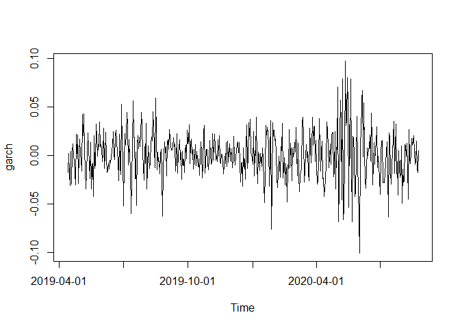

README
================

# MCmarket an R Package Designed for Simulating Asset Market Returns

This is the README for Nathan Potgieter’s financial econometrics
project, in which a framework for the Monte Carlo simulation of asset
markets is developed.

## Aim

The aim of this project is to develop a general and easy to use Monte
Carlo simulation package that generates asset return data, with a
prespecified correlation structure and dynamic dependencies. Ideally the
user will be able to adjust a “leverage” parameter, which will determine
the markets left-tail dependency, and in turn effect the likelihood of
entering a “crisis period” characterized by extreme joint drawdowns.

Elliptical copulas are used to induce the correlation in the simulated
data, while Archmedian copulas are used induce greater left-tail
dependencies.

The data will also be simulated to exhibit volatility clustering, this
is accomplished by utilizing various ARIMA(p,q) + GARCH(q,p) models, the
parameters of which can be adjusted to induce alternative risk
characteristics. Various ARIMA(p,q) + APGARCH(q,p) structures can be
called on to induce mean and variance persistence.

## Monte Carlo Framework

The Monte Carlo simulation routine involves the following steps:

This example generates k periods of returns, for D Assets across N
markets.

1.  Draw a series of k random uniformly distributed numbers
    (corresponding to k trading periods), across a set of D variables
    (or D assets), from a multivariate distribution with a given
    correlation matrix.
    -   This is accomplished using Euclidean (Gaussian or t-copula) and
        Archmediean (Clayton) copula’s and can easily be done using the
        rcopula function.
2.  Convert the uniformly distributed univariate distributions into
    something that more resembles the distribution of asset returns. For
    example one could convert them into normal, student-t or
    skewed-generalized t distributions.
    -   This is done the same way one would convert p-values into test
        statistics using the dnorm() and dsgt() functions respectively.
    -   Technically this is accomplished via the inversion of the
        cumulative distribution function (CDF).
3.  This step induces mean and variance persistence to the series, by
    plugging them into a ARIMA(p,q) + GARCH(q,p) equation as
    innovations.
    -   If the parameters are set accordingly the resulting series
        should possess the volatility clustering observed in empirical
        asset returns.
4.  The final step is to repeat the first 3 steps N times to generate an
    ensemble of asset markets, each with the same risk characteristics
    but different realisations.

#### Loading Packages

``` r
library(pacman)
#These packages are used in functions.
p_load(tidyverse, copula, fGarch, lubridate, forecast, sgt, glue)
#These packages are only used in research and demonstration tasks.
p_load(tbl2xts)
```

# The Set up

## Generating Ad Hoc Covarience matrix

In this section I developed a simple function that allows the user to
easily generate a correlation matrix with a desired cluster structure.
This will be used as a key input when simulating financial markets. Note
that the majority of the code was provided by Nico Katzke. The function
is located in the gen\_corr.R code file.

### gen\_corr’s arguments

1.  D - is the number of assets in the universe

2.  Clusters - a character string specifying the type of cluster
    structure. Available options are “none”, for a correlation matrix
    with no clusters, “non-overlapping” for a correlation matrix with
    number one layer of clusters, and “overlapping” for a correlation
    matrix with Num\_Layers and Num\_clusters per layer.

3.  Num\_Clusters - if Clusters is equal to “non-overlapping” or “none”
    then Num\_Clusters is an integer value specifying the number of
    clusters. If Clusters = “overlapping” then Num\_Clusters must be a
    vector of length equal to Num\_Layers specifying the number of
    clusters per layer.

4.  Num\_Layers - an integer value between 1 and 4, specifying the
    number of cluster layers. Only needed of using “overlapping”
    clusters.

``` r
#Co-Varience matrix generatimg function

gen_corr <- function (D = 50, 
                      Clusters = c("none", "non-overlapping", "overlapping"),
                      Num_Clusters = NULL, 
                      Num_Layers = NULL) {
    
Grps <- Num_Clusters
#set.seed(123)
    
if(Clusters == "none"){
    # Unclustered covariance matrix
    Sigma <- diag(D)
    for (i in 1:D) for (j in 1:D) Sigma[i,j] <- 0.9^abs(i-j)
    Sigma <- propagate::cor2cov(Sigma, runif(D, 1, 5))
    corr <- cov2cor(Sigma)
} else

if(Clusters == "non-overlapping"){
    #----------------------
    # distinct non-overlapping clusters:
    #----------------------
    
    if(is.null(Num_Clusters)) stop("Please provide a valid Num_Clusters argument when using Overlapping clusters")
    
    
    Sigma <- matrix(0.9, D, D)
    diag(Sigma) <- 1

    
for (i in 1:Grps) {
      ix <- seq((i-1) * D / Grps + 1, i * D / Grps)
      Sigma[ix, -ix] <- 0.0001                       #think about
    }
    Sigma <- propagate::cor2cov(Sigma, runif(D, 1, 5))
    corr <- cov2cor(Sigma)
} else
  
if(Clusters == "overlapping"){
    #----------------------
    # distinct overlapping clusters:
    #----------------------
  
  if(is.null(Num_Layers)|Num_Layers<2){
      stop("Please provide a valid Num_Layers argument when using Overlapping clusters")
      }else
  if(length(Num_Clusters) != Num_Layers){
      stop("Please provide a Num_Clusters argument with length equal to Num_Layers")
  }
    
  
    Sigma <- matrix(0.9, D, D)
    diag(Sigma) <- 1

    for (i in 1:Grps[1]) {
      ix <- seq((i-1) * D / Grps[1] + 1, i * D / Grps[1])
      Sigma[ix, -ix] <- 0.7
    }
    if(Num_Layers>=2){
        for (i in 1:Grps[2]) {
          ix <- seq((i-1) * D / Grps[2] + 1, i * D / Grps[2])
          Sigma[ix, -ix] <- 0.5
        } }
    if(Num_Layers>=3){
        for (i in 1:Grps[3]) {
      ix <- seq((i-1) * D / Grps[3] + 1, i * D / Grps[3])
      Sigma[ix, -ix] <- 0.3
        } }
    if(Num_Layers>=4){
        for (i in 1:Grps[4]) {
      ix <- seq((i-1) * D / Grps[4] + 1, i * D / Grps[4])
      Sigma[ix, -ix] <- 0.15
        } } 
    }

    Sigma <- propagate::cor2cov(Sigma, runif(D, 1, 5))  #Is this necessary???
    corr <- cov2cor(Sigma)

return(corr)

  }
```

Demonstrating the use of gen\_corr

``` r
source("code/gen_corr.R")
gen_corr(D = 60, Clusters = "overlapping", Num_Layers = 4, Num_Clusters = c(10,5,3,2)) %>% ggcorrplot::ggcorrplot(title = "Overlapping Clusters", hc.order = TRUE)
```


## Creating a Dataset of Emperical Correlation Matrix’s

Since it would also be useful for users of the package to have some
labelled types of empirical correlation matrices at their disposal, a
data set of stressed rally and normal covariance matrices is now built.

S&P500 data since 1/01/2000 is used to sample covariance matrices that
can be used as inputs in the Monte Carlo procedure. These matrices will
be made available as part of the MCmarket package. They can albe be used
at a later stage to train CorrGAN.

Note that none of the code in this section is run when building this
README, due to concerns regarding the speed of computation.

#### Getting SNP 500 data since 2000

-   The code below pulls in SNP 500 data since 2000/01/01.

``` r
p_load(tidyverse, tidyquant, lubridate)
source("code/impute_missing_returns.R")

# save current system date to a variable
today <- Sys.Date()
#date <- today %m+% months(-90)
date <- as.Date("2000-01-01")

# Getting all tickers in SP500
stock_list <- tq_index("SP500") %>%
    arrange(symbol) %>%
    mutate(symbol = case_when(symbol == "BRK.B" ~ "BRK-B", #repairing names that cause errors
                              symbol == "BF.B" ~ "BF-B",
                              TRUE ~ as.character(symbol))) %>%
    pull(symbol)

# This function gets the data for a ticker and date
get_data <- function (ticker, from) {
    df <- tq_get(ticker, from = from) %>% mutate(symbol = rep(ticker, length(date)))
    return(df)
}

#Getting S&P500 data set
SNP_data <-
    1:length(stock_list) %>% map(~get_data(ticker = stock_list[[.]], from = date)) %>% bind_rows()
save(SNP_data, file = "data/SNP_data.Rda")

#Calculating returns and sd 
#and imputing missing returns using Nico's impute_missing_returns function
SNP_returns <- left_join(
    SNP_data %>%
        group_by(symbol) %>%
        arrange(date) %>%
        mutate(return = log(adjusted/dplyr::lag(adjusted))) %>%
        dplyr::filter(date>first(date)) %>%
        select(date, symbol, return) %>%
        spread(symbol, return) %>%
        impute_missing_returns(impute_returns_method = "Drawn_Distribution_Own") %>% #Imputing missing returns
        gather(symbol, return, -date) %>%
        group_by(symbol) %>%
        mutate(sd = sd(return, na.rm = T)*sqrt(252)) %>%  # calculate annualized SD
        ungroup(),
    SNP_data %>%
        select(date, symbol, volume, adjusted),
    by = c("date", "symbol")
)
save(SNP_returns, file = "data/SNP_returns.Rda")
```

#### Labeling SNP Data into Rally, Normal and Stressed Markets

This chunk calculates the sharp ratios for random equally weighted
portfolios of 50 assets over a random time slice of 252 days since
2000/01/01 from the SNP\_return data set. The portfolios are then labels
as follows:

-   ‘stressed market’: A market is ‘stressed’ whenever the equi-weighted
    basket of stocks has a Sharpe below -0.5 over the year of study (252
    trading days).

-   ‘rally market’: A market is ‘rallying’ whenever the equi-weighted
    basket of stocks under has a Sharpe above 2 over the year of study
    (252 trading days).

-   ‘normal market’: A market is ‘normal’ whenever the equi-weighted
    basket of stocks under has a Sharpe in-between -0.5 and 2 over the
    year of study (252 trading days).

Note that this methodology is consistent with that used in
<https://marti.ai/qfin/2020/02/03/sp500-sharpe-vs-corrmats.html>.

``` r
load("data/SNP_returns.Rda")


#Packages used in chunk
library(pacman)
p_load(tidyverse, furrr, PerformanceAnalytics, tbl2xts, rmsfuns, lubridate, fitHeavyTail)

#This function generates random portfolios with option to supply sharp ratio, 
#sharp = TRUE takes substantially longer to calculate.
gen_random_port <- function(dim = 100, sharp = TRUE){
    #list of Assets from which sample
    symbols <- SNP_returns %>%
        dplyr::filter(date==first(date)) %>%
        pull(symbol)
    dim <- dim
    sample_symbols <- sample(symbols, dim)

    #Dates from which to sample
    dates <- SNP_returns %>%
        dplyr::filter(symbol == "A") %>%
        select(date)
    indx <- sample.int(nrow(dates) - 252, 1)
    start_date <- dates[indx,]
    end_date <- dates[indx + 252,]
    sample_dates <- dates %>% dplyr::filter(date >= start_date[[1]] &
                   date <= end_date[[1]]) %>% pull()

    if(sharp == FALSE){
        training_data <- list(dates = list(sample_dates),
                              symbols = list(sample_symbols)) %>% as_tibble()
    }else
        if(sharp == TRUE){
            #setting rebalance months
            RebMonths <- c(1,4,7,10)
            EQweights <-
                SNP_returns %>%
                dplyr::filter(symbol %in% sample_symbols &
                                  date %in% sample_dates) %>%
                select(date, symbol, return) %>%
                mutate(Months = as.numeric(format(date, format = "%m")),
                       YearMonths = as.numeric(format(date, format = "%Y%m"))) %>%
                dplyr::filter(Months %in% RebMonths) %>%
                group_by(YearMonths, Months, symbol) %>%
                dplyr::filter(date == last(date)) %>%
                ungroup() %>%
                group_by(date) %>%
                mutate(weight = 1/n()) %>%
                select(date, symbol, weight) %>%
                spread(symbol, weight) %>% ungroup() %>%
                tbl_xts()

            # Return wide data
            Returns <-
                SNP_returns %>%
                dplyr::filter(symbol %in% sample_symbols &
                                  date %in% sample_dates) %>%
                select(date, symbol, return) %>%
                spread(symbol, return) %>% tbl_xts()

            #calculating portfolio returns
            EW_RetPort <- rmsfuns::Safe_Return.portfolio(Returns,
                                               weights = EQweights, lag_weights = TRUE,
                                               verbose = TRUE, contribution = TRUE,
                                               value = 100, geometric = TRUE)
            Sharp <- SharpeRatio(EW_RetPort$returns, FUN="StdDev", annualize = TRUE)

            training_data <- list(dates = list(sample_dates),
                                  symbols = list(sample_symbols),
                                  sharp = Sharp[1]) %>% as_tibble()
    }

}
#------------------------------------------
#First I generate the labeled training data
#------------------------------------------

#Generating N random portfolios, with Sharp ratio's.
# The furrr packages is used to speed up computation
set.seed(5245214)
plan(multiprocess)
training_data_sharp <-
    1:1000 %>% future_map(~gen_random_port(dim = 50), .progress = TRUE) %>% reduce(bind_rows)
save(training_data_sharp, file = "data/training_data_sharp.Rda")

load("data/training_data_sharp.Rda")

# Separating by sharp ratio into market types.
stressed_market <- 
  training_data_sharp %>% 
  dplyr::filter(sharp < -0.5) 

rally_market <- 
  training_data_sharp %>% 
  dplyr::filter(sharp > 2) 

normal_market <- 
  training_data_sharp %>% 
  dplyr::filter(sharp >= -0.5 & sharp <= 2)

#This function gathers the SNP data corresponding to the portfolios described above
get_market_data <- function(index_df, i){
        SNP_returns %>%
        select(date, symbol, return) %>%
            dplyr::filter(symbol %in% index_df$symbols[[i]] &
                       date %in% index_df$dates[[i]])
}

#Separating portfolio by sharp ratio
stressed_market_data <- 1:nrow(stressed_market) %>% map(~get_market_data(stressed_market, .x))

rally_market_data <- 1:nrow(rally_market) %>% map(~get_market_data(rally_market, .x))

normal_market_data <- 1:nrow(normal_market) %>% map(~get_market_data(normal_market, .x))

#Calculating Covariance matrix using the fitHeavyTail method
calc_cov <- function(df, i){
    df[[i]] %>% select(date, symbol, return) %>%
        spread(symbol, return) %>% select(-date) %>%
        fitHeavyTail::fit_mvt() %>% .$cov
}

stressed_market_cov <- 1:length(stressed_market_data) %>% map(~calc_cov(stressed_market_data, .x))

rally_market_cov <- 1:length(rally_market_data) %>% map(~calc_cov(rally_market_data, .x))

normal_market_cov <- 1:length(normal_market_data) %>% map(~calc_cov(normal_market_data, .x))

#Joining and saving datasets
#Called Labelled training data because it will be used to train CorGAN at a later stage
labeled_training_data <- list(stressed_market = stressed_market_corr,
                              rally_market = rally_market_corr,
                              normal_market = normal_market_corr)
save(labeled_training_data, file = "data/labeled_training_data.Rda")

#------------------------------------------
#Now to generate unlabelled training data
#Hence why sharp = FALSE in gen_random_port
#------------------------------------------

plan(multiprocess)
training_data_indx <-
    1:10000 %>% future_map(~gen_random_port(dim = 50, sharp = FALSE), .progress = TRUE) %>% reduce(bind_rows)

market_data <- 1:nrow(training_data) %>% future_map(~get_market_data(training_data, .x), .progress = TRUE)

training_data <- 1:length(market_data) %>% map(~calc_cor(market_data, .x))


save(training_data, file = "data/training_data.Rda")
```

#### An Example of Each Type of Correlation Matrix

Note that they are converted from covariance matrices to correlation
matrices before being plotted.


# Building the Monte Carlo Framework

## Step 1: Draw a series of random uniformly distributed numbers across a set of variables with a specified dependence structure.

### Generating Random Draws Using Various Copulas

#### Elliptal copulas

Elliptal copulas such as the Gaussian and the student t copulas, allow
us to specify a correlation matrix before randomly selecting
observations from the multivariate distribution. Doing so allows one to
produce random draws of uniformly distributed variables, that contain
the correlation structure and joint distribution specified by the
copula. The chunk of code below demonstrates this functionality.

``` r
#loading copula package; already loaded
# pacman::p_load(copula)

#generating toy corr matrix
corr <- gen_corr(D = 50, Clusters = "overlapping", Num_Layers = 3, Num_Clusters = c(10, 5, 2))

#generating normal and student t copula objects   
Ncop <- ellipCopula(family = "normal", dispstr = "un", param = P2p(corr), dim = 50)
Tcop <- ellipCopula(family = "t", dispstr = "un", param = P2p(corr), dim = 50)

#generating 252 random draws for each of the dim = 50 variables. 
set.seed(123)
rn <- rCopula(copula = Ncop, n = 252)
rt <- rCopula(copula = Tcop, n = 252)

#Checking if the correlation structure was maintained
p_load(patchwork)
# Original corr
p1 <- ggcorrplot::ggcorrplot(corr, hc.order = TRUE) + 
  labs(title = "Input Correlation Matrix") +
  scale_x_discrete(labels = NULL) + scale_y_discrete(labels = NULL) +
  theme(legend.position = "bottom")
# corr from random draws form norm and t copula
p2 <- fitHeavyTail::fit_mvt(rn) %>% .$cov %>% cov2cor() %>% 
  ggcorrplot::ggcorrplot(hc.order = TRUE) + 
  labs(subtitle = "Normal Copula") +
  scale_x_discrete(labels = NULL) + scale_y_discrete(labels = NULL) +
  theme(legend.position = "none")

p3 <- fitHeavyTail::fit_mvt(rt) %>% .$cov %>% cov2cor() %>% 
  ggcorrplot::ggcorrplot(hc.order = TRUE) + 
  labs(subtitle = "T-Copula") +
  scale_x_discrete(labels = NULL) + scale_y_discrete(labels = NULL) +
  theme(legend.position = "none")

#Printing summary output
#Note that all the variables appear uniformly distributed
p_load(printr)
summary(rn)
```

|     | V1                | V2              | V3                | V4                | V5                | V6              | V7                | V8              | V9               | V10              | V11               | V12              | V13               | V14             | V15             | V16               | V17               | V18              | V19               | V20               | V21               | V22               | V23               | V24              | V25               | V26              | V27              | V28              | V29              | V30              | V31              | V32              | V33              | V34              | V35              | V36               | V37              | V38              | V39              | V40              | V41              | V42             | V43              | V44             | V45              | V46              | V47              | V48             | V49              | V50              |
|:----|:------------------|:----------------|:------------------|:------------------|:------------------|:----------------|:------------------|:----------------|:-----------------|:-----------------|:------------------|:-----------------|:------------------|:----------------|:----------------|:------------------|:------------------|:-----------------|:------------------|:------------------|:------------------|:------------------|:------------------|:-----------------|:------------------|:-----------------|:-----------------|:-----------------|:-----------------|:-----------------|:-----------------|:-----------------|:-----------------|:-----------------|:-----------------|:------------------|:-----------------|:-----------------|:-----------------|:-----------------|:-----------------|:----------------|:-----------------|:----------------|:-----------------|:-----------------|:-----------------|:----------------|:-----------------|:-----------------|
|     | Min. :0.0009617   | Min. :0.00184   | Min. :0.0004641   | Min. :0.0004934   | Min. :0.0003666   | Min. :0.01094   | Min. :0.0008552   | Min. :0.00355   | Min. :0.006659   | Min. :0.004168   | Min. :0.0006098   | Min. :0.005393   | Min. :0.0009939   | Min. :0.00023   | Min. :0.00165   | Min. :0.0005143   | Min. :0.0006651   | Min. :0.000014   | Min. :0.0002743   | Min. :0.0000209   | Min. :0.0000962   | Min. :0.0002104   | Min. :0.0002318   | Min. :0.001102   | Min. :0.0004169   | Min. :0.003538   | Min. :0.007611   | Min. :0.002733   | Min. :0.007346   | Min. :0.001792   | Min. :0.008003   | Min. :0.008007   | Min. :0.006617   | Min. :0.002179   | Min. :0.002292   | Min. :0.0007579   | Min. :0.002141   | Min. :0.003416   | Min. :0.002066   | Min. :0.003576   | Min. :0.007007   | Min. :0.00328   | Min. :0.005966   | Min. :0.01432   | Min. :0.002299   | Min. :0.006011   | Min. :0.008558   | Min. :0.01009   | Min. :0.005523   | Min. :0.005356   |
|     | 1st Qu.:0.2895102 | 1st Qu.:0.25063 | 1st Qu.:0.2743136 | 1st Qu.:0.2753622 | 1st Qu.:0.2747741 | 1st Qu.:0.29187 | 1st Qu.:0.3006705 | 1st Qu.:0.30370 | 1st Qu.:0.274809 | 1st Qu.:0.290940 | 1st Qu.:0.2699475 | 1st Qu.:0.296040 | 1st Qu.:0.2732076 | 1st Qu.:0.27882 | 1st Qu.:0.25423 | 1st Qu.:0.2377012 | 1st Qu.:0.2563201 | 1st Qu.:0.263832 | 1st Qu.:0.2555524 | 1st Qu.:0.2461544 | 1st Qu.:0.2645738 | 1st Qu.:0.2372632 | 1st Qu.:0.2806083 | 1st Qu.:0.254557 | 1st Qu.:0.2368761 | 1st Qu.:0.230024 | 1st Qu.:0.242272 | 1st Qu.:0.217164 | 1st Qu.:0.207489 | 1st Qu.:0.225324 | 1st Qu.:0.203472 | 1st Qu.:0.240107 | 1st Qu.:0.221988 | 1st Qu.:0.225559 | 1st Qu.:0.201647 | 1st Qu.:0.2396687 | 1st Qu.:0.220997 | 1st Qu.:0.269726 | 1st Qu.:0.257321 | 1st Qu.:0.246868 | 1st Qu.:0.248819 | 1st Qu.:0.25241 | 1st Qu.:0.249651 | 1st Qu.:0.23551 | 1st Qu.:0.221869 | 1st Qu.:0.192119 | 1st Qu.:0.255505 | 1st Qu.:0.22727 | 1st Qu.:0.227357 | 1st Qu.:0.234425 |
|     | Median :0.5163852 | Median :0.52103 | Median :0.5438532 | Median :0.5528291 | Median :0.5418446 | Median :0.52736 | Median :0.5495574 | Median :0.53813 | Median :0.514362 | Median :0.500987 | Median :0.5309729 | Median :0.508508 | Median :0.5467258 | Median :0.54522 | Median :0.52646 | Median :0.5342155 | Median :0.5347143 | Median :0.518077 | Median :0.5510965 | Median :0.5196397 | Median :0.4911587 | Median :0.5043114 | Median :0.5074400 | Median :0.499317 | Median :0.4859194 | Median :0.517969 | Median :0.546578 | Median :0.500076 | Median :0.523911 | Median :0.534367 | Median :0.473231 | Median :0.451622 | Median :0.458184 | Median :0.467884 | Median :0.464162 | Median :0.4688669 | Median :0.465759 | Median :0.459856 | Median :0.480990 | Median :0.482832 | Median :0.463766 | Median :0.45121 | Median :0.451214 | Median :0.47860 | Median :0.445964 | Median :0.463970 | Median :0.436920 | Median :0.43296 | Median :0.443075 | Median :0.465864 |
|     | Mean :0.5176783   | Mean :0.51368   | Mean :0.5186562   | Mean :0.5247009   | Mean :0.5243539   | Mean :0.51843   | Mean :0.5226113   | Mean :0.52568   | Mean :0.517843   | Mean :0.513594   | Mean :0.5242427   | Mean :0.521479   | Mean :0.5175549   | Mean :0.52509   | Mean :0.51029   | Mean :0.5079715   | Mean :0.5149609   | Mean :0.508961   | Mean :0.5199390   | Mean :0.5147085   | Mean :0.4981540   | Mean :0.4958726   | Mean :0.5043568   | Mean :0.502678   | Mean :0.4882866   | Mean :0.510527   | Mean :0.515025   | Mean :0.493462   | Mean :0.503357   | Mean :0.498886   | Mean :0.481755   | Mean :0.475502   | Mean :0.470873   | Mean :0.472133   | Mean :0.470350   | Mean :0.4918273   | Mean :0.482592   | Mean :0.488774   | Mean :0.489506   | Mean :0.492143   | Mean :0.478543   | Mean :0.47968   | Mean :0.488095   | Mean :0.48591   | Mean :0.477953   | Mean :0.467690   | Mean :0.471633   | Mean :0.46795   | Mean :0.473472   | Mean :0.464658   |
|     | 3rd Qu.:0.7693845 | 3rd Qu.:0.76409 | 3rd Qu.:0.7506587 | 3rd Qu.:0.7643383 | 3rd Qu.:0.7684620 | 3rd Qu.:0.75765 | 3rd Qu.:0.7539597 | 3rd Qu.:0.77111 | 3rd Qu.:0.768445 | 3rd Qu.:0.756171 | 3rd Qu.:0.7633314 | 3rd Qu.:0.758526 | 3rd Qu.:0.7439274 | 3rd Qu.:0.77606 | 3rd Qu.:0.76172 | 3rd Qu.:0.7372558 | 3rd Qu.:0.7541235 | 3rd Qu.:0.770587 | 3rd Qu.:0.7708486 | 3rd Qu.:0.7901882 | 3rd Qu.:0.7524578 | 3rd Qu.:0.7346260 | 3rd Qu.:0.7367821 | 3rd Qu.:0.758330 | 3rd Qu.:0.6972881 | 3rd Qu.:0.787870 | 3rd Qu.:0.775250 | 3rd Qu.:0.773551 | 3rd Qu.:0.808584 | 3rd Qu.:0.742672 | 3rd Qu.:0.718421 | 3rd Qu.:0.694439 | 3rd Qu.:0.714363 | 3rd Qu.:0.731217 | 3rd Qu.:0.715038 | 3rd Qu.:0.7532318 | 3rd Qu.:0.745008 | 3rd Qu.:0.732575 | 3rd Qu.:0.728494 | 3rd Qu.:0.730226 | 3rd Qu.:0.706607 | 3rd Qu.:0.70880 | 3rd Qu.:0.733888 | 3rd Qu.:0.71986 | 3rd Qu.:0.730367 | 3rd Qu.:0.695265 | 3rd Qu.:0.708428 | 3rd Qu.:0.70556 | 3rd Qu.:0.699575 | 3rd Qu.:0.684342 |
|     | Max. :0.9912186   | Max. :0.99917   | Max. :0.9976098   | Max. :0.9941445   | Max. :0.9894033   | Max. :0.99736   | Max. :0.9970415   | Max. :0.99191   | Max. :0.997811   | Max. :0.998013   | Max. :0.9947570   | Max. :0.994921   | Max. :0.9869116   | Max. :0.99287   | Max. :0.98577   | Max. :0.9939344   | Max. :0.9970041   | Max. :0.991979   | Max. :0.9813038   | Max. :0.9910874   | Max. :0.9963864   | Max. :0.9985984   | Max. :0.9963376   | Max. :0.998622   | Max. :0.9955548   | Max. :0.998954   | Max. :0.995577   | Max. :0.994828   | Max. :0.993362   | Max. :0.987955   | Max. :0.996493   | Max. :0.999230   | Max. :0.997985   | Max. :0.996689   | Max. :0.996078   | Max. :0.9895226   | Max. :0.994111   | Max. :0.997228   | Max. :0.996630   | Max. :0.992441   | Max. :0.996091   | Max. :0.99480   | Max. :0.998661   | Max. :0.99571   | Max. :0.997928   | Max. :0.990199   | Max. :0.997252   | Max. :0.99646   | Max. :0.996277   | Max. :0.996324   |

``` r
p1
```


``` r
#Notice that the underlying correlation structure has, for the most part, been maintained.
# Though, some noise has been introduced
(p2+p3) + plot_annotation(title = "Output Correlation Matrices") +
  plot_layout(guides='collect') &
  theme(legend.position='bottom')  
```


### Archimedean Copulas

Unfortunately, Elliptal copulas cannot be calibrated to exhibit dynamic
correlations at different points of the multivariate distribution (i.e
dynamic correlations or left-tail dependence). Therefore, in this
section we examine some properties of Archimedean copulas which do
exhibit this characteristic.

Archimedean copulas such as the Clayton, Frank, Gumbel and Joe exhibit
higher levels of dependence at the tails of the multivariate
distribution. In this section we will examine the Clayton copula due to
it exhibiting enhanced left-tail dependencies. Other copulas have been
examined, but the Clayton copula is currently the only Archimedean
copula, in the copula package, that allows random sampling from
multivariate distributions with Dim &gt; 2. Additionally, the other
copulas have to be rotated 180 degrees to exhibit left-tail dependence
(since they naturally posses right-tail dependence). This rotation step
can be quite time consuming in higher dimensions. Therefore, the choice
to focus on only using the Clayton copula was largely due to practical
concerns raised when experimenting with alternative copulas. Therefore,
in future work it would be beneficial to explore alternative high
dimensional, left-tail copulas.

``` r
# first look at at dim=2 to get understanding of what parameter tning does

#Clayton Copula
claycop <- archmCopula(family = "clayton", param = 2, dim = 2)
claycop2 <- archmCopula(family = "clayton", param = 4, dim = 2)
claycop3 <- archmCopula(family = "clayton", param = 6, dim = 2)
#Normal Copula
Ncop <- ellipCopula(family = "normal", dispstr = "un", param = 0.5, dim = 2)
# rCopula(251, claycop)

#note how left tail dependence increases with the parameter along with the overall correlation
#param = 2
persp(claycop, main = "Clayon Copula - param = 2", dCopula, zlim = c(0, 15), theta = 18)
```


``` r
#param = 4
persp(claycop2, main = "Clayon Copula - param = 4", dCopula, zlim = c(0, 15), theta = 18)
```

    ## Warning in persp.default(x = x., y = y., z = z.mat, zlim = zlim, xlab = xlab, :
    ## surface extends beyond the box


``` r
#param = 6
persp(claycop3, main = "Clayon Copula - param = 6", dCopula, zlim = c(0, 15), theta = 18)
```

    ## Warning in persp.default(x = x., y = y., z = z.mat, zlim = zlim, xlab = xlab, :
    ## surface extends beyond the box


``` r
#Normal Copula
persp(Ncop, main = "Normal Copula - cor = 0.5", dCopula, zlim = c(0, 15), theta = 18)
```


``` r
# Compairing Clayton with Normal copula
bind_rows(rCopula(5000, copula = claycop) %>% as_tibble() %>% mutate(copula = "claycop"),
          rCopula(5000, copula = Ncop) %>% as_tibble() %>% mutate(copula = "normal")) %>% 
  ggplot(aes(x=V1,y=V2)) +
        geom_point(alpha=0.5) +
        geom_density_2d_filled(alpha=0.7) +
        facet_wrap(~copula, nrow = 1) +
        labs(title = "2D kernal Density - Clayton vs Normal Copula",
             caption = "Clayton parameter = 2, Normal correlation = 0.5") +
        theme_bw() +
        theme(legend.position = "bottom")
```

    ## Warning: The `x` argument of `as_tibble.matrix()` must have unique column names if `.name_repair` is omitted as of tibble 2.0.0.
    ## Using compatibility `.name_repair`.
    ## This warning is displayed once every 8 hours.
    ## Call `lifecycle::last_warnings()` to see where this warning was generated.


Out of interest some code written when experimenting with alternative
Archimedian copulas, deemed unusable, is supplied below:

``` r
#Note that the Gumbel and Joe copulas must be rotated 180 degrees to exhibit greater left tail dependence

#-----------------------------------------------
#Gumbel Copula
#This copula function breaks when using dim >= 7
#-----------------------------------------------
gumcop <- archmCopula(family = "gumbel", param = 2, dim = 2) %>% rotCopula()
persp(gumcop, dCopula, zlim = c(0, 10))
rCopula(1000, copula = gumcop) %>% plot(main = "Gumbel Copula")


#-----------------------------------------------------------------
# Joe copula
#This copulas computation time is unacceptable long with dim = 10
#and doesnt work when dim = 50
#----------------------------------------------------------------
joecop <- archmCopula(family = "joe", param = 3, dim = 50) %>% rotCopula()
persp(joecop, dCopula, zlim = c(0, 10))
rCopula(1000, copula = joecop) %>% plot()

#--------------------------------
#Galambos
#This  function breaks when dim>2
#--------------------------------
galcop <- evCopula(family = "galambos", param = 2, dim = 2) %>% rotCopula()
persp(galcop, dCopula, zlim = c(0, 10))
rCopula(1000, galcop) %>% plot()
```

## Hybrid Copulas

Tawn’s (1988) Theorem: Shows that a copula is a convex set and every
convex combination of existing copula functions is again a copula.

Thus, if
")
and
")
are multivariate copula’s of dimension N and
 is a weighting variable
between 0 and 1, then

<center>

=w.C_1(U_N)+(1-w)C_2(U_N)")

</center>

is a unique copula. Therefore, a hybrid copula
") can
be created by linearly weighting an Elliptical and Archimedean copula of
the same dimension.

See @ruenzi2011 “Extreme Dependence Structures and the Cross-Section of
Expected Stock Returns” page 8 & 9.

### Generatimg Some 2D Hybrid Copulas.

This chunk of code creates and plots some pseudo hybrid copulas by
linearly weighting the random numbers generated from a student-t and
Clayton copula.

   

Remember that each variable is still currently uniformly distributed.


# Step 2: Converting the uniformly distributed variables to something that better resembles the distribution of asset returns.

## Looking at options for marginal distributions

Due to convenience, it has become standard to use the normal, or
student-t distribution when simulating asset returns.

However, after reading up on numerous possible marginal distributions, I
decided that the the Skewed generalized t distribution is the most
appropriate as it allows for the most flexibility. In fact, the SGT
distribution nests 12 common probability distribution functions (pdf).
The tree diagram below indicates how one can set the SGT parameters to
achieve the desired pdf.

For ease of use the functions will also include arguments to induce the
marginals to be uniformly, normal and student-t distributed.


### The skewed generalizd t distribution with different parameters

The code below demonstrates how the p, q and

functions influence the SGT distribution.


### Calibrating the SGT with Architypal Low, Medium and High Risk Assets

##### This section will most likely be scraped, due to the sensitivity of the parameters.

We now look at data on each share in the S&P500 over the last 90 months.
The shares with the top 5% highest annualized SD’s are used to model an
archetypal high risk asset, shares with the 5% lowest annualized SD’s
are used to model an archetypal low risk asset, while shares with SD
between the 45th and 55th percentile are used to model the medium risk
asset.

``` r
load("data/SNP_returns.Rda")

high_vol <-
  SNP_returns %>% 
  dplyr::filter(date==last(date)) %>% 
  arrange(desc(sd)) %>% 
  group_by(date) %>% 
  slice_max(., order_by = sd, prop = 0.1 ) %>%  #select top 10% SD's
  pull(symbol)

low_vol <-
  SNP_returns %>% 
  dplyr::filter(date==last(date)) %>% 
  arrange(sd) %>% 
  slice_min(., order_by = sd, prop = 0.1) %>% #select bot 10% SD's
  pull(symbol)

medium_vol <-
  SNP_returns %>% 
  dplyr::filter(date==last(date)) %>% 
  arrange(sd) %>% 
  group_by(date) %>% 
  dplyr::filter(sd>=quantile(sd, probs = 0.45, na.rm = T) &
                  sd<=quantile(sd, probs = 0.55, na.rm = T)) %>% 
  pull(symbol)
```

##### Plotting low, medium and high risk returns.

    ## Coordinate system already present. Adding new coordinate system, which will replace the existing one.


#### Estimating SGT

-   See “code/filter\_resid.R” to see how filtered residuals (garch.Rda)
    was obtained.
-   See “code/estimate\_sgt.R” to see how the parameters of the sgt were
    estimated.

``` r
load("data/garch.Rda")

estimate_sgt <- function(df, start = NULL){
  x <- df[[1]]
  X.f <- X ~ x
  if(is.null(start)) start <- list(mu = 0, sigma = 0.03, lambda = -0.02, p = 1.5, q = 2.25)
  result <- sgt.mle(X.f = X.f, start = start, finalHessian = "BHHH")
  summary(result)
}

# High Vol stocks
df <- resid_high_vol %>% 
  dplyr::mutate(date = unique(SNP_returns$date)) %>% 
  gather(symbol, return, -date) %>% 
  dplyr::filter(date>first(date)) %>% 
  select(return)

#start <- list(mu = -0.0001957195, sigma = 0.04217965, lambda = -0.0062424590, p= 1.452239, q = 2.058042)
 # sgt_high_vol <- estimate_sgt(df, start = start)
 # save(sgt_high_vol, file = "data/sgt_high_vol.Rda")
load(file = "data/sgt_high_vol.Rda")

# Low Vol stocks
df <- resid_low_vol %>% 
  mutate(date = unique(SNP_returns$date)) %>% 
  gather(symbol, return, -date) %>% 
  dplyr::filter(date>first(date)) %>% 
  select(return)

 # sgt_low_vol <- estimate_sgt(df)
 # save(sgt_low_vol, file = "data/sgt_low_vol.Rda")
load(file = "data/sgt_low_vol.Rda")


#Medium Vol stocks
df <- resid_medium_vol %>% 
  mutate(date = unique(SNP_returns$date)) %>% 
  gather(symbol, return, -date) %>% 
  dplyr::filter(date>first(date)) %>% 
  select(return)

 # sgt_medium_vol <- estimate_sgt(df)
 # save(sgt_medium_vol, file = "data/sgt_medium_vol.Rda")
load(file = "data/sgt_medium_vol.Rda")
```


## Simulating Innovations

This section introduces the sim\_inno function, which is designed to
carry out the first two steps of this Monte Carlo framework.

### sim\_inno

The function below generates randomly distributed numbers from a hybrid
t and/or clayton copula. Need to think about how to calibrate df and
claycop parameters.

Arguments

-   Corr this is a correlation matrix used as the parameter for the
    elliptical copula
-   elliptal\_copula family name of elliptal copula. Default is to use
    “t”, but “norm” is also accepted
-   df\_ellip a positive integer specifying the degrees of freedom for
    the student t elliptical copula. Only required when using
    elliptal\_copula = “t”.
-   left\_cop\_param a positive integer specifying the parameter of the
    **Clayton** copula.
-   left\_cop\_weight a value between 0 and 1 corresponding to the
    weight assigned to the left copula, when generating random draws
    from a hybrid copula.
-   marginal\_dist a character string specifying the marginal
    distribution of the simulated data. Must be “norm” or “t”, with the
    default generating uniformly distributed marginals.
-   df\_marginal\_dist a positive integer specifying the degrees of
    freedom parameter of the “t” distributed marginals.
-   marginal\_dist\_model a list containing the parameters of the
    marginal distribution.

See code/sim\_inno.R for the actual function

``` r
sim_inno <- function(corr,
                     k = 252,
                     mv_dist = "t",
                     mv_df = 3,
                     left_cop_param = 5,
                     left_cop_weight = 0,
                     marginal_dist = "norm",
                     marginal_dist_model = NULL) {

    N <- nrow(corr)
    k <- k + 5   # extra room for sim_garch to use later
    Cor <- P2p(corr)

    # Specifying  Copulas
    # elliptical
    if(!(mv_dist %in% c("norm", "t"))) stop("Please supply a valid argument for mv_dist")
    else
        if (mv_dist == "t") {
            if (is.null(mv_df)) stop('Please supply a valid degrees of freedom parameter when using mv_dist = "t".')
            Ecop <- ellipCopula(family = "t",
                                dispstr = "un",
                                df = mv_df,
                                param = Cor,
                                dim = N)
    } else
        if (mv_dist == "norm") {
            Ecop <- ellipCopula(family = "normal", dispstr = "un", param = Cor, dim = N)
        }

    # Left-cop (Archemedian copula)
    if (left_cop_weight < 0|left_cop_weight > 1) stop("Please provide a valid left_cop_weight between 0 and 1")
    
    if (left_cop_weight != 0) {
        Acop <- archmCopula(family = "clayton", param = left_cop_param, dim = N)
    }

    #generating random (uniformly distributed) draws from hybrid copula's
    if (left_cop_weight == 0) {
        data <- rCopula(k, Ecop)
    } else
        if(left_cop_weight == 1) {
            data <- rCopula(k, Acop)
        } else
            data <- left_cop_weight*rCopula(k, Acop) + (1-left_cop_weight)*rCopula(k, Ecop)

    #naming and converting data to tibble
    colnames(data) <- glue::glue("Asset_{1:ncol(data)}")
    data <- as_tibble(data)

    if (marginal_dist == "unif") return(data)  # How to make function stop here?

    #Converting Uniform marginal distributions to norm, t or sgt.
    if (!(marginal_dist %in% c("norm", "t", "sgt", "unif"))) stop ("Please supply a valid marginal_dist argument")
    if (marginal_dist == "norm") {
        if (is.null(marginal_dist_model)) {
            marginal_dist_model <- list(mu=0, sigma = 1)     #Should defaults move to the top?
        }
        data <- data %>% map_df(~qnorm(.x, 
                                       mean = marginal_dist_model$mu,
                                       sd = marginal_dist_model$sigma))
        return(data)
    } else
        if (marginal_dist == "t") {
            if (is.null(marginal_dist_model)) {
                marginal_dist_model <- list(mu=0, df = 5)
            }
            data <- data %>%
                map_df(~qt(.x, ncp = marginal_dist_model$mu, df = mv_df))
            return(data)
        } else
            if (marginal_dist == "sgt") {
                if (is.null(marginal_dist_model))
                    stop ('Please supply a valid marginal_dist_model when using marginal_dist="sgt".')
                else
                    if (is.null(marginal_dist_model$mu)) {marginal_dist_model$mu <- 0}
                    if (is.null(marginal_dist_model$sigma)) {marginal_dist_model$sigma <- 1}  # Do I need an else?? Seems like including it will not work
                    if (is.null(marginal_dist_model$lambda)|
                       is.null(marginal_dist_model$p)|
                       is.null(marginal_dist_model$q)) stop('Please supply valid arguments for lambda, p and q when using marginal_dist = "sgt".')
                        data <- data %>%
                            map_df(~qsgt(.x, mu =  marginal_dist_model$mu,
                                         sigma = marginal_dist_model$sigma,
                                         lambda = marginal_dist_model$lambda,
                                         p = marginal_dist_model$p,
                                         q = marginal_dist_model$q,
                                         mean.cent = TRUE))
                        return(data)
                }
}
```

### Testing sim\_inno

This code simply tests and demonstrates the functionality of sim\_inno.

``` r
# Sourcing function, loading data and setting seed
source("code/sim_inno.R")
source("code/gen_corr.R")
load("data/sgt_low_vol.Rda")
set.seed(872154)

Corr <- gen_corr(D = 50, Clusters = "overlapping", Num_Layers = 3, Num_Clusters = c(10,5,2))
Corr %>% ggcorrplot::ggcorrplot()
```


``` r
# ----------------------------------------
# Simulating data with marginal_dist="norm"
# ----------------------------------------
data_norm <- sim_inno(corr = Corr, 
                 mv_dist = "t",
                 mv_df = 4,
                 left_cop_param = 5,
                 left_cop_weight = 0.2,
                 marginal_dist = "norm",
                 marginal_dist_model = list(mu = 0, sigma = 0.02311859),
                 k = 500)
colnames(data_norm) <- glue::glue("V{1:ncol(data_norm)}")

# ----------------------------------------
# Simulating data with marginal_dist="sgt"
# ----------------------------------------
sgt_pars <- as.list(sgt_low_vol$estimate)
data_sgt <- sim_inno(corr = Corr, 
                 mv_dist = "t",
                 mv_df = 4,
                 left_cop_param = 10,
                 left_cop_weight = 0,
                 marginal_dist = "sgt",
                 marginal_dist_model = sgt_pars,
                 k = 500)
colnames(data_sgt) <- glue::glue("V{1:ncol(data_sgt)}")

# ------------------------
# Plotting Simulated Data
# ------------------------

# First: Note how the correlation matrix has been maintained
data_sgt %>% fitHeavyTail::fit_mvt() %>% .$cov %>% cov2cor() %>% ggcorrplot::ggcorrplot()
```


``` r
#-------------------
# Plotting SGT data
# Plotting V1 vs the variables in the first, second and third cluster layers.
#-------------------
data_sgt %>% gather(key, value, -V1) %>% 
    mutate(Cluster = case_when( key %in% c("V2","V3","V4","V5") ~ "First Cluster",
                                key %in% c("V6","V7","V8","V9","V10") ~ "Second Cluster",
                                key %in% c("V11","V12","V13","V14","V15") ~ "Third Cluster")) %>% 
    na.omit() %>% 
    ggplot(aes(x = V1, y = value)) +
    geom_point(alpha=0.4) +
    geom_density_2d_filled(alpha = 0.7, bins = 10) +
    facet_wrap(~Cluster, nrow = 3, 
               scales = "free_y") +
    theme_bw() +
    labs(title = "2D Density plot of SGT Distributed Data")
```


``` r
# Plotting Normally distributed data
data_norm %>% gather(key, value, -V1) %>% 
    mutate(Cluster = case_when( key %in% c("V2","V3","V4","V5") ~ "First Cluster",
                                key %in% c("V6","V7","V8","V9","V10") ~ "Second Cluster",
                                key %in% c("V11","V12","V13","V14","V15") ~ "Outside Cluster")) %>% 
    na.omit() %>% 
    ggplot(aes(x = V1, y = value)) +
    geom_point(alpha=0.4) +
    geom_density_2d_filled(alpha = 0.7, bins = 10) +
    facet_wrap(~Cluster, nrow = 3, 
               scales = "free_y") +
    theme_bw() +
    labs(title = "2D Density plot of Normally Distributed Data")
```


# Step 3: Introducing Volitility Persistence

The simulated innovations do not yet demonstrate the mean and/or
volatility persistence observed in real asset return series, hence why I
refer to them as innovations.

``` r
p1 <- ggAcf(data_sgt$V1) + theme_bw() + labs(title = "ACF of Innovations")
p2 <- ggAcf(data_sgt$V1^2) + theme_bw() + labs(title = "ACF of Squared Innovations")
p <- p1 / p2 
p + plot_annotation(title = "No Significant Persistence in Mean or Volatility")
```


In this step I introduce autocorrelation and volatility using an
ARMA(p,q) + APGARCH(q,p) model.

-   “The leptokurtosis, clustering volatility and leverage effects
    characteristics of financial time series justifies the GARCH
    modelling approach. The non-linear characteristic of the time series
    is used to check the Brownian motion and investigate into the
    temporal evolutionary patterns. The non-linear methods of
    forecasting and signal analysis are gaining popularity in stock
    market because of their robustness in feature extraction and
    classification.” source:
    <https://towardsdatascience.com/garch-processes-monte-carlo-simulations-for-analytical-forecast-27edf77b2787>

## sim\_garch

This function introduces mean and variance persistence by plugging in
the numbers generated by the sim\_inno function as innovations in the
GARCH process. Note that most of the code was re-purposed from fGarch’s
garchspec and garchsim functions.

``` r
sim_garch <- function(model= list(), innovations, simple = TRUE){
    
    #default parameters for garch model  
    default <- list(omega = 1e-06, 
                    alpha = 0.1,
                    gamma = NULL, 
                    beta = 0.8, 
                    mu = 0,   #changed form NULL to 0
                    ar = NULL, 
                    ma = NULL, 
                    delta = 2)
    
    default[names(model)] <- model
    model <- default   
    
    #obtaining parameters and lag orders from model object
    mu <- model$mu 
    ar <- model$ar
    ma <- model$ma
    omega <-  model$omega
    alpha <- model$alpha
    gamma <- model$gamma
    beta <- model$beta
    delta <- model$delta
    deltainv <- 1/delta
    order.ar <- length(ar)
    order.ma <- length(ma)
    order.alpha <- length(alpha)
    order.beta <- length(beta)
    max.order <- max(order.ar, order.ma, order.alpha, order.beta)
    n <- length(innovations) - 5
    
    if(max.order>5)stop("Please supply a volitility model with max order less than or equal to 5")
    
    #Generating innovations
    z_length <- n + max.order
    z <- c(innovations)[1:z_length]  #must change this later
    
    h <- c(rep(model$omega/(1 - sum(model$alpha) - sum(model$beta)), 
               times = max.order), rep(NA, n))    #sd's
    
    y <- c(rep(model$mu/(1 - sum(model$ar)), times = max.order), rep(NA, n))  #garch simulations
    m <- max.order
    
    #simulating GARCH  
    eps <- h^deltainv * z  #this part often breaks depending on GARCH parameters chosen
    
    for (i in (m + 1):(n + m)) {
        h[i] = omega + sum(alpha * (abs(eps[i - (1:order.alpha)]) - 
                                        gamma * (eps[i - (1:order.alpha)]))^delta) + 
            sum(beta * h[i - (1:order.beta)])  
        
        eps[i] = h[i]^deltainv * z[i]
        y[i] = mu + sum(ar * y[i - (1:order.ar)]) + sum(ma * 
                                                            eps[i - (1:order.ma)]) + eps[i]
    }
    
    if(simple == TRUE) {
        data <- y[(m + 1):(n + m)] #removes burn in data
    } else {
        data <- tibble(z = z[(m + 1):(n + m)], 
                       sigma = h[(m + 1):(n + m)]^deltainv, 
                       y = y[(m + 1):(n + m)])
    }
}
```

## Demonstrating sim\_garch

Note that: - volatility clusters and significant autocorrelation appear
in the series after it is processed through the sim\_garch function. -
sim\_garch is a deterministic function.

``` r
source("code/sim_inno.R")
load("data/garch.Rda")
set.seed(32156454)

inno <- sgt::rsgt(n = 10001, lambda = -0.0143, p = 1.6650, q = 1.9095)
#Parameters from Statistics and Data Analysis for Financial Engineering pg.421-423
model <- list(mu = 0.000002,        
              omega = 0.000005, #key unconditional volatility parameter
              alpha = 0.098839, 
              beta = 0.899506, 
              ar = 0.063666,
              ma = NULL,
              gamma = 0.12194,
              delta = 1.85)
# Introducing Mean and Var Persistence
return <- sim_garch(model, inno, simple = TRUE)

p_load(patchwork)
p1 <- inno %>% as_tibble() %>% ggplot(aes(x=1:length(inno), y=value)) +
  geom_line() + theme_bw() + labs(subtitle = "Random Draws From SGT Distribution", x = "", y = "Innovations")

p2 <- return %>% as_tibble() %>% ggplot(aes(x=1:length(return), y=value)) +
  geom_line() + theme_bw() + labs(subtitle = "Same Random Draws After sim_garch", x = "", y = "Returns")
  
p1/p2 + plot_annotation(title = "SGT Innovations vs APGARCH Returns")
```


``` r
p1 <- ggAcf(inno^2)+ theme_bw()+ labs(title = "ACF of Squared Innovations")
p2 <- ggAcf(return^2) + theme_bw() + labs(title = "ACF of Squared Returns")
p1/p2
```


# Steps 1, 2 and 3: Simulating an Asset Market

The code below uses the sim\_inno and sim\_garch functions to simulate
500 days of returns for a market of 20 assets.

``` r
source("code/gen_corr.R")
source("code/sim_inno.R")
source("code/sim_garch.R")


#----------------
# toy corr matrix
#----------------
corr <- gen_corr(D = 20, Clusters = "none", Num_Layers = 3, Num_Clusters = c(2,4,5))   
#------------------------------
# Empirical Correlation matrix
#------------------------------
#load("data/labeled_training_data.Rda")
#set.seed(1234)
#corr <- labeled_training_data$stressed_market[[1]]
#dim <- sample(1:nrow(corr), size = 20)
#corr <- corr[dim,dim]

#------------------------------------------
# marginal distribution parameters (for SGT)
#------------------------------------------

#sgt_pars <- list(lambda = -0.04140381, p = 1.880649, q = Inf)
set.seed(8745865)
inno <- sim_inno(corr = corr, 
         mv_dist = "t",
         mv_df = 4,
         left_cop_param = 4,
         left_cop_weight = 0.1,
         marginal_dist = "t",
         marginal_dist_model = list(mu = 0, df = 3),   #mu is required must change function
         k = 500)

#---------------------------------------------------------------------------------
# Model Parameters from Statistics and Data Analysis for Financial Engineering pg.421-423
#---------------------------------------------------------------------------------
model <- list(mu = 0.000002,        
              omega = 0.000005, #key unconditional volatility parameter
              alpha = 0.098839, 
              beta = 0.899506, 
              ar = 0.063666,
              ma = NULL,
              gamma = 0.12194,
              delta = 1.95)


#Mapping sim_garch over innovations
simdat <- inno %>% map_dfc(~sim_garch(innovations = .x, model = model))

#Making Simdat tidy
tidy_simdat <- simdat %>%  mutate(date = 1:nrow(simdat)) %>% 
  gather(key = Asset, value = Return, -date)

#generating and plotting Cum returns
tidy_simdat %>%  
  arrange(date) %>% 
  group_by(Asset) %>%
  mutate(Cum_Return = cumprod(1 + Return)*100) %>%
  ungroup() %>% 
  ggplot() + 
  geom_line(aes(x=date, y=Cum_Return, color = Asset)) +
  facet_wrap(~Asset, scales = "free_y") +
  labs(title = "Cumulative Returns",
       subtitle = "500 Trading Days Across 20 Assets") +
  theme_bw() +
  theme(legend.position = "none") 
```


``` r
tidy_simdat %>% ggplot() +
  geom_line(aes(x=date,y=Return, color = Asset)) +
  facet_wrap(~Asset) +
  labs(title = "Returns",
       subtitle = "500 Trading Days Across 20 Assets") +
  theme_bw() +
  theme(legend.position = "none")
```


## Prototype: sim\_asset\_market Function

``` r
source("code/sim_inno.R")
sim_asset_market <- function(corr, 
                             k = 500,
                             mv_dist = "t", 
                             mv_df = 3,
                             left_cop_weight = 0,
                             left_cop_param = 4,
                             marginal_dist = "norm", 
                             marginal_dist_model = NULL,         # may want to change to a list
                             ts_model = NULL 
                             ) {    
        #Simulating innovations
        inno <- sim_inno(corr = corr, 
                 elliptal_copula = mv_dist,
                 df_ellip = mv_df,
                 left_cop_param = left_cop_param,
                 left_cop_weight = left_cop_weight,
                 marginal_dist = marginal_dist,
                 marginal_dist_model = sgt_pars,
                 k = k) 
        
        #Applying sim_garch to each column in simdat
        simdat <- inno %>% map_dfc(~sim_garch(ts_model, .x))
        
        #adding a date column
        start_date <- Sys.Date()
        # CHANGE LATER
        dates <- rmsfuns::dateconverter(StartDate = start_date, 
                                        EndDate = start_date %m+% lubridate::days(k),
                                        Transform = "alldays")
        
        #Creating final df
        simdat %>% 
          mutate(date = dates, .before = `Asset_1`) %>% 
          gather(key=Asset, value = Return, -date)
}
```

# Step 4: Simulating an Ensemble of Asset Markets

The mc\_market function performs the montecarlo simulation of asset
markets.

## mc\_market

Arguments: - corr a correlation matrix. - N Positive integer indicating
the number of markets to simulate. - k Positive integer indicating the
number of time periods per market. - mv\_dist a string specifying the
multivariate distribution. Can be one of c(“norm”, “t”) refering to the
multivariate normal and t distributions respectively. - mv\_df degrees
of freedom of the multivariate distribution, required when mv\_dist =
“t”. - left\_cop\_weight a positive value between 0 and 1, indicating
the weight attributed to the Clayton copula, which exhibits increased
left-tail dependencies. Note that the higher the weight the less the
data will adherer to the input correlation matrix. Default is 0. -
left\_cop\_param the parameter of the Clayton copula. Default is 4. -
marginal\_dist a string specifying the univariate distribution of each
assets innovations. Can be one of c(“norm”, “t”, “sgt”) referring to the
normal, student-t and skewed-generalized-t distributions respectively.
Default is “norm”. - marginal\_dist\_model a list containing relevant
parameters for the chosen marginal\_dist, note that the values are
normalized to zero mean and standard deviation of 1, since the ts\_model
argument is better suited to specify the typical daily mean and
volatility. marginal\_dist = “norm” accepts a mean and standard
deviation list(mu, sigma), default is 0 and 1 respectively.
marginal\_dist = “t” accepts the non-centrality and degrees of freedom
argument default values are list(mu = 0, df = 5). marginal\_dist = “sgt”
accepts the mean, sd, lambda, p and q parameters list(mu, sigma, lambda,
p, q), the defaults for mu and sigma are 0 and 1 respectively, but
lambda, p and q must be set by the user. - ts\_model a list containing
various ARIMA + GARCH, AP-GARCH, GJR-GARCH, ect… parameters allowing
once to specify the time series properties of the simulated returns.
Note that parameter combinations resulting in non-stationary of the mean
or variance will produce NAN’s. The default values are set as list(omega
= 5e-04, alpha = 0, gamma = NULL, beta = 0, mu = 0, ar = NULL, ma =
NULL, delta = 2). Note that omega is a key input indicating the constant
coefficient of the variance equation.

… additional arguments passed onto sim\_asset\_market

``` r
source("code/sim_inno.R")
source("code/sim_asset_market.R")
library(furrr)
```

    ## Loading required package: future

``` r
mc_market <- function(corr, 
                      N = 100, 
                      k = 252, 
                      mv_dist = "t",
                      mv_df = 3,
                      left_cop_weight = 0,
                      left_cop_param = 4,
                      marginal_dist = "norm",
                      marginal_dist_model = NULL,         # may want to change to a list
                      ts_model = list(),
                      parallel = FALSE) {
  if (parallel == FALSE) {
    mc_data <- 1:N %>% 
      map(~sim_asset_market(corr = corr, 
                            k = k,
                            mv_dist = mv_dist,
                            mv_df = mv_df,
                            left_cop_weight = left_cop_weight,
                            left_cop_param = left_cop_param,
                            marginal_dist = marginal_dist,
                            marginal_dist_model = marginal_dist_model,
                            ts_model = ts_model)) %>% # Must add additional arguments
      reduce(left_join, by = c("date","Asset"))
} else
  if (parallel == TRUE) {
    mc_data <- 1:N %>% 
      future_map(~sim_asset_market(corr = corr, 
                                   k = k,
                                   mv_dist = mv_dist, 
                                   mv_df = mv_df,
                                   left_cop_weight = left_cop_weight,
                                   left_cop_param = left_cop_param,
                                   marginal_dist = marginal_dist, 
                                   marginal_dist_model = marginal_dist_model, 
                                   ts_model = ts_model)) %>%   # Must add additional arguments
      reduce(left_join, by = c("date","Asset"))
  }
  colnames(mc_data) <- c("date", "Asset", glue("Universe_{1:(ncol(mc_data)-2)}"))
  
  mc_data %>% gather(Universe, Return, c(-date, -Asset))
}
```

``` r
#---------
#toy corr
#--------
source("code/gen_corr.R")
corr <- gen_corr(D = 20, Clusters = "overlapping", Num_Clusters = c(2,5,4), Num_Layers = 3 )
#--------------
#emperical corr
#--------------
#load("data/labeled_training_data.Rda")
#set.seed(96472)
#idx <- sample(1:50, size = 20)
#corr <- labeled_training_data$normal_market[[1]] %>% .[idx, idx] 
#-----------------------------
#Monte Carlo market simulation
#-----------------------------
set.seed(521554)
mc_data <- mc_market(corr, N = 10, 
                     k = 500, marginal_dist = "t",
                     left_cop_weight = 0.1)

# Plotting reasults
mc_data %>% 
  group_by(Asset, Universe) %>% 
  arrange(date) %>% 
  mutate(cum_ret = cumprod(1 + Return)*100) %>% 
  ggplot() +
  geom_line(aes(x = date, y = cum_ret, color = Universe), size = 1, alpha = 0.5) + 
  facet_wrap(~Asset, scales = "free_y") + 
  labs(title = "Ensemble of Cumulative Returns",
       subtitle = "50 Realizations for a Market of 20 Assets") +
  theme_bw()+
  theme(legend.position = "none") 
```


