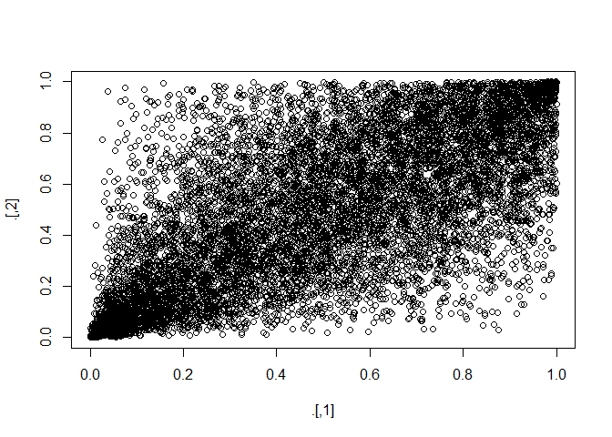
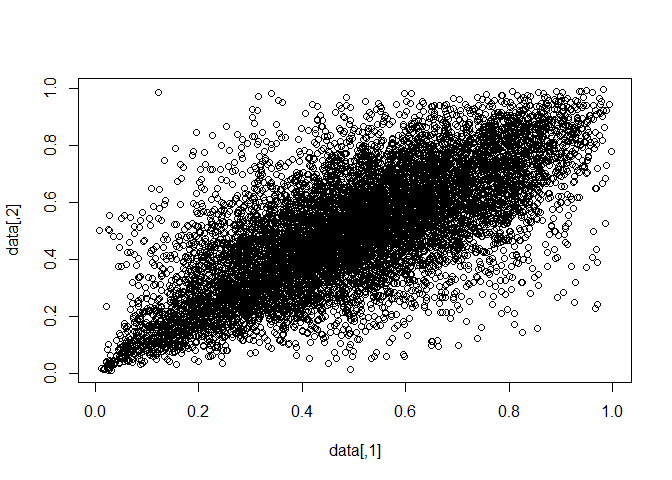
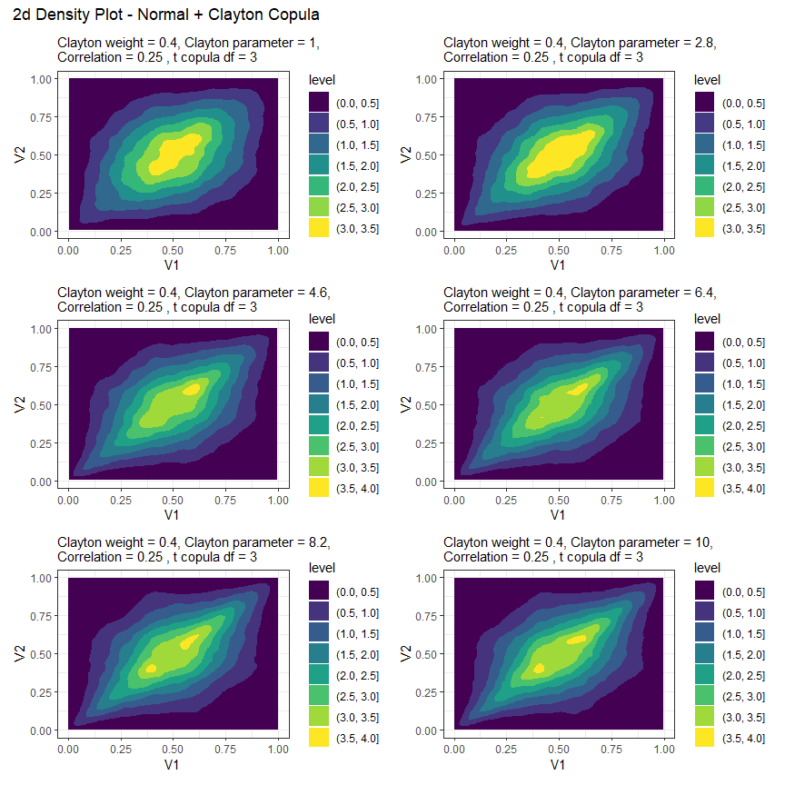
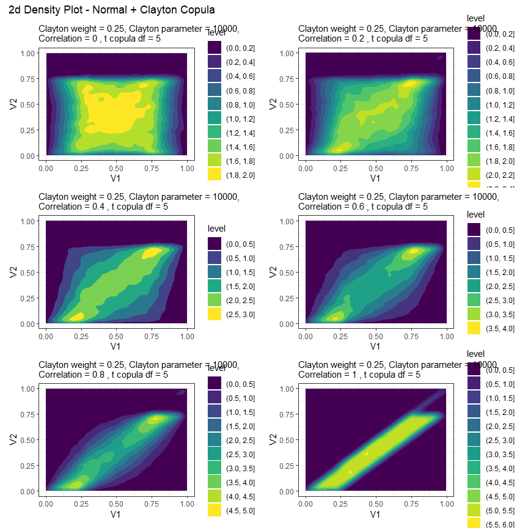
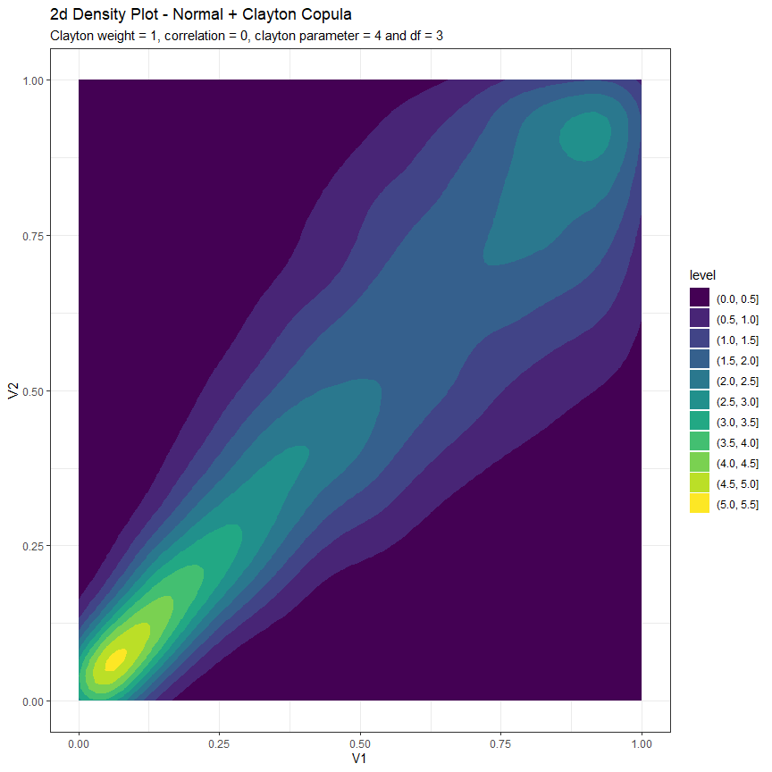

README
================

# INTRO

This is the README file for Nathan Potgieter’s financial econometrics
project.

The aim of this project is to develop a general and easy to use Monte
Carlo package, that generates financial data with the possibility of
extreme joint down movements, as observed during financial crisis.

``` r
library(pacman)
p_load(tidyverse)
```

# Generating Covarience matrix

In this section I developed a simple function that allows the user to
easily generate a covarience matrix with the desired cluster structure.
Note that the majority of the code was writen by Nico Katzke. The
function is located in the gcVar.R code file.

#### Question refering to this chunk of code

1.  How to I specify the function argument so that; if(Clusters ==
    “overlapping”) then Num,Clusters must be a vector of length 3?
    that way the user can specify the number of clusters in each layer.

2.  how would you suggest that I enable the user to specify in and out
    cluster correlation? What would the arhgument look like?

3.  Please give me some pointers on what you think I should change/add
    to this function

<!-- end list -->

``` r
#Co-Varience matrix generatimg function

gcVar <- function(N = 50, Clusters = c("none", "non-overlapping", "overlapping") , Num.Clusters = 10){
    
N <- N
Grps <- Num.Clusters
#set.seed(123)
    
if(Clusters == "none"){
    # Unclustered covariance matrix
    Sigma <- diag(N)
    for (i in 1:N) for (j in 1:N) Sigma[i,j] <- 0.9^abs(i-j)
    Sigma <- propagate::cor2cov(Sigma, runif(N, 1, 5))
    corr <- cov2cor(Sigma)
}

if(Clusters == "non-overlapping"){
    #----------------------
    # distinct non-overlapping clusters:
    #----------------------
    Sigma <- matrix(0.9, N, N)
    diag(Sigma) <- 1
    
    for (i in 1:Grps) {
      ix <- seq((i-1) * N / Grps + 1, i * N / Grps)
      Sigma[ix, -ix] <- 0.1
    }
    Sigma <- propagate::cor2cov(Sigma, runif(N, 1, 5))
    corr <- cov2cor(Sigma)
}

if(Clusters == "overlapping"){
    #----------------------
    # distinct overlapping clusters:
    #----------------------
    Sigma <- matrix(0.9, N, N)
    diag(Sigma) <- 1
    
    Grps <- 10  #Grps[1]
    for (i in 1:Grps) {
      ix <- seq((i-1) * N / Grps + 1, i * N / Grps)
      Sigma[ix, -ix] <- 0.6
    }
    
    Grps <- 5   #Grps[2]
    for (i in 1:Grps) {
      ix <- seq((i-1) * N / Grps + 1, i * N / Grps)
      Sigma[ix, -ix] <- 0.3
    }
    
    Grps <- 2   #Grps[3]
    for (i in 1:Grps) {
      ix <- seq((i-1) * N / Grps + 1, i * N / Grps)
      Sigma[ix, -ix] <- 0.1
    }
    
    Sigma <- propagate::cor2cov(Sigma, runif(N, 1, 5))
    corr <- cov2cor(Sigma)
}

return(corr)

}
```

``` r
gcVar(N = 50, Clusters = "none") %>% corrplot::corrplot()
```

``` r
gcVar(N = 50, Clusters = "non-overlapping", Num.Clusters = 2) %>% corrplot::corrplot()
```

``` r
gcVar(N = 50, Clusters = "overlapping") %>% corrplot::corrplot()
```

## GeneratingRrandom Draws with numerous Copula Functions

### Elliptal copulas

Elliptal copulas such as the Gaussian and the student t copulas, allow
us to specify a correlation matrix and then produce random draws of
uniformly distributed variable, that contain the correlation structure
and joint distribution specified by the copula. The chunk of code below
demonstrates this functionality.

Unfortunately, both Elliptal copulas are symmetric and cannot be
calibrated to exhibit increased co-movements within the tails of the
distribution. therefore, in the next section we examine some properties
of Archimedean copulas.

``` r
#loading copula package
p_load(copula)

#generating corr  matrix object
corr <- gcVar(N = 50, Clusters = "overlapping")

#generating copula objects   
Ncop <- ellipCopula(family = "normal", dispstr = "un", param = P2p(corr), dim = 50)
Tcop <- ellipCopula(family = "t", dispstr = "un", param = P2p(corr), dim = 50)

#generating 251 random draws for each of the N variables
set.seed(123)
rn <- rCopula(copula = Ncop, n = 251)
rt <- rCopula(copula = Tcop, n = 251)

#Checking if the correlation structure was maintained
# Origional corr
corr %>% corrplot::corrplot()
```

<!-- -->

``` r
# corr from random draws form norm and t copula
cor(rn) %>% corrplot::corrplot()
```

<!-- -->

``` r
cor(rt) %>% corrplot::corrplot()
```

<!-- -->

``` r
#Notice that the underlying correlation structure has been maintained for the most part
```

### Archimedean copulas

Archimedean copulas such as the clayton, frank, gumbel and joe exhibit
increased dependence at the tails of the multivariate distribution. In
this section we will examine the clayton, …. copulas due to them
exhibiting enhanced left-tail dependencies. We will also have a look at
the hybrid BB1-BB6 which in which exibit increased dynamic dependenies
in both tails.

``` r
# first look at at dim=2 to get understanding of what parameter tning does

#Clayton Copula
claycop <- archmCopula(family = "clayton", param = 1.5, dim = 2)
# rCopula(251, claycop)

#note how left tail dependence increases with the parameter
persp(archmCopula(family = "clayton", param = 1, dim = 2), dCopula, zlim = c(0, 10))
```

<!-- -->

``` r
persp(archmCopula(family = "clayton", param = 1.5, dim = 2), dCopula, zlim = c(0, 10))
```

<!-- -->

``` r
persp(archmCopula(family = "clayton", param = 2, dim = 2), dCopula, zlim = c(0, 10))
```

    ## Warning in persp.default(x = x., y = y., z = z.mat, zlim = zlim, xlab = xlab, :
    ## surface extends beyond the box

<!-- -->

``` r
#Note that the Gumbel and Joe copulas can be rotated 180 degrees to exibit greater left tail dependence
#Gumbel Copula
gumcop <- archmCopula(family = "gumbel", param = 1.5, dim = 2)
# rCopula(251, gumcop)

#note how right tail dependence > left tail dependence; tail dependence increase with the parameter value.
persp(archmCopula(family = "gumbel", param = 1, dim = 2), dCopula, zlim = c(0, 10))
```

    ## parameter at boundary ==> returning indepCopula()

<!-- -->

``` r
persp(archmCopula(family = "gumbel", param = 1.5, dim = 2), dCopula, zlim = c(0, 10))
```

<!-- -->

``` r
persp(archmCopula(family = "gumbel", param = 2.1, dim 


### Elliptal and Archimedean hybrid
= 2), dCopula, zlim = c(0, 10))
```

    ## Warning in persp.default(x = x., y = y., z = z.mat, zlim = zlim, xlab = xlab, :
    ## surface extends beyond the box

<!-- -->

``` r
#Joe copula
joecop <- archmCopula(family = "joe", param = 1.5, dim = 2)
# rCopula(251, joecop)

#note how right tail dependence > left tail dependence;tail dependence increase with the parameter value at rate < gumbel
persp(archmCopula(family = "joe", param = 1, dim = 2), dCopula, zlim = c(0, 10))
```

    ## parameter at boundary ==> returning indepCopula()

<!-- -->

``` r
persp(archmCopula(family = "joe", param = 1.5, dim = 2), dCopula, zlim = c(0, 10))
```

<!-- -->

``` r
persp(archmCopula(family = "joe", param = 2, dim = 2), dCopula, zlim = c(0, 10))
```

<!-- -->

``` r
#Rotated Joe
persp(rotCopula(archmCopula(family = "joe", param = 2, dim = 2)), dCopula, zlim = c(0, 10))
```

<!-- -->

``` r
#looking at some hybrid copulas
persp(copula::evCopula(family = "galambos", param = 1, dim = 2), dCopula, zlim = c(0, 10))
```

<!-- -->

``` r
persp(copula::evCopula(family = "galambos", param = 1.5, dim = 2), dCopula, zlim = c(0, 10))
```

    ## Warning in persp.default(x = x., y = y., z = z.mat, zlim = zlim, xlab = xlab, :
    ## surface extends beyond the box

<!-- -->

``` r
persp(copula::evCopula(family = "galambos", param = 2, dim = 2), dCopula, zlim = c(0, 10))
```

    ## Warning in persp.default(x = x., y = y., z = z.mat, zlim = zlim, xlab = xlab, :
    ## surface extends beyond the box

<!-- -->

# Looking at some hybrid copulas

Tawn’s (1988) Theorem: Shows that a copula is a convex set and every
convex combination of existing copula functions is again a copula. See
“Extreme Dependence Structures and the Cross-Section of Expected Stock
Returns” page 8 & 9.

``` r
#first lookat at situation when dim = 2

#Central distribution Copulas
Ncop <- ellipCopula(family = "normal", dispstr = "un", param = 0.8, dim = 2)
Tcop <- ellipCopula(family = "t", dispstr = "un", param = 0.8, dim = 2, df = 1)

#left tail copulas
claycop <- archmCopula(family = "clayton", param = 2, dim = 2)
gumcop <- rotCopula(archmCopula(family = "gumbel", param = 2, dim = 2))  #note that gumbel must be rotated 180degrees to exhibit LT dependence

rCopula(10000, gumcop) %>% plot()
```

<!-- -->

``` r
#looking at different combinations
set.seed(123)
w1=0.5  #tinker with weights and notice what happens; observed corr diminishes as we decrease w1
#Norm + Clayton
data <- (1-w1)*rCopula(10000, Ncop) + w1*rCopula(10000, claycop)
cor(data)
```

    ##           [,1]      [,2]
    ## [1,] 1.0000000 0.7290065
    ## [2,] 0.7290065 1.0000000

``` r
plot(data, type = "p")
```

<!-- -->

``` r
#T + Clayton; try adjusting the df to see what happens
data <- (1-w1)*rCopula(10000, Tcop) + w1*rCopula(10000, claycop)
cor(data)
```

    ##         [,1]    [,2]
    ## [1,] 1.00000 0.70571
    ## [2,] 0.70571 1.00000

``` r
plot(data, type = "p")
```

<!-- -->

``` r
#T + Gumbel; Gumbel cop exhibits more right-tail dependence than Clayton, therefre may be better to pair with Normcop
data <- (1-w1)*rCopula(10000, Tcop) + w1*rCopula(10000, gumcop)
cor(data)
```

    ##           [,1]      [,2]
    ## [1,] 1.0000000 0.7012212
    ## [2,] 0.7012212 1.0000000

``` r
plot(data, type = "p")
```

<!-- -->

``` r
#Norm + Gumbel
data <- (1-w1)*rCopula(10000, Ncop) + w1*rCopula(10000, gumcop)
cor(data)
```

    ##          [,1]     [,2]
    ## [1,] 1.000000 0.732939
    ## [2,] 0.732939 1.000000

``` r
plot(data, type = "p")
```

<!-- -->

``` r
#Results from the tcop + clayton cop seem to be the most promising
```

## Hybrid Clayton + t copulas

The function below generates random uniformly distributed numbers from a
hybrid t and clayton copula. Need to think about how to calibrate df and
claycop parameters

``` r
set.seed(123)
hycop <- function(Corr, left.cop.weight, N = 10, T = 251){
    Corr <- P2p(Corr)

#specifying  Copula's
    
Ecop <- ellipCopula(family = "t", dispstr = "un", df = 20, param = Corr, dim = N)
 
Acop <- archmCopula(family = "clayton", param = 10, dim = N)

data <- left.cop.weight*rCopula(T, Acop) + (1-left.cop.weight)*rCopula(T, Ecop)
return(data)
}

#generating Corr matrix
corr <- gcVar(N = 50, Clusters = "non-overlapping", Num.Clusters = 2)

#Testing where N=50 and left.cop.weight = 0; i.e. just t copula
data <- hycop(Corr = corr, left.cop.weight = 0 , N = 50, T = 10000)
data %>% plot() 
```

<!-- -->

``` r
#Testing where N=50 and left.cop.weight = 0.2
data <- hycop(Corr = corr, left.cop.weight = 0.2 , N = 50, T = 10000)
data %>% plot()   
```

<!-- -->

``` r
#Testing where N=50 and left.cop.weight = 0.4
data <- hycop(Corr = corr, left.cop.weight = 0.4 , N = 50, T = 10000)
data %>% plot()
```

<!-- -->

``` r
#Testing where N=50 and left.cop.weight = 0.6
data <- hycop(Corr = corr, left.cop.weight = 0.6 , N = 50, T = 10000)
data %>% plot() 
```

<!-- -->

``` r
#Testing where N=50 and left.cop.weight = 0.8
data <- hycop(Corr = corr, left.cop.weight = 0.8 , N = 50, T = 10000)
data %>% plot() 
```

<!-- -->

``` r
#Testing where N=50 and left.cop.weight = 1
data <- hycop(Corr = corr, left.cop.weight = 1 , N = 50, T = 10000)
data %>% plot() 
```

<!-- -->

In this chunk we convert the random numbers from uniform to t
distributed

``` r
#Setting seed, Generating corr matrix and random uniform numbers
p_load(moments)
set.seed(123)
corr <- gcVar(N = 50, Clusters = "overlapping", Num.Clusters = 2)
data <- hycop(Corr = corr, left.cop.weight = 0.5, N = 50, T = 10000)

#converting uniform marginals to t dist 
dat <- apply(data, 2, qt, df = 10)   #how do I adjust the df parameter within the apply???)

#note how the plots change when comparing variables from outside the clusters.
plot(dat[,1], dat[,4])
```

<!-- -->

``` r
plot(dat[,1], dat[,6])
```

<!-- -->

``` r
plot(dat[,1], dat[,11])
```

<!-- -->

``` r
plot(dat[,1], dat[,26])
```

<!-- -->

``` r
dat %>% cor() %>% corrplot::corrplot()
```

<!-- -->

``` r
dat[,1] %>% hist()
```

<!-- -->

``` r
apply(dat, 2, mean)
```

    ##  [1] -0.0017997153 -0.0013177571 -0.0017518292 -0.0041443770 -0.0013675255
    ##  [6] -0.0026603400 -0.0011132282 -0.0048625590 -0.0006787169 -0.0030851896
    ## [11] -0.0039686493 -0.0034991227 -0.0061898138 -0.0050539881 -0.0083264921
    ## [16]  0.0012476224 -0.0016586547 -0.0007336943  0.0003347628 -0.0021053200
    ## [21] -0.0006897918  0.0031128570 -0.0012529536 -0.0007781636 -0.0006180585
    ## [26]  0.0024416812  0.0018165957  0.0056340271 -0.0005148995  0.0003735155
    ## [31] -0.0063546461 -0.0047501597 -0.0069504920 -0.0046904594 -0.0044822955
    ## [36]  0.0008965576  0.0019877801  0.0022788512  0.0011098689  0.0015600445
    ## [41] -0.0016352368  0.0007200063 -0.0012961687 -0.0001506615 -0.0026265336
    ## [46]  0.0007378734  0.0006570931 -0.0005942452 -0.0003313163 -0.0008074728

``` r
apply(dat, 2, sd)
```

    ##  [1] 0.6354447 0.6367357 0.6352309 0.6379933 0.6412327 0.6310410 0.6338632
    ##  [8] 0.6303425 0.6367919 0.6391516 0.6436001 0.6491664 0.6441722 0.6482856
    ## [15] 0.6426683 0.6409742 0.6457081 0.6459812 0.6431898 0.6469907 0.6421435
    ## [22] 0.6448826 0.6400038 0.6409253 0.6419292 0.6410474 0.6392873 0.6414445
    ## [29] 0.6385534 0.6362870 0.6442661 0.6451947 0.6440976 0.6426686 0.6417147
    ## [36] 0.6481504 0.6435084 0.6463988 0.6426527 0.6473734 0.6428348 0.6402322
    ## [43] 0.6386785 0.6379461 0.6410118 0.6361576 0.6345458 0.6398863 0.6457018
    ## [50] 0.6374009

``` r
apply(dat, 2, kurtosis)
```

    ##  [1] 3.808095 3.907041 3.869944 3.870084 3.905264 3.823846 4.030112 3.809574
    ##  [9] 3.974558 3.959410 3.818293 3.815099 3.775206 3.783226 3.706024 3.627064
    ## [17] 3.772769 3.879903 3.736316 3.672130 3.884494 3.802365 3.667669 3.747729
    ## [25] 3.823734 3.843483 3.582017 3.681189 3.571262 3.749125 3.635778 3.940412
    ## [33] 3.662945 3.628263 3.743496 3.908228 3.896292 3.924605 3.807063 3.901105
    ## [41] 3.730179 3.763759 3.693036 3.669339 3.755470 3.794930 3.870078 3.956985
    ## [49] 3.903336 3.824295

``` r
qnorm(0.01)
```

    ## [1] -2.326348

``` r
qnorm(0.001)
```

    ## [1] -3.090232

``` r
qnorm(0.0001)
```

    ## [1] -3.719016

This chunk of code is intended to be used to test the speed of
computation

``` r
library(tictoc)
p_load(furrr)
set.seed(123)
#generating Corr matrix
corr <- gcVar(N = 50, Clusters = "non-overlapping", Num.Clusters = 2)

#rerunning hycop for each counterfactual
tic()
data <- map(1:1000, ~hycop(Corr = corr, left.cop.weight = 0 , N = 50, T = 251))
toc()
```

    ## 14.63 sec elapsed

``` r
tic()
data <- furrr::future_map(1:1000, ~hycop(Corr = corr, left.cop.weight = 0 , N = 50, T = 251))
toc()
```

    ## 14.62 sec elapsed
