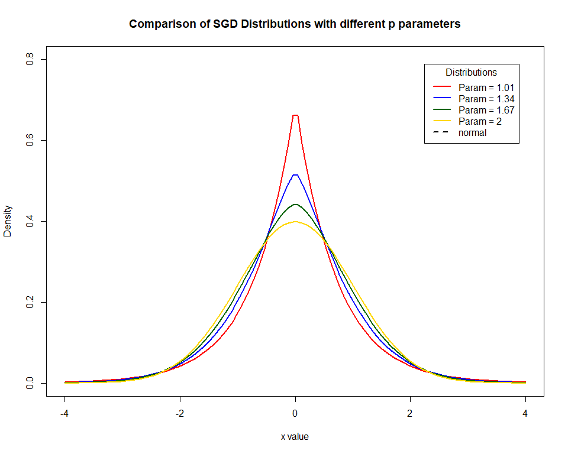
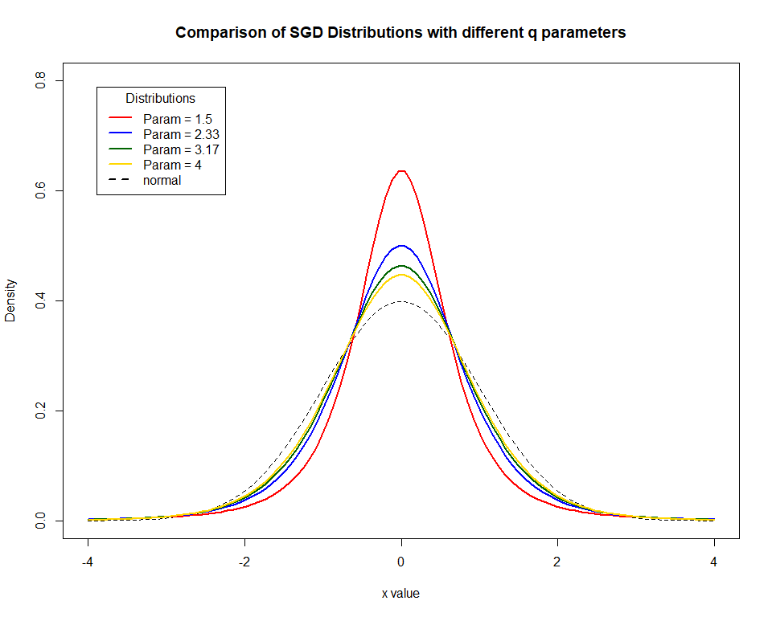
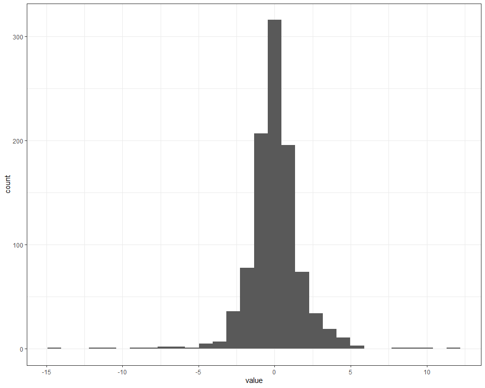
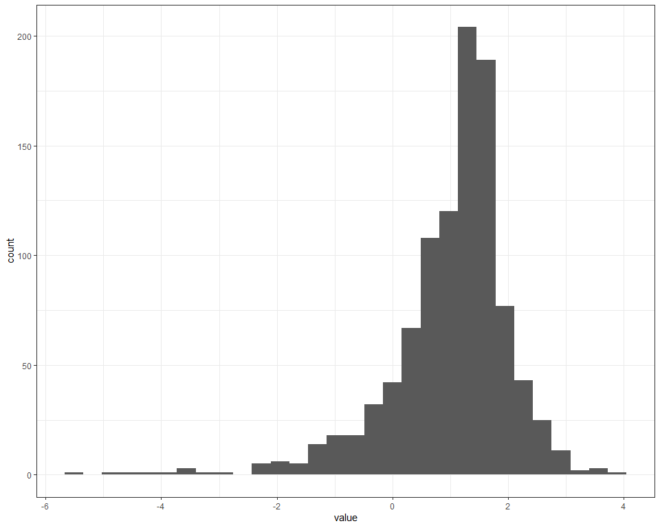
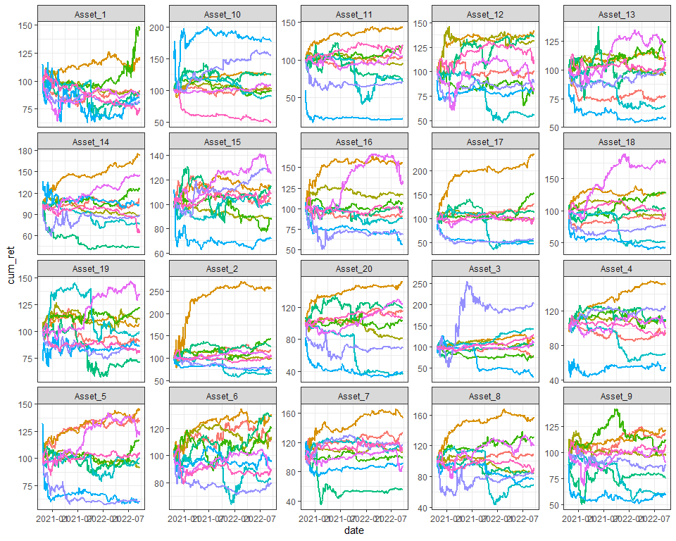

README
================

# Introduction

This is the README for Nathan Potgieter’s financial econometrics
project, in which a framework the Monte Carlo simulation of asset
markets is developed.

## Aim

The aim of this project is to develop a general and easy to use Monte
Carlo simulation package that generates asset return data, with a
prespecified correlation structure and dynamic dependencies. The is to
have the user be able to adjust a “leverage” parameter, which will
determine the likelihood of entering a “crisis period” characterized by
extreme joint drawdowns. Elliptical copulas are used to induce the
correlation in the simulated data, while Archmedian copulas are used to
adjust the likelihood of joint drawdowns.

The data will also be simulated to exhibit ARIMA(p,q) + APGARCH(q,p)
features, or volatility clustering, the parameters of which can be
adjusted to induce alternative risk characteristics. Various ARIMA(p,q)
+ APGARCH(q,p) structures can be called on to induce mean and variance
persistence.

## Monte Carlo Framework

The simulation routine for a single market involves the following steps:

1.  Draw a series of 252 random uniformly distributed numbers
    (corresponding to one trading year), across a set of 50 variables
    (or 50 assets), with a given correlation matrix, from a Euclidean
    copula (Gaussian or t-copula).

<!-- end list -->

  - This easily be done using the rcopula function.

<!-- end list -->

2.  Convert the uniformly distributed marginal distributions to
    something that more resembles the distribution of asset returns. For
    example I could convert them into normal, student-t or
    skewed-generalized t distributions.

<!-- end list -->

  - This is done the same way one would convert p-values into test
    statistics using the dnorm, dt and dsgt functions respectively.

<!-- end list -->

3.  The next step is to induce mean and variance persistence to the
    series, by plugging them into a ARIMA(p,q) + GARCH(q,p) equation as
    innovations.

<!-- end list -->

  - If the parameters are set accordingly the resulting series should
    resemble asset returns.

#### Loading Packages

``` r
library(pacman)
p_load(tidyverse, copula, fGarch, lubridate, forecast, bizdays, sgt, glue)
p_load(tbl2xts)
```

# Generating Covarience matrix

In this section I developed a simple function that allows the user to
easily generate a correlation matrix with a desired cluster structure.
This will be used as a key input when simulating our financial markets.
Note that the majority of the code was written by Nico Katzke. The
function is located in the gen\_corr.R code file.

### gen\_corr’s arguments

1.  N - is the number of assets in the universe

2.  Clusters - a character string specifying the type of cluster
    structure. Available options are “none”, for a correlation matrix
    with no clusters, “non-overlapping” for a correlation matrix with
    number one layer of clusters, and “overlapping” for a correlation
    matrix with Num\_Layers and Num\_clusters per layer.

3.  Num\_Clusters - if Clusters is equal to “non-overlapping” or “none”
    then Num\_Clusters is an integer value specifying the number of
    clusters. If Clusters = “overlapping” then Num\_Clusters must be a
    vector of length equal to Num\_Layers specifying the number of
    clusters per layer.

4.  Num\_Layers - an integer value between 1 and 4, specifying the
    number of cluster layers. Only needed of using “overlapping”
    clusters.

<!-- end list -->

``` r
#Co-Varience matrix generatimg function

gen_corr <- 
  function(N = 50, Clusters = c("none", "non-overlapping", "overlapping") , Num_Clusters = NULL, Num_Layers = NULL){
    
Grps <- Num_Clusters
#set.seed(123)
    
if(Clusters == "none"){
    # Unclustered covariance matrix
    Sigma <- diag(N)
    for (i in 1:N) for (j in 1:N) Sigma[i,j] <- 0.9^abs(i-j)
    Sigma <- propagate::cor2cov(Sigma, runif(N, 1, 5))
    corr <- cov2cor(Sigma)
} else

if(Clusters == "non-overlapping"){
    #----------------------
    # distinct non-overlapping clusters:
    #----------------------
    
    if(is.null(Num_Clusters)) stop("Please provide a valid Num_Clusters argument when using Overlapping clusters")
    
    
    Sigma <- matrix(0.9, N, N)
    diag(Sigma) <- 1

    
for (i in 1:Grps) {
      ix <- seq((i-1) * N / Grps + 1, i * N / Grps)
      Sigma[ix, -ix] <- 0.0001                       #think about
    }
    Sigma <- propagate::cor2cov(Sigma, runif(N, 1, 5))
    corr <- cov2cor(Sigma)
} else
  
if(Clusters == "overlapping"){
    #----------------------
    # distinct overlapping clusters:
    #----------------------
  
  if(is.null(Num_Layers)|Num_Layers<2){
      stop("Please provide a valid Num_Layers argument when using Overlapping clusters")
      }else
  if(length(Num_Clusters) != Num_Layers){
      stop("Please provide a Num_Clusters argument with length equal to Num_Layers")
  }
    
  
    Sigma <- matrix(0.9, N, N)
    diag(Sigma) <- 1

    for (i in 1:Grps[1]) {
      ix <- seq((i-1) * N / Grps[1] + 1, i * N / Grps[1])
      Sigma[ix, -ix] <- 0.7
    }
    if(Num_Layers>=2){
        for (i in 1:Grps[2]) {
          ix <- seq((i-1) * N / Grps[2] + 1, i * N / Grps[2])
          Sigma[ix, -ix] <- 0.5
        } }
    if(Num_Layers>=3){
        for (i in 1:Grps[3]) {
      ix <- seq((i-1) * N / Grps[3] + 1, i * N / Grps[3])
      Sigma[ix, -ix] <- 0.3
        } }
    if(Num_Layers>=4){
        for (i in 1:Grps[4]) {
      ix <- seq((i-1) * N / Grps[4] + 1, i * N / Grps[4])
      Sigma[ix, -ix] <- 0.15
        } } 
    }

    Sigma <- propagate::cor2cov(Sigma, runif(N, 1, 5))  #Is this necessary???
    corr <- cov2cor(Sigma)

return(corr)

  }
```

Demonstrating the use of gen\_corr

``` r
source("code/gen_corr.R")
gen_corr(N = 60, Clusters = "overlapping", Num_Layers = 4, Num_Clusters = c(10,5,3,2)) %>% ggcorrplot::ggcorrplot(title = "Overlapping Clusters", hc.order = TRUE)
```


## Generating a Dataset of Emperical Correlation Matrix’s

I now use S\&P500 data since 1/01/2000 to sample correlation matrices
that will be used to train CorrGAN at a later stage. The data set is
build to contain 3 classes of correlation matrices, defined as follows:

  - ‘stressed market’: A market is ‘stressed’ whenever the equi-weighted
    basket of stocks has a Sharpe below -0.5 over the year of study (252
    trading days).

  - ‘rally market’: A market is ‘rallying’ whenever the equi-weighted
    basket of stocks under has a Sharpe above 2 over the year of study
    (252 trading days).

  - ‘normal market’: A market is ‘normal’ whenever the equi-weighted
    basket of stocks under has a Sharpe in-between -0.5 and 2 over the
    year of study (252 trading days).

Note that this methodology is consistent with that used in
<https://marti.ai/qfin/2020/02/03/sp500-sharpe-vs-corrmats.html>.

  - See “code/SNP\_data.R” to see how the SNP\_data.Rda file was
    created.
  - See “code/get\_training\_data.R” to see how the training data sets
    were generated.

<!-- end list -->

``` r
load("data/labeled_training_data.Rda")

labeled_training_data$rally_market[[2]] %>% 
  ggcorrplot::ggcorrplot(title = "Rally Market", hc.order = TRUE)
```


``` r
labeled_training_data$normal_market[[2]] %>% 
  ggcorrplot::ggcorrplot(title = "Normal Market", hc.order = TRUE)
```


``` r
labeled_training_data$stressed_market[[2]] %>% 
  ggcorrplot::ggcorrplot(title = "Stressed Market", hc.order = TRUE)
```


## Generating Random Draws with Numerous Copula Functions

### Elliptal copulas

Elliptal copulas such as the Gaussian and the student t copulas, allow
us to specify a correlation matrix as a parameter. Doing so allows one
to produce random draws of uniformly distributed variables, that contain
the correlation structure and joint distribution specified by the
copula. The chunk of code below demonstrates this functionality.

Unfortunately, both Elliptal copulas cannot be calibrated to exhibit
increased co-movements within the tails of the distribution. Therefore,
in the next section we examine some properties of Archimedean copulas.

``` r
#loading copula package
pacman::p_load(copula)

#generating corr  matrix object
corr <- gen_corr(N = 50, Clusters = "overlapping", Num_Layers = 3, Num_Clusters = c(10, 5, 2))

#generating copula objects   
Ncop <- ellipCopula(family = "normal", dispstr = "un", param = P2p(corr), dim = 50)
Tcop <- ellipCopula(family = "t", dispstr = "un", param = P2p(corr), dim = 50)

#generating 252 random draws for each of the N variables
set.seed(123)
rn <- rCopula(copula = Ncop, n = 252)
rt <- rCopula(copula = Tcop, n = 252)

#Checking if the correlation structure was maintained
p_load(patchwork)
# Original corr
p1 <- ggcorrplot::ggcorrplot(corr, hc.order = TRUE) + 
  labs(title = "Input Correlation Matrix") +
  scale_x_discrete(labels = NULL) + scale_y_discrete(labels = NULL) +
  theme(legend.position = "bottom")
# corr from random draws form norm and t copula
p2 <- fitHeavyTail::fit_mvt(rn) %>% .$cov %>% cov2cor() %>% 
  ggcorrplot::ggcorrplot(hc.order = TRUE) + 
  labs(subtitle = "Normal Copula") +
  scale_x_discrete(labels = NULL) + scale_y_discrete(labels = NULL) +
  theme(legend.position = "none")

p3 <- fitHeavyTail::fit_mvt(rt) %>% .$cov %>% cov2cor() %>% 
  ggcorrplot::ggcorrplot(hc.order = TRUE) + 
  labs(subtitle = "T-Copula") +
  scale_x_discrete(labels = NULL) + scale_y_discrete(labels = NULL) +
  theme(legend.position = "none")

rn %>% as_tibble()
```

    ## # A tibble: 252 x 50
    ##        V1    V2    V3    V4     V5    V6     V7     V8    V9   V10   V11   V12
    ##     <dbl> <dbl> <dbl> <dbl>  <dbl> <dbl>  <dbl>  <dbl> <dbl> <dbl> <dbl> <dbl>
    ##  1 0.542  0.584 0.781 0.620 0.627  0.743 0.601  0.386  0.457 0.487 0.837 0.761
    ##  2 0.763  0.734 0.733 0.857 0.713  0.853 0.532  0.775  0.729 0.739 0.508 0.397
    ##  3 0.0967 0.160 0.124 0.118 0.0843 0.139 0.0937 0.0551 0.117 0.218 0.158 0.264
    ##  4 0.724  0.722 0.674 0.511 0.621  0.587 0.687  0.576  0.732 0.576 0.859 0.659
    ##  5 0.957  0.925 0.826 0.884 0.814  0.633 0.595  0.618  0.844 0.682 0.389 0.404
    ##  6 0.544  0.521 0.548 0.602 0.769  0.555 0.695  0.643  0.552 0.375 0.747 0.750
    ##  7 0.124  0.122 0.110 0.104 0.143  0.505 0.233  0.490  0.617 0.710 0.707 0.646
    ##  8 0.396  0.112 0.236 0.292 0.193  0.484 0.494  0.438  0.178 0.748 0.743 0.822
    ##  9 0.239  0.146 0.188 0.244 0.318  0.105 0.200  0.311  0.183 0.255 0.504 0.475
    ## 10 0.951  0.937 0.910 0.923 0.932  0.269 0.718  0.529  0.618 0.553 0.861 0.757
    ## # ... with 242 more rows, and 38 more variables: V13 <dbl>, V14 <dbl>,
    ## #   V15 <dbl>, V16 <dbl>, V17 <dbl>, V18 <dbl>, V19 <dbl>, V20 <dbl>,
    ## #   V21 <dbl>, V22 <dbl>, V23 <dbl>, V24 <dbl>, V25 <dbl>, V26 <dbl>,
    ## #   V27 <dbl>, V28 <dbl>, V29 <dbl>, V30 <dbl>, V31 <dbl>, V32 <dbl>,
    ## #   V33 <dbl>, V34 <dbl>, V35 <dbl>, V36 <dbl>, V37 <dbl>, V38 <dbl>,
    ## #   V39 <dbl>, V40 <dbl>, V41 <dbl>, V42 <dbl>, V43 <dbl>, V44 <dbl>,
    ## #   V45 <dbl>, V46 <dbl>, V47 <dbl>, V48 <dbl>, V49 <dbl>, V50 <dbl>

``` r
p1
```


``` r
#Notice that the underlying correlation structure has, for the most part, been maintained.
# Some Noise has been introduced
(p2+p3) + plot_annotation(title = "Output Correlation Matrices") +
  plot_layout(guides='collect') &
  theme(legend.position='bottom')  
```


### Archimedean copulas

Archimedean copulas such as the clayton, frank, gumbel and joe exhibit
increased dependence at the tails of the multivariate distribution. In
this section we will examine the clayton, …. copulas due to them
exhibiting enhanced left-tail dependencies. We will also have a look at
the hybrid BB1-BB6 which in which exhibit increased dynamic dependencies
in both tails.

# Generating 2D Hybrid Copulas

Tawn’s (1988) Theorem: Shows that a copula is a convex set and every
convex combination of existing copula functions is again a copula. See
“Extreme Dependence Structures and the Cross-Section of Expected Stock
Returns” page 8 & 9.

Some 2D hybrid copulas are plotted bellow.

   

# Looking at options for marginal distributions

After investigating numerous possible marginal distributions, I have
settles on the Skewed generalized t distribution as it allows for the
most flexibility.

## The skewed generalizd t distribution with different parameters



## Calibrating the SGT with architypal low, med and high risk assets

We now look at data on each share in the S\&P500 over the last 90
months. The shares with the top 5% highest annualized SD’s are used to
model an archetypal high risk asset, shares with the 5% lowest
annualized SD’s are used to model an archetypal low risk asset, while
shares with SD between the 45th and 55th percentile are used to model
the medium risk asset. - See “code/SNP\_data.R” to see how the
SNP\_data.Rda file was created.

``` r
load("data/SNP_returns.Rda")

high_vol <-
  SNP_returns %>% 
  dplyr::filter(date==last(date)) %>% 
  arrange(desc(sd)) %>% 
  group_by(date) %>% 
  slice_max(., order_by = sd, prop = 0.05 ) %>%  #select top 10% SD's
  pull(symbol)

low_vol <-
  SNP_returns %>% 
  dplyr::filter(date==last(date)) %>% 
  arrange(sd) %>% 
  slice_min(., order_by = sd, prop = 0.05) %>% #select bot 10% SD's
  pull(symbol)

medium_vol <-
  SNP_returns %>% 
  dplyr::filter(date==last(date)) %>% 
  arrange(sd) %>% 
  group_by(date) %>% 
  dplyr::filter(sd>=quantile(sd, probs = 0.45, na.rm = T) &
                  sd<=quantile(sd, probs = 0.55, na.rm = T)) %>% 
  pull(symbol)
```

# Plotting low, medium and high risk returns.

    ## Coordinate system already present. Adding new coordinate system, which will replace the existing one.


### Estimating SGT

  - See “code/filter\_resid.R” to see how filtered residuals (garch.Rda)
    was obtained.
  - See “code/estimate\_sgt.R” to see how the parameters of the sgt were
    estimated.

<!-- end list -->

``` r
load("data/garch.Rda")

estimate_sgt <- function(df, start = NULL){
  x <- df[[1]]
  X.f <- X ~ x
  if(is.null(start)) start <- list(mu = 0, sigma = 0.03, lambda = -0.02, p = 1.5, q = 2.25)
  result <- sgt.mle(X.f = X.f, start = start, finalHessian = "BHHH")
  summary(result)
}

# High Vol stocks
df <- resid_high_vol %>% 
  dplyr::mutate(date = unique(SNP_returns$date)) %>% 
  gather(symbol, return, -date) %>% 
  dplyr::filter(date>first(date)) %>% 
  select(return)

#start <- list(mu = -0.0001957195, sigma = 0.04217965, lambda = -0.0062424590, p= 1.452239, q = 2.058042)
 # sgt_high_vol <- estimate_sgt(df, start = start)
 # save(sgt_high_vol, file = "data/sgt_high_vol.Rda")
load(file = "data/sgt_high_vol.Rda")

# Low Vol stocks
df <- resid_low_vol %>% 
  mutate(date = unique(SNP_returns$date)) %>% 
  gather(symbol, return, -date) %>% 
  dplyr::filter(date>first(date)) %>% 
  select(return)

 # sgt_low_vol <- estimate_sgt(df)
 # save(sgt_low_vol, file = "data/sgt_low_vol.Rda")
load(file = "data/sgt_low_vol.Rda")


#Medium Vol stocks
df <- resid_medium_vol %>% 
  mutate(date = unique(SNP_returns$date)) %>% 
  gather(symbol, return, -date) %>% 
  dplyr::filter(date>first(date)) %>% 
  select(return)

 # sgt_medium_vol <- estimate_sgt(df)
 # save(sgt_medium_vol, file = "data/sgt_medium_vol.Rda")
load(file = "data/sgt_medium_vol.Rda")
```


# Simulating Innovations

### sim\_inno

The function below generates randomly distributed numbers from a hybrid
t and clayton copula. Need to think about how to calibrate df and
claycop parameters.

Arguments

  - Corr this is a correlation matrix uses as the parameter for the
    elliptical copula
  - elliptal\_copula family name of elliptal copula. Default is to use
    “t”, but “norm” is also accepted
  - df\_ellip a positive integer specifying the degrees of freedom for
    the student t elliptic copula. Only required when using
    elliptal\_copula = “t”.
  - left\_cop\_param a positive integer specifying the parameter of the
    **Clayton** copula.
  - left\_cop\_weight a value between 0 and 1 corresponding to the
    weight assigned to the left copula, when generating random draws
    from a hybrid copula.
  - marginal\_dist a character string specifying the marginal
    distribution of the simulated data. Must be “norm” or “t”, with the
    default generating uniformly distributed marginals.
  - df\_marginal\_dist a positive integer specifying the degrees of
    freedom parameter of the “t” distributed marginals.

<!-- end list -->

``` r
sim_inno <- function(corr,
                  elliptal_copula = c("norm", "t"), 
                  df_ellip = NULL, 
                  left_cop_param = 5,
                  left_cop_weight = 0,
                  T = 251, 
                  marginal_dist = NULL,
                  marginal_dist_model = NULL,
                  sd_md = NULL){
  
  N <- nrow(corr)
  T <- T + 5
  Cor <- P2p(corr)

#specifying  Copula's
#elliptal
  if(elliptal_copula == "t"){
    
    if(is.null(df_ellip))stop('Please supply a valid degrees of freedom parameter when using elliptal_copula = "t". ')
    Ecop <- ellipCopula(family = elliptal_copula, dispstr = "un", df = df_ellip, param = Cor, dim = N)
    
    }else
      if(elliptal_copula == "norm"){
        
        Ecop <- ellipCopula(family = "norm", dispstr = "un", param = Cor, dim = N)
      
    }else
      stop("Please supply a valid argument for elliptal_copula")

#left-cop
  Acop <- archmCopula(family = "clayton", param = left_cop_param, dim = N)
  
  
#generating random uniformly distributed data
  if(left_cop_weight<0|left_cop_weight>1)stop("Please provide a valid left_cop_weight between 0 and 1")   
  
  if(left_cop_weight==0){
   data <- rCopula(T, Ecop)
 }else
   if(left_cop_weight==1){
   data <- rCopula(T, Acop)
 }else
    data <- left_cop_weight*rCopula(T, Acop) + (1-left_cop_weight)*rCopula(T, Ecop)


#Converting Uniform marginal distributions to norm or sgt. 
 if(marginal_dist=="norm"){
            
             if(is.null(sd_md))stop('Please supply a valid sd_md parameter when using marginal_dist="norm".')
             data <- apply(data, 2, qnorm, sd = sd_md)
            
            }else
              if(marginal_dist=="sgt"){
                
                if(is.null(marginal_dist_model))stop('Please supply a valid marginal_dist_model when using marginal_dist="sgt".')
                
                   lambda <- marginal_dist_model$lambda
                   p <- marginal_dist_model$p
                   q <- marginal_dist_model$q
                  
                   data <- apply(data, 2, qsgt, sigma = 1, lambda = lambda, p = p, q = q)
                  
              }
              
              return(data)
            
}
```

### Testing sim\_inno

``` r
source("code/sim_inno.R")
source("code/gen_corr.R")
set.seed(123)

Corr <- gen_corr(N = 50, Clusters = "overlapping", Num_Layers = 3, Num_Clusters = c(10,5,2))

#Using marginal_dist="std"
sgt_pars <- list(mu = 0.0001715299, sigma = 0.01850809, lambda = -0.08140381, p = 1.880649, q = 1.621578)
data <- sim_inno(corr = Corr, 
         elliptal_copula = "t",
         df_ellip = 4,
         left_cop_param = 10,
         left_cop_weight = 0,
         marginal_dist = "sgt",
         marginal_dist_model = sgt_pars,
         T = 10000)
colnames(data) <- glue::glue("V{1:ncol(data)}")
data <- as_tibble(data)

#Note how the correlation matrix has been maintained
data %>% fitHeavyTail::fit_mvt() %>% .$cov %>% cov2cor() %>% ggcorrplot::ggcorrplot()
```


``` r
#and how the distribution change when moving to variables outside the specified risk cluster

plot_2d_density <- function(x, y, title, subtitle, xlab = NULL, ylab = NULL, lim = c(-2,2)){
  data %>% ggplot(aes(x=x, y=y)) +
   geom_point(alpha = 0.3) +
    geom_density_2d_filled(alpha = 0.7) +
  coord_cartesian(xlim = lim, ylim = lim) +
    theme_bw() +
    ggtitle(title, subtitle) +
    xlab(xlab) +
    ylab(ylab)
}

plot_2d_density(x = data$V1, y = data$V2, 
                title = "2d Density plot of SGT Innovations", subtitle = "within first cluster", 
                xlab = "V1", ylab = "V2")
```


``` r
plot_2d_density(x = data$V1, y = data$V6, 
                title = "2d Density plot of SGT Innovations", subtitle = "within seconed cluster", 
                xlab = "V1", ylab = "V6")
```



``` r
plot_2d_density(x = data$V1, y = data$V11, 
                title = "2d Density plot of SGT Innovations", subtitle = "outside cluster", 
                xlab = "V1", ylab = "V11")
```



# Introducing Volitility Persistence

The simulated innovations do not yet demonstrate the mean and/or
volatility persistence observed in real asset return series, hence why I
refer to them as innovations.

``` r
p1 <- ggAcf(data$V1) + theme_bw() + labs(title = "ACF of Innovations")
p2 <- ggAcf(data$V1^2) + theme_bw() + labs(title = "ACF of Squared Innovations")
p <- p1 / p2 
p + plot_annotation(title = "No Significant Persistence in Mean or Volatility")
```


In this step I introduce autocorrelation and volatility using an AR(p,q)
+ APGARCH(q,p) model.

  - “The leptokurtosis, clustering volatility and leverage effects
    characteristics of financial time series justifies the GARCH
    modeling approach. The non-linear characteristic of the time series
    is used to check the Brownian motion and investigate into the
    temporal evolutionary patterns. The nonlinear methods of forecasting
    and signal analysis are gaining popularity in stock market because
    of their robustness in feature extraction and classification.”
    <https://towardsdatascience.com/garch-processes-monte-carlo-simulations-for-analytical-forecast-27edf77b2787>

My go at writing a GARCHSIM function, much of the code was borrowed from
fGarch’s garchspec and garchsim functions.

``` r
sim_garch <- function(model= list(), innovations, simple = TRUE){
  
  #default parameters for garch model  
    default <- list(omega = 1e-06, 
                   alpha = 0.1,
                   gamma = NULL, 
                   beta = 0.8, 
                   mu = 0,   #changed form NULL to 0
                   ar = NULL, 
                   ma = NULL, 
                   delta = 2)
    
    default[names(model)] <- model
    model <- default   
    
  #obtaining parameters and lag orders from model object
    mu <- model$mu 
    ar <- model$ar
    ma <- model$ma
    omega <-  model$omega
    alpha <- model$alpha
    gamma <- model$gamma
    beta <- model$beta
    delta <- model$delta
    deltainv <- 1/delta
    order.ar <- length(ar)
    order.ma <- length(ma)
    order.alpha <- length(alpha)
    order.beta <- length(beta)
    max.order <- max(order.ar, order.ma, order.alpha, order.beta)
    n <- length(innovations) - 5
    
   if(max.order>5)stop("Please supply a volitility model with max order less than or equal to 5")
    
  #Generating innovations
    z_length <- n + max.order
    z <- c(innovations)[1:z_length]  #must change this later
    
    h <- c(rep(model$omega/(1 - sum(model$alpha) - sum(model$beta)), 
            times = max.order), rep(NA, n))    #sd's
    
    y <- c(rep(model$mu/(1 - sum(model$ar)), times = max.order), rep(NA, n))  #garch simulations
    m <- max.order
    
    #simulating GARCH  
    eps <- h^deltainv * z  #this part often breaks depending on GARCH parameters chosen
    
    for (i in (m + 1):(n + m)) {
        h[i] = omega + sum(alpha * (abs(eps[i - (1:order.alpha)]) - 
            gamma * (eps[i - (1:order.alpha)]))^delta) + 
          sum(beta * h[i - (1:order.beta)])  
        
        eps[i] = h[i]^deltainv * z[i]
        y[i] = mu + sum(ar * y[i - (1:order.ar)]) + sum(ma * 
            eps[i - (1:order.ma)]) + eps[i]
    }
    
    data <- cbind(z = z[(m + 1):(n + m)], 
                  sigma = h[(m + 1):(n + m)]^deltainv, 
                  y = y[(m + 1):(n + m)])
    
    rownames(data) <- as.character(1:n)  # may want to change to dates
    colnames(data) <- glue::glue("Asset:{1:ncol(data)}")
    data <- data[-(1:m), ]   #removes burn in data
    
    
    if(simple == TRUE){
      data[,3]
      }else data
  
}
```

## Demonstrating sim\_garch

Not sure if sim\_garch is working correctly.

``` r
source("code/sim_inno.R")
load("data/garch.Rda")
set.seed(123)

inno <- sgt::rsgt(n = 10000, lambda = -0.0143, p = 1.6650, q = 1.9095)
#Parameters from Statistics and Data Analysis for Financial Engineering pg.421-423
model <- list(mu = 0.000002,        
              omega = 0.000005, #key unconditional volatility parameter
              alpha = 0.098839, 
              beta = 0.899506, 
              ar = 0.063666,
              ma = NULL,
              gamma = 0.12194,
              delta = 1.85)

return <- sim_garch(model, inno)

p_load(patchwork)
p1 <- inno %>% as_tibble() %>% ggplot(aes(x=1:length(inno), y=value)) +
  geom_line() + theme_bw() + labs(subtitle = "Random Draws From SGT Distribution", x = "", y = "Innovations")

p2 <- return %>% as_tibble() %>% ggplot(aes(x=1:length(return), y=value)) +
  geom_line() + theme_bw() + labs(subtitle = "Same Random Draws After sim_garch", x = "", y = "Returns")
  
p1/p2 + plot_annotation(title = "SGT Innovations vs APGARCH Returns")
```


``` r
p1 <- ggAcf(inno^2)+ theme_bw()+ labs(title = "ACF of Squared Innovations")
p2 <- ggAcf(return^2) + theme_bw() + labs(title = "ACF of Squared Returns")
p1/p2
```


# Simulating an asset market

``` r
source("code/gen_corr.R")
source("code/sim_inno.R")

set.seed(123)

#toy corr matrix
#corr <- gen_corr(N = 20, Clusters = "none", Num_Layers = 3, Num_Clusters = c(2,4,5))   

#Emperical Corr matrix
load("data/labeled_training_data.Rda")
set.seed(1234)
corr <- labeled_training_data$stressed_market[[1]]
dim <- sample(1:nrow(corr), size = 20)
corr <- corr[dim,dim]

#corr <- matrix(data = rep(0.5, 4), nrow = 2); diag(corr) <- 1

sgt_pars <- list(sigma = 1, lambda = -0.04140381, p = 1.880649, q = 1.621578)
inno <- sim_inno(corr = corr, 
         elliptal_copula = "t",
         df_ellip = 4,
         left_cop_param = 2,
         left_cop_weight = 0.01,
         marginal_dist = "sgt",
         marginal_dist_model = sgt_pars,
         T = 500)

colnames(inno) <- glue::glue("Asset_{1:ncol(inno)}") #move to sim_inno
#inno  %>% cor() %>% corrplot::corrplot()

rinno <- suppressMessages(
  1:ncol(inno) %>% map(~rev(inno[,.])) %>% reduce(bind_cols)
  )
colnames(rinno) <- glue::glue("Asset_{1:ncol(inno)}")

#getting empirical parameters
load("data/coef.Rda")
model <- 2:ncol(coef) %>% map(~mean(coef[[.]])) 
names(model) <- colnames(coef)[-1]

#Parameters from Statistics and Data Analysis for Financial Engineering pg.421-423
model <- list(mu = 0.000002,        
              omega = 0.000005, #key unconditional volatility parameter
              alpha = 0.098839, 
              beta = 0.899506, 
              ar = 0.063666,
              ma = NULL,
              gamma = 0.12194,
              delta = 1.85)


#Making Simdat tidy
simdat <- suppressMessages(
  1:ncol(inno) %>% map(~sim_garch(model, inno[,.x])) %>% reduce(bind_cols)
  )
colnames(simdat) <- glue::glue('Asset_{1:ncol(simdat)}')

tidy_simdat <- simdat %>%  mutate(date = 1:nrow(simdat)) %>% 
  gather(key = Asset, value = Return, -date)

#Correlation matrix of GARCH sim data
#simdat %>% spread(key = Asset, value = Return) %>% select(-date) %>% cor() %>% corrplot::corrplot()

#generating and plotting Cum returns
tidy_simdat %>%  
  arrange(date) %>% 
  group_by(Asset) %>%
  mutate(Cum_Return = cumprod(1 + Return)) %>%
  ggplot() + geom_line(aes(x=date, y=Cum_Return, color = Asset)) +
  facet_wrap(~Asset, scales = "free_y") +
  theme_bw() +
  theme(legend.position = "none") 
```


``` r
tidy_simdat %>% ggplot() +
  geom_line(aes(x=date,y=Return, color = Asset)) +
  facet_wrap(~Asset, scales = "free_y") +
  theme_bw() +
  theme(legend.position = "none")
```


## Simulating an ensemble of asset markets: Prototype

``` r
source("code/gen_corr.R")
source("code/sim_inno.R")
Sim.Asset.Market <- function(corr, T = 500, model = list()){    #note that length out is 499 not 500,  
                                                                #look at garchsim to fix
  
                            sgt_pars <- list(mu = 0.0001715299, sigma = 1, 
                                             lambda = -0.04140381, p = 1.880649, q = 1.621578)
                            inno <- sim_inno(corr = corr, 
                                     elliptal_copula = "t",
                                     df_ellip = 4,
                                     left_cop_param = 4,
                                     left_cop_weight = 0,
                                     marginal_dist = "sgt",
                                     marginal_dist_model = sgt_pars,
                                     T = T)
                            
                            #Applying sim_garch to each column in simdat
                            simdat <- suppressMessages(
                              1:ncol(inno) %>% map(~sim_garch(model, inno[,.x])) %>% reduce(bind_cols) )
                              
                            # Naming Each coloumn
                            colnames(simdat) <- glue::glue('Asset_{1:ncol(simdat)}')
                            
                            #adding a date column
                            bizdays::create.calendar(name = "weekdays", weekdays = c("saturday", "sunday"))
                            start_date <- Sys.Date()
                            end_date <- bizdays::offset(start_date, nrow(simdat), "weekdays")
                            weekdays <- rmsfuns::dateconverter(start_date, end_date, "weekdays")[1:nrow(simdat)]
                            
                            
                            simdat <- simdat %>% mutate(date = weekdays, .before = `Asset_1`) %>% 
                              gather(key=Asset, value = Return, -date)
                            
                        return(simdat)
}
```

Now lets use the function above to run our first MC simulation.

``` r
#Emperical Corr matrix
load("data/labeled_training_data.Rda")

set.seed(1234)
corr <- labeled_training_data$stressed_market[[1]]
dim <- sample(1:nrow(corr), size = 20)
corr <- corr[dim,dim]
ggcorrplot::ggcorrplot(corr, hc.order = TRUE)
```


``` r
#Parameters from Statistics and Data Analysis for Financial Engineering pg.421-423
model <- list(mu = 0,        
              omega = 0.0000025, #key unconditional volatility parameter
              alpha = 0.098839, 
              beta = 0.899506, 
              ar = 0.063666,
              ma = NULL,
              gamma = 0.12194,
              delta = 1.85)

#Is there a better way to name cols? i.e before we reduce?
mc.data <- suppressMessages(
1:10 %>% map(~Sim.Asset.Market(corr, T = 500, model)) %>% reduce(left_join, by = c("date","Asset"))
)
colnames(mc.data) <- c("date", "Asset", glue::glue("Universe_{1:(ncol(mc.data)-2)}"))

#This is how I want my final output to look. 
mc.data <- mc.data %>% gather(Universe, Return, c(-date,-Asset))

mc.data %>% 
  group_by(Asset, Universe) %>% 
  arrange(date) %>% 
  mutate(cum_ret = cumprod(1 + Return)*100) %>% 
  ggplot() +
  geom_line(aes(x = date, y = cum_ret, color = Universe), size = 1) + 
  facet_wrap(~Asset, scales = "free_y") + 
  theme_bw()+
  theme(legend.position = "none") 
```


