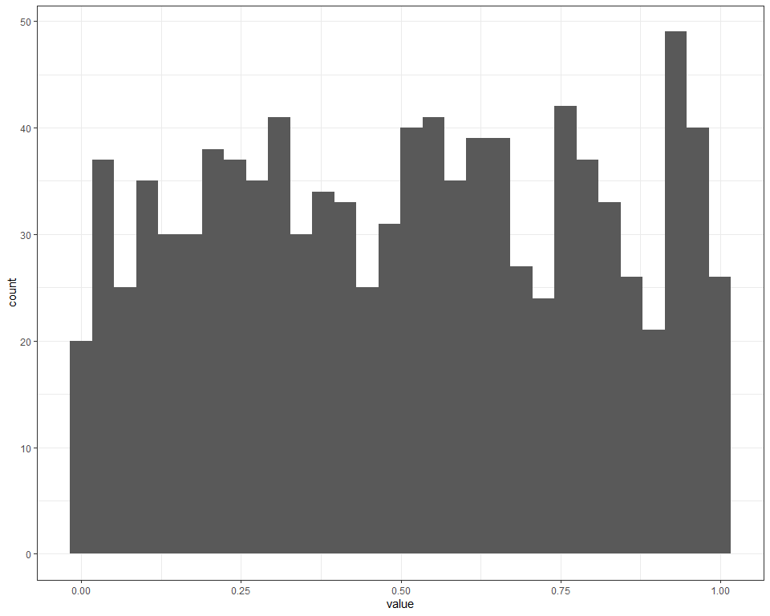
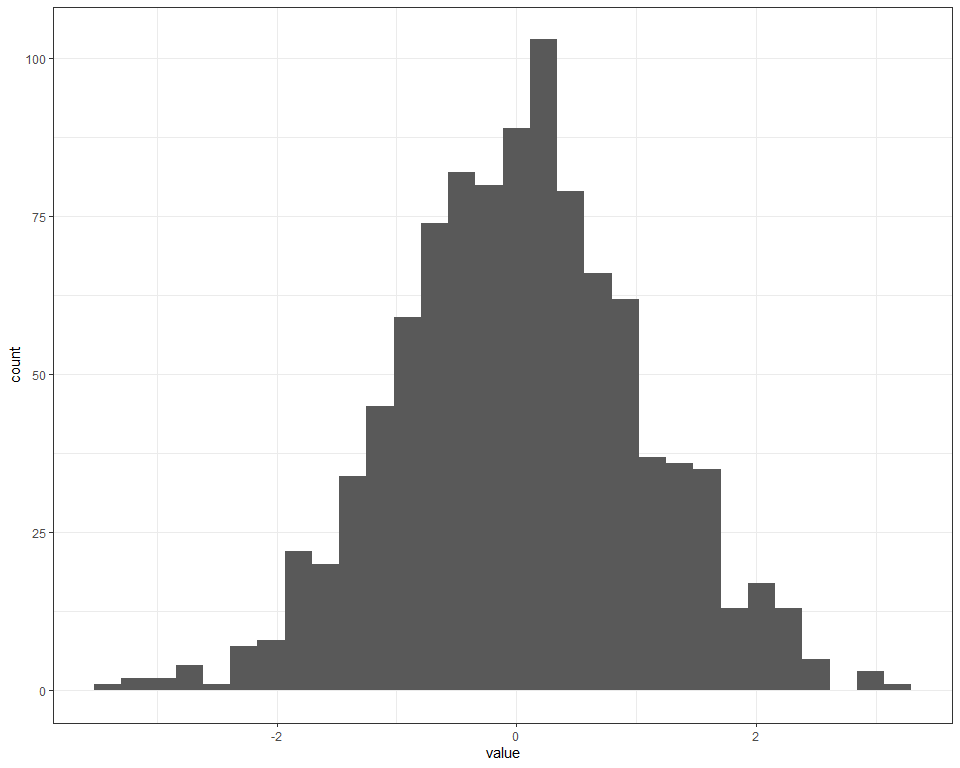

README
================

# MCmarket an R Package Designed for Simulating Asset Market Returns

This is the README for Nathan Potgieter’s financial econometrics
project. This work sets out and packages a framework for the Monte Carlo
simulation of asset markets. The package will be available in on githib
under the “Nathan-Potgieter/MCmarket” repository.

## Aim

The aim of this project is to develop a general and easy to use Monte
Carlo simulation package designed to generate asset return data, with a
prespecified correlation structure and dynamic correlations. Here
dynamic correlations refer to a property of a multivariate distribution
where average correlations/dependencies increase within the left-tail.
Ideally the user will be able to adjust a “leverage” parameter, which
will determine the markets left-tail dependency, and in turn effect the
likelihood of entering a “crisis period” characterized by extreme joint
drawdowns.

Elliptical copulas are used to specify the correlation structure in the
simulated data and the Archmedian Clayton copula is used induce greater
left-tail dependencies.

The data will also be simulated to posses volatility persistence, this
way the simulated data can exhbit volatility clusters. This is
accomplished by utilizing various ARMA(1,1) + APARCH(1,1) models, the
parameters of which can be adjusted to induce alternative risk
characteristics. Since APARCH nests at least 7 other volatility models,
the user effectively has a wide range of volatility models from which to
choose.

## Monte Carlo Framework

The Monte Carlo simulation routine involves the following steps:

This example generates k periods of returns, for D Assets across N
markets.

1.  Draw a series of k random uniformly distributed numbers
    (corresponding to k trading periods), across a set of D variables
    (or D assets), from a multivariate distribution with a given
    correlation matrix.
      - This is accomplished using Euclidean (Gaussian or t-copula) and
        the Archmediean Clayton copula’s and can easily be done using
        the *ellipCopula*, *archmCopula* and *rcopula* functions from
        the *copula* package.
2.  Convert the uniformly distributed data into something that more
    resembles the distribution of asset returns. Functionality is
    provided to convert them into normal, student-t or
    skewed-generalized t distributions.
      - This is done the same way one would convert p-values into test
        statistics using the dnorm() and dsgt() functions respectively.
      - Technically this is accomplished via the inversion of the
        cumulative distribution function (CDF).
3.  This step induces mean and variance persistence to the series, by
    plugging the random numbers resulting from step 2 into a ARMA(1,1) +
    APARCH(1,1) equation as the innovations.
      - If the parameters are set accordingly the resulting series
        should possess the volatility clustering observed in empirical
        asset returns.
4.  The final step is to repeat the first 3 steps N times to generate an
    ensemble of asset markets, each with the same risk characteristics.

#### Loading Packages

``` r
library(pacman)
# Loading MCmarket
p_load(MCmarket)
#These packages are used in the Monte Carlo (MC) functions.
p_load(tidyverse, copula, lubridate, forecast, sgt, glue)
#These packages are only used in research and demonstration tasks.
p_load(tbl2xts, fGarch)
```

# The Set up

## Generating Ad Hoc Covarience matrix

In this section I developed a simple function that allows the user to
easily generate a correlation matrix with a desired correlation
structure. This will be used as a key input when simulating the
financial markets. Note that the majority of the code was provided by
Nico Katzke. The function is located in the gen\_corr.R code file.

### gen\_corr

``` r
#' @title gen_corr
#' @description This function allows users to easily generate ad hoc correlation
#' matrices with a set number of clusters and up to 4 layers.
#' @param D The number of variables, generates an D by D correlation matrix.
#' @param clusters a character string specifying the type of cluster structure.
#' Available options are "none", for a correlation matrix with no clusters,
#' "non-overlapping" for a correlation matrix with one layer of clusters, and
#' "overlapping" for a correlation matrix with up to 4 layers and a set number
#' of clusters per layer.
#' @param num_clusters if clusters = "non-overlapping" or clusters = "none" then
#' num_clusters is an integer value specifying the number of clusters. If clusters =
#' "overlapping" then num_clusters must be a vector, arranged in descending order, of
#' length equal to num_Layers specifying the number of clusters per layer.
#' @param num_Layers an positive integer value between 1 and 4, specifying the number
#' of cluster layers. Only needed if using "overlapping" clusters.
#' @return this function returns a D by D correlation matrix.
#'
#' @import propagate
#'
#' @examples
#' \dontrun{
#' library(ggcorrplot)
#'
#' ### This generates a 50 by 50 correlation matrix with no clusters.
#' gen_corr(D = 50, clusters = "none) %>%
#'          ggcorrplot(title = "Overlapping clusters")
#'
#' ### This generates a 50 by 50 correlation matrix with 5 non-overlapping clusters.
#' gen_corr(D = 50, clusters = "non-overlapping) %>%
#'          ggcorrplot(title = "Overlapping clusters")
#'
#' ### This generates a 60 by 60 correlation matrix consisting
#' ### of 4 layers with 10, 5, 3 and 2 clusters respectively.
#' gen_corr(D = 60,
#'          clusters = "overlapping",
#'          num_Layers = 4,
#'          num_clusters = c(10,5,3,2)) %>%
#'                   ggcorrplot(title = "Overlapping clusters")
#'
#' }
#' @export
gen_corr <- function (D = 50,
                      clusters = c("none", "non-overlapping", "overlapping"),
                      num_clusters = NULL,
                      num_Layers = NULL) {

        Grps <- num_clusters
        #set.seed(123)

        if (!(clusters %in%  c("none", "non-overlapping", "overlapping"))) stop("Please provide a valid clusters argument")

        if(clusters == "none"){
                # Unclustered covariance matrix
                Sigma <- diag(D)
                for (i in 1:D) for (j in 1:D) Sigma[i,j] <- 0.9^abs(i-j)
                Sigma <- propagate::cor2cov(Sigma, runif(D, 1, 5))
                corr <- cov2cor(Sigma)
        } else

                if(clusters == "non-overlapping"){
                        #----------------------
                        # distinct non-overlapping clusters:
                        #----------------------

                        if(is.null(num_clusters)) stop("Please provide a valid num_clusters argument when using Overlapping clusters")

                        Sigma <- matrix(0.9, D, D)
                        diag(Sigma) <- 1

                        for (i in 1:Grps) {
                                ix <- seq((i-1) * D / Grps + 1, i * D / Grps)
                                Sigma[ix, -ix] <- 0.0001                       #think about
                        }
                        Sigma <- propagate::cor2cov(Sigma, runif(D, 1, 5))
                        corr <- cov2cor(Sigma)
                } else

                        if(clusters == "overlapping"){
                                #----------------------
                                # distinct overlapping clusters:
                                #----------------------

                                if(is.null(num_Layers)|num_Layers<2){
                                        stop("Please provide a valid num_Layers argument when using Overlapping clusters")
                                }else
                                        if(length(num_clusters) != num_Layers){
                                                stop("Please provide a num_clusters argument with length equal to num_Layers")
                                        }

                                Sigma <- matrix(0.6, D, D)
                                diag(Sigma) <- 1

                                for (i in 1:Grps[1]) {
                                        ix <- seq((i-1) * D / Grps[1] + 1, i * D / Grps[1])
                                        Sigma[ix, -ix] <- 0.7
                                }
                                if(num_Layers>=2){
                                        for (i in 1:Grps[2]) {
                                                ix <- seq((i-1) * D / Grps[2] + 1, i * D / Grps[2])
                                                Sigma[ix, -ix] <- 0.5
                                        } }
                                if(num_Layers>=3){
                                        for (i in 1:Grps[3]) {
                                                ix <- seq((i-1) * D / Grps[3] + 1, i * D / Grps[3])
                                                Sigma[ix, -ix] <- 0.3
                                        } }
                                if(num_Layers>=4){
                                        for (i in 1:Grps[4]) {
                                                ix <- seq((i-1) * D / Grps[4] + 1, i * D / Grps[4])
                                                Sigma[ix, -ix] <- 0.05
                                        } }
                        }

        Sigma <- propagate::cor2cov(Sigma, runif(D, 1, 5))  #Is this necessary???
        corr <- cov2cor(Sigma)

        return(corr)

}
```

Demonstrating the use of gen\_corr

``` r
gen_corr(D = 60, clusters = "none") %>% 
  ggcorrplot::ggcorrplot(title = "No Clusters", hc.order = FALSE)
```


``` r
gen_corr(D = 60, clusters = "non-overlapping", num_clusters = c(3)) %>% 
  ggcorrplot::ggcorrplot(title = "Non-Overlapping Clusters", hc.order = FALSE)
```


``` r
gen_corr(D = 60, clusters = "overlapping", num_layers = 4, num_clusters = c(10,5,4,2)) %>% ggcorrplot::ggcorrplot(title = "Overlapping Clusters", hc.order = FALSE)
```


## Creating a Dataset of Emperical Correlation Matrices

Since it would also be useful for MCmarkets’s users to have easy acess
to some labeled empirical correlation matrices, a data set containing
correlation matrices labeled “stressed”, “rally” and “normal” is now
constructed.

S\&P500 data since 1/01/2000 is used to sample covariance matrices that
can be used as inputs in the Monte Carlo procedure. These matrices will
be made available as part of the MCmarket package. They can also be used
at a train Generative adversarial network (GAN) models, like CorrGAN
(<https://marti.ai>).

Note that none of the code in this section is run when building this
README, It would simply take forever to knit this document.

#### Getting SNP 500 data since 2000

  - The code below pulls in SNP 500 data since 2000/01/01.

<!-- end list -->

``` r
pacman::p_load(tidyverse, tidyquant, lubridate)
source("code/impute_missing_returns.R")

# save current system date to a variable
today <- Sys.Date()
#date <- today %m+% months(-90)
date <- as.Date("2000-01-01")

# Getting all tickers in SP500
stock_list <- tq_index("SP500") %>%
    arrange(symbol) %>%
    mutate(symbol = case_when(symbol == "BRK.B" ~ "BRK-B", #repairing names that cause errors
                              symbol == "BF.B" ~ "BF-B",
                              TRUE ~ as.character(symbol))) %>%
    pull(symbol)

# This function gets the data for a ticker and date
get_data <- function (ticker, from) {
    df <- tq_get(ticker, from = from) %>% mutate(symbol = rep(ticker, length(date)))
    return(df)
}

#Getting S&P500 data set
SNP_data <-
    1:length(stock_list) %>% map(~get_data(ticker = stock_list[[.]], from = date)) %>% bind_rows()
save(SNP_data, file = "data/SNP_data.Rda")

#Calculating returns and sd 
#and imputing missing returns using Nico's impute_missing_returns function
SNP_returns <- left_join(
    SNP_data %>%
        group_by(symbol) %>%
        arrange(date) %>%
        mutate(return = log(adjusted/dplyr::lag(adjusted))) %>%
        dplyr::filter(date>first(date)) %>%
        select(date, symbol, return) %>%
        spread(symbol, return) %>%
        impute_missing_returns(impute_returns_method = "Drawn_Distribution_Own") %>% #Imputing missing returns
        gather(symbol, return, -date) %>%
        group_by(symbol) %>%
        mutate(sd = sd(return, na.rm = T)*sqrt(252)) %>%  # calculate annualized SD
        ungroup(),
    SNP_data %>%
        select(date, symbol, volume, adjusted),
    by = c("date", "symbol")
)
save(SNP_returns, file = "data/SNP_returns.Rda")
```

#### Labeling SNP Data into Rally, Normal and Stressed Markets

This chunk calculates the sharp ratios for random equally weighted
portfolios of 50 assets over a random time slice of 252 days since
2000/01/01 from the SNP\_return data set. The portfolios are then labels
as follows:

  - ‘stressed market’: A market is ‘stressed’ whenever the equi-weighted
    basket of stocks has a Sharpe below -0.5 over the year of study (252
    trading days).

  - ‘rally market’: A market is ‘rallying’ whenever the equi-weighted
    basket of stocks under has a Sharpe above 2 over the year of study
    (252 trading days).

  - ‘normal market’: A market is ‘normal’ whenever the equi-weighted
    basket of stocks under has a Sharpe in-between -0.5 and 2 over the
    year of study (252 trading days).

Note that this methodology is consistent with that used in
<https://marti.ai/qfin/2020/02/03/sp500-sharpe-vs-corrmats.html>.

``` r
load("data/SNP_returns.Rda")


#Packages used in chunk
library(pacman)
p_load(tidyverse, furrr, PerformanceAnalytics, tbl2xts, rmsfuns, lubridate, fitHeavyTail)

#This function generates random portfolios with option to supply sharp ratio, 
#sharp = TRUE takes substantially longer to calculate.
gen_random_port <- function(dim = 100, sharp = TRUE) {
    #list of Assets from which sample
    symbols <- SNP_returns %>%
        dplyr::filter(date==first(date)) %>%
        pull(symbol)
    dim <- dim
    sample_symbols <- sample(symbols, dim)

    #Dates from which to sample
    dates <- SNP_returns %>%
        dplyr::filter(symbol == "A") %>%
        select(date)
    indx <- sample.int(nrow(dates) - 252, 1)
    start_date <- dates[indx,]
    end_date <- dates[indx + 252,]
    sample_dates <- dates %>% dplyr::filter(date >= start_date[[1]] &
                   date <= end_date[[1]]) %>% pull()

    if(sharp == FALSE){
        training_data <- list(dates = list(sample_dates),
                              symbols = list(sample_symbols)) %>% as_tibble()
    }else
        if(sharp == TRUE){
            #setting rebalance months
            RebMonths <- c(1,4,7,10)
            EQweights <-
                SNP_returns %>%
                dplyr::filter(symbol %in% sample_symbols &
                                  date %in% sample_dates) %>%
                select(date, symbol, return) %>%
                mutate(Months = as.numeric(format(date, format = "%m")),
                       YearMonths = as.numeric(format(date, format = "%Y%m"))) %>%
                dplyr::filter(Months %in% RebMonths) %>%
                group_by(YearMonths, Months, symbol) %>%
                dplyr::filter(date == last(date)) %>%
                ungroup() %>%
                group_by(date) %>%
                mutate(weight = 1/n()) %>%
                select(date, symbol, weight) %>%
                spread(symbol, weight) %>% ungroup() %>%
                tbl_xts()

            # Return wide data
            Returns <-
                SNP_returns %>%
                dplyr::filter(symbol %in% sample_symbols &
                                  date %in% sample_dates) %>%
                select(date, symbol, return) %>%
                spread(symbol, return) %>% tbl_xts()

            #calculating portfolio returns
            EW_RetPort <- rmsfuns::Safe_Return.portfolio(Returns,
                                               weights = EQweights, lag_weights = TRUE,
                                               verbose = TRUE, contribution = TRUE,
                                               value = 100, geometric = TRUE)
            Sharp <- SharpeRatio(EW_RetPort$returns, FUN="StdDev", annualize = TRUE)

            training_data <- list(dates = list(sample_dates),
                                  symbols = list(sample_symbols),
                                  sharp = Sharp[1]) %>% as_tibble()
        }
    return(training_data)
}
#------------------------------------------
#First I generate the labeled training data
#------------------------------------------

#Generating N random portfolios, with Sharp ratio's.
# The furrr packages is used to speed up computation
set.seed(5245214)
training_data_sharp <-
    1:500 %>% map_dfr(~gen_random_port(dim = 50))
save(training_data_sharp, file = "data/training_data_sharp.Rda")

load("data/training_data_sharp.Rda")

# Separating by sharp ratio into market types.
stressed_market <- 
  training_data_sharp %>% 
  dplyr::filter(sharp < -0.5) 

rally_market <- 
  training_data_sharp %>% 
  dplyr::filter(sharp > 2) 

normal_market <- 
  training_data_sharp %>% 
  dplyr::filter(sharp >= -0.5 & sharp <= 2)

#This function gathers the SNP data corresponding to the portfolios described above
get_market_data <- function(index_df, i){
        SNP_returns %>%
        select(date, symbol, return) %>%
            dplyr::filter(symbol %in% index_df$symbols[[i]] &
                       date %in% index_df$dates[[i]])
}

#Separating portfolio by sharp ratio
stressed_market_data <- 
  1:nrow(stressed_market) %>% 
  map(~get_market_data(stressed_market, .x))

rally_market_data <- 
  1:nrow(rally_market) %>% 
  map(~get_market_data(rally_market, .x))

normal_market_data <- 
  1:nrow(normal_market) %>% 
  map(~get_market_data(normal_market, .x))

#Calculating Covariance matrix using the fitHeavyTail method
calc_cov <- function(df, i){
    df[[i]] %>% select(date, symbol, return) %>%
        spread(symbol, return) %>% select(-date) %>%
        fitHeavyTail::fit_mvt() %>% .$cov
}

stressed_market_cov <- 
  1:length(stressed_market_data) %>% 
  map(~calc_cov(stressed_market_data, .x))

rally_market_cov <- 
  1:length(rally_market_data) %>% 
  map(~calc_cov(rally_market_data, .x))

normal_market_cov <- 
  1:length(normal_market_data) %>% 
  map(~calc_cov(normal_market_data, .x))

# Creating and saving a data frame of covariance matrices.
cov_mats <- list(cov_normal = normal_market_cov,
                  cov_stressed = stressed_market_cov,
                  cov_rally = rally_market_cov)
save(cov_mats, file = "data/cov_mats.Rda")

# Creating and saving a data frame of correlation matrices.
cor_mats <- 
  list(
    cor_normal = 1:length(normal_market_cov) %>% 
                       map(~cov2cor(normal_market_cov[[.x]])),
    cor_stressed = 1:length(stressed_market_cov) %>% 
                       map(~cov2cor(stressed_market_cov[[.x]])),
    cor_rally = 1:length(rally_market_cov) %>% 
                       map(~cov2cor(rally_market_cov[[.x]]))
  )
save(cor_mats, file = "data/cor_mats.Rda")


#------------------------------------------
#Now to generate unlabelled training data
#Hence why sharp = FALSE in gen_random_port.
# This section has been scrapped for now;
# corrgan may only be implemented at a later stage
#------------------------------------------
training_data_indx <-
    1:500 %>% map_dfr(~gen_random_port(dim = 50, sharp = FALSE))

market_data <- 1:nrow(training_data) %>% map(~get_market_data(training_data, .x))

training_data <- 1:length(market_data) %>% map(~calc_cor(market_data, .x))


save(training_data, file = "data/training_data.Rda")
```

#### An Example of Each Type of Emperical Correlation Matrix

Note that they are converted from covariance matrices to correlation
matrices before being plotted.


# Building the Monte Carlo Framework

## Step 1: Draw a series of random uniformly distributed numbers across a set of variables with a specified dependence structure.

### Generating Random Draws Using Various Copulas

#### Elliptal copulas

the Gaussian and t Elliptal copulas allow us to specify a correlation
matrix before randomly selecting observations from the multivariate
distribution. Doing so allows one to produce random draws of uniformly
distributed variables that adhere to the user specified correlation
structure. The chunk of code below demonstrates this functionality.

``` r
#loading copula package; already loaded
# pacman::p_load(copula)

#generating toy corr matrix
corr <- gen_corr(D = 50, clusters = "overlapping", num_layers = 3, num_clusters = c(10, 5, 2))

#generating normal and student t copula objects   
Ncop <- ellipCopula(family = "normal", dispstr = "un", param = P2p(corr), dim = 50)
Tcop <- ellipCopula(family = "t", dispstr = "un", param = P2p(corr), dim = 50)

#generating 252 random draws for each of the dim = 50 variables. 
set.seed(123)
rn <- rCopula(copula = Ncop, n = 252)
rt <- rCopula(copula = Tcop, n = 252)

#Checking if the correlation structure was maintained
p_load(patchwork)
# Original corr
p1 <- ggcorrplot::ggcorrplot(corr, hc.order = TRUE) + 
  labs(title = "Input Correlation Matrix") +
  scale_x_discrete(labels = NULL) + scale_y_discrete(labels = NULL) +
  theme(legend.position = "bottom")
# corr from random draws form norm and t copula
p2 <- fitHeavyTail::fit_mvt(rn) %>% .$cov %>% cov2cor() %>% 
  ggcorrplot::ggcorrplot(hc.order = TRUE) + 
  labs(subtitle = "Normal Copula") +
  scale_x_discrete(labels = NULL) + scale_y_discrete(labels = NULL) +
  theme(legend.position = "none")

p3 <- fitHeavyTail::fit_mvt(rt) %>% .$cov %>% cov2cor() %>% 
  ggcorrplot::ggcorrplot(hc.order = TRUE) + 
  labs(subtitle = "T-Copula") +
  scale_x_discrete(labels = NULL) + scale_y_discrete(labels = NULL) +
  theme(legend.position = "none")

#Printing summary output
#Note that all the variables appear uniformly distributed
p_load(printr)
summary(rn)
```

|  | V1               | V2               | V3               | V4               | V5               | V6               | V7                | V8               | V9               | V10              | V11               | V12             | V13               | V14               | V15               | V16              | V17              | V18               | V19              | V20               | V21               | V22               | V23               | V24             | V25              | V26              | V27              | V28              | V29              | V30              | V31              | V32              | V33              | V34               | V35              | V36              | V37              | V38              | V39              | V40              | V41              | V42              | V43              | V44             | V45              | V46              | V47              | V48              | V49              | V50              |
| :- | :--------------- | :--------------- | :--------------- | :--------------- | :--------------- | :--------------- | :---------------- | :--------------- | :--------------- | :--------------- | :---------------- | :-------------- | :---------------- | :---------------- | :---------------- | :--------------- | :--------------- | :---------------- | :--------------- | :---------------- | :---------------- | :---------------- | :---------------- | :-------------- | :--------------- | :--------------- | :--------------- | :--------------- | :--------------- | :--------------- | :--------------- | :--------------- | :--------------- | :---------------- | :--------------- | :--------------- | :--------------- | :--------------- | :--------------- | :--------------- | :--------------- | :--------------- | :--------------- | :-------------- | :--------------- | :--------------- | :--------------- | :--------------- | :--------------- | :--------------- |
|  | Min. :0.007098   | Min. :0.003022   | Min. :0.001259   | Min. :0.001032   | Min. :0.001339   | Min. :0.008517   | Min. :0.0000196   | Min. :0.005243   | Min. :0.002634   | Min. :0.006741   | Min. :0.0002914   | Min. :0.01184   | Min. :0.0008023   | Min. :0.0000349   | Min. :0.0000142   | Min. :0.002799   | Min. :0.004945   | Min. :0.0000175   | Min. :0.003786   | Min. :0.0000386   | Min. :0.0001844   | Min. :0.0007961   | Min. :0.0009481   | Min. :0.00299   | Min. :0.002662   | Min. :0.004609   | Min. :0.003124   | Min. :0.001632   | Min. :0.004241   | Min. :0.001585   | Min. :0.002885   | Min. :0.003994   | Min. :0.003331   | Min. :0.0009928   | Min. :0.002219   | Min. :0.001089   | Min. :0.005954   | Min. :0.003879   | Min. :0.003733   | Min. :0.007477   | Min. :0.002481   | Min. :0.004893   | Min. :0.005576   | Min. :0.02025   | Min. :0.002443   | Min. :0.005205   | Min. :0.001957   | Min. :0.003112   | Min. :0.001037   | Min. :0.005138   |
|  | 1st Qu.:0.295501 | 1st Qu.:0.234431 | 1st Qu.:0.271546 | 1st Qu.:0.300009 | 1st Qu.:0.278818 | 1st Qu.:0.248640 | 1st Qu.:0.3049631 | 1st Qu.:0.332494 | 1st Qu.:0.243788 | 1st Qu.:0.309240 | 1st Qu.:0.2776770 | 1st Qu.:0.27823 | 1st Qu.:0.3168528 | 1st Qu.:0.2791146 | 1st Qu.:0.2366060 | 1st Qu.:0.258238 | 1st Qu.:0.275312 | 1st Qu.:0.2638479 | 1st Qu.:0.297065 | 1st Qu.:0.2632021 | 1st Qu.:0.2555626 | 1st Qu.:0.2354916 | 1st Qu.:0.2833655 | 1st Qu.:0.25460 | 1st Qu.:0.251036 | 1st Qu.:0.249656 | 1st Qu.:0.271992 | 1st Qu.:0.204907 | 1st Qu.:0.211654 | 1st Qu.:0.206260 | 1st Qu.:0.248430 | 1st Qu.:0.264662 | 1st Qu.:0.248683 | 1st Qu.:0.2386767 | 1st Qu.:0.243765 | 1st Qu.:0.231889 | 1st Qu.:0.244227 | 1st Qu.:0.250977 | 1st Qu.:0.229075 | 1st Qu.:0.237658 | 1st Qu.:0.197966 | 1st Qu.:0.248643 | 1st Qu.:0.253502 | 1st Qu.:0.22658 | 1st Qu.:0.234969 | 1st Qu.:0.210509 | 1st Qu.:0.268128 | 1st Qu.:0.228985 | 1st Qu.:0.221410 | 1st Qu.:0.201689 |
|  | Median :0.531288 | Median :0.537359 | Median :0.524745 | Median :0.530231 | Median :0.532713 | Median :0.535569 | Median :0.5195331 | Median :0.558365 | Median :0.516122 | Median :0.466524 | Median :0.5125215 | Median :0.54756 | Median :0.5012081 | Median :0.5391057 | Median :0.4959909 | Median :0.503865 | Median :0.522426 | Median :0.5273840 | Median :0.528557 | Median :0.5216921 | Median :0.4966922 | Median :0.4823789 | Median :0.5206706 | Median :0.51662 | Median :0.465475 | Median :0.508347 | Median :0.507671 | Median :0.470082 | Median :0.473701 | Median :0.489791 | Median :0.484261 | Median :0.470341 | Median :0.461106 | Median :0.4635581 | Median :0.462741 | Median :0.468923 | Median :0.454717 | Median :0.464861 | Median :0.474449 | Median :0.485156 | Median :0.413951 | Median :0.454282 | Median :0.467252 | Median :0.49336 | Median :0.458083 | Median :0.463587 | Median :0.479387 | Median :0.455441 | Median :0.491378 | Median :0.449215 |
|  | Mean :0.513770   | Mean :0.508038   | Mean :0.513361   | Mean :0.526467   | Mean :0.526355   | Mean :0.516185   | Mean :0.5222495   | Mean :0.532535   | Mean :0.514388   | Mean :0.501104   | Mean :0.5205139   | Mean :0.51675   | Mean :0.5086903   | Mean :0.5248778   | Mean :0.4945815   | Mean :0.506240   | Mean :0.516782   | Mean :0.5065281   | Mean :0.524385   | Mean :0.5176175   | Mean :0.5001963   | Mean :0.4960548   | Mean :0.5142493   | Mean :0.50909   | Mean :0.481280   | Mean :0.509427   | Mean :0.519574   | Mean :0.475991   | Mean :0.493095   | Mean :0.485602   | Mean :0.495493   | Mean :0.487197   | Mean :0.475711   | Mean :0.4764815   | Mean :0.477529   | Mean :0.489937   | Mean :0.473622   | Mean :0.482252   | Mean :0.483457   | Mean :0.489008   | Mean :0.469082   | Mean :0.473770   | Mean :0.491785   | Mean :0.48662   | Mean :0.472151   | Mean :0.471089   | Mean :0.487564   | Mean :0.477764   | Mean :0.493814   | Mean :0.470146   |
|  | 3rd Qu.:0.754066 | 3rd Qu.:0.756944 | 3rd Qu.:0.776006 | 3rd Qu.:0.763817 | 3rd Qu.:0.779601 | 3rd Qu.:0.758171 | 3rd Qu.:0.7424127 | 3rd Qu.:0.763789 | 3rd Qu.:0.767240 | 3rd Qu.:0.740969 | 3rd Qu.:0.7936023 | 3rd Qu.:0.76245 | 3rd Qu.:0.7543526 | 3rd Qu.:0.7835063 | 3rd Qu.:0.7606892 | 3rd Qu.:0.757275 | 3rd Qu.:0.751687 | 3rd Qu.:0.7301500 | 3rd Qu.:0.776602 | 3rd Qu.:0.7985304 | 3rd Qu.:0.7616902 | 3rd Qu.:0.7620283 | 3rd Qu.:0.7606433 | 3rd Qu.:0.75200 | 3rd Qu.:0.726562 | 3rd Qu.:0.770438 | 3rd Qu.:0.771216 | 3rd Qu.:0.722104 | 3rd Qu.:0.789659 | 3rd Qu.:0.717873 | 3rd Qu.:0.746415 | 3rd Qu.:0.692572 | 3rd Qu.:0.709877 | 3rd Qu.:0.7188877 | 3rd Qu.:0.735197 | 3rd Qu.:0.745344 | 3rd Qu.:0.709402 | 3rd Qu.:0.710031 | 3rd Qu.:0.718005 | 3rd Qu.:0.718350 | 3rd Qu.:0.716769 | 3rd Qu.:0.700996 | 3rd Qu.:0.749123 | 3rd Qu.:0.71626 | 3rd Qu.:0.710849 | 3rd Qu.:0.706304 | 3rd Qu.:0.712982 | 3rd Qu.:0.749284 | 3rd Qu.:0.746672 | 3rd Qu.:0.711019 |
|  | Max. :0.994789   | Max. :0.998698   | Max. :0.998652   | Max. :0.997828   | Max. :0.995730   | Max. :0.993855   | Max. :0.9955389   | Max. :0.996432   | Max. :0.994969   | Max. :0.996501   | Max. :0.9954856   | Max. :0.99577   | Max. :0.9851690   | Max. :0.9954198   | Max. :0.9903958   | Max. :0.995059   | Max. :0.996812   | Max. :0.9928489   | Max. :0.994940   | Max. :0.9915388   | Max. :0.9985925   | Max. :0.9996857   | Max. :0.9950239   | Max. :0.99940   | Max. :0.989287   | Max. :0.999517   | Max. :0.991402   | Max. :0.994119   | Max. :0.996924   | Max. :0.989847   | Max. :0.996223   | Max. :0.999385   | Max. :0.997310   | Max. :0.9928371   | Max. :0.996088   | Max. :0.988939   | Max. :0.998540   | Max. :0.997685   | Max. :0.996754   | Max. :0.989053   | Max. :0.996750   | Max. :0.991693   | Max. :0.998723   | Max. :0.99608   | Max. :0.999002   | Max. :0.997470   | Max. :0.999760   | Max. :0.997560   | Max. :0.999501   | Max. :0.996479   |

``` r
p1
```


``` r
#Notice that the underlying correlation structure has, for the most part, been maintained.
# Though, some noise has been introduced
(p2+p3) + plot_annotation(title = "Output Correlation Matrices") +
  plot_layout(guides='collect') &
  theme(legend.position='bottom')  
```


### Archimedean Copulas

Unfortunately, Elliptal copulas cannot be calibrated to exhibit dynamic
correlations (i.e left-tail dependence). And Archimedean copulas don’t
allow us to stipulate their surrelation structure, that is not via a
correlation matrix. Therefore, in this section we examine some
properties of Archimedean copulas which do exhibit this characteristic.

Archimedean copulas such as the Clayton, Frank, Gumbel and Joe exhibit
higher levels of dependence at the tails of the multivariate
distribution. In this section we will examine the Clayton copula due to
it exhibiting enhanced left-tail dependencies. Other copulas have been
examined, but the Clayton copula is currently the only Archimedean
copula, in the copula package, that allows random sampling from
multivariate distributions with Dim \> 2. Additionally, the other
copulas have to be rotated 180 degrees to exhibit left-tail dependence
(since they naturally posses right-tail dependence). This rotation step
can be quite time consuming and often fails in higher dimensions.
Therefore, the choice to focus on only using the Clayton copula was
largely due to practical concerns raised when tinkering with alternative
copulas. Therefore, in future work it would be beneficial to explore
alternative high dimensional, left-tail copulas.

``` r
# first look at at dim=2 to get understanding of what parameter tning does

#Clayton Copula
claycop <- archmCopula(family = "clayton", param = 2, dim = 2)
claycop2 <- archmCopula(family = "clayton", param = 4, dim = 2)
claycop3 <- archmCopula(family = "clayton", param = 6, dim = 2)
#Normal Copula
Ncop <- ellipCopula(family = "normal", dispstr = "un", param = 0.5, dim = 2)
# rCopula(251, claycop)

#note how left tail dependence increases with the parameter along with the overall correlation
#param = 2
persp(claycop, main = "Clayon Copula - param = 2", dCopula, zlim = c(0, 15), theta = 18)
```


``` r
#param = 4
persp(claycop2, main = "Clayon Copula - param = 4", dCopula, zlim = c(0, 15), theta = 18)
```

    ## Warning in persp.default(x = x., y = y., z = z.mat, zlim = zlim, xlab = xlab, :
    ## surface extends beyond the box


``` r
#param = 6
persp(claycop3, main = "Clayon Copula - param = 6", dCopula, zlim = c(0, 15), theta = 18)
```

    ## Warning in persp.default(x = x., y = y., z = z.mat, zlim = zlim, xlab = xlab, :
    ## surface extends beyond the box


``` r
#Normal Copula
persp(Ncop, main = "Normal Copula - cor = 0.5", dCopula, zlim = c(0, 15), theta = 18)
```


``` r
# Compairing Clayton with Normal copula
bind_rows(rCopula(5000, copula = claycop) %>% as_tibble() %>% mutate(copula = "claycop"),
          rCopula(5000, copula = Ncop) %>% as_tibble() %>% mutate(copula = "normal")) %>% 
  ggplot(aes(x=V1,y=V2)) +
        geom_point(alpha=0.5) +
        geom_density_2d_filled(alpha=0.7) +
        facet_wrap(~copula, nrow = 1) +
        labs(title = "2D kernal Density - Clayton vs Normal Copula",
             caption = "Clayton parameter = 2, Normal correlation = 0.5") +
        theme_bw() +
        theme(legend.position = "bottom")
```

    ## Warning: The `x` argument of `as_tibble.matrix()` must have unique column names if `.name_repair` is omitted as of tibble 2.0.0.
    ## Using compatibility `.name_repair`.
    ## This warning is displayed once every 8 hours.
    ## Call `lifecycle::last_warnings()` to see where this warning was generated.


Out of interest some code written when experimenting with alternative
Archimedian copulas, deemed unusable, is supplied below:

``` r
#Note that the Gumbel and Joe copulas must be rotated 180 degrees to exhibit greater left tail dependence

#-----------------------------------------------
#Gumbel Copula
#This copula function breaks when using dim >= 7
#-----------------------------------------------
gumcop <- archmCopula(family = "gumbel", param = 2, dim = 2) %>% rotCopula()
persp(gumcop, dCopula, zlim = c(0, 10))
rCopula(1000, copula = gumcop) %>% plot(main = "Gumbel Copula")


#-----------------------------------------------------------------
# Joe copula
#This copulas computation time is unacceptable long with dim = 10
#and doesnt work when dim = 50
#----------------------------------------------------------------
joecop <- archmCopula(family = "joe", param = 3, dim = 50) %>% rotCopula()
persp(joecop, dCopula, zlim = c(0, 10))
rCopula(1000, copula = joecop) %>% plot()

#--------------------------------
#Galambos
#This  function breaks when dim>2
#--------------------------------
galcop <- evCopula(family = "galambos", param = 2, dim = 2) %>% rotCopula()
persp(galcop, dCopula, zlim = c(0, 10))
rCopula(1000, galcop) %>% plot()
```

## Hybrid Copulas

Tawn’s (1988) Theorem: States that a copula is a convex set and every
convex combination of existing copula functions is again a copula.

Thus, if ") and
") are multivariate copula’s of dimension D and
 is a weighting variable
between 0 and 1, then

<center>

  
=w.C_1(U_N)+(1-w)C_2(U_N)")  

</center>

is a unique copula. Therefore, a hybrid copula
") can
be created by linearly weighting an Elliptical and Archimedean copula of
the same dimension.

See @ruenzi2011 “Extreme Dependence Structures and the Cross-Section of
Expected Stock Returns” page 8 & 9.

### Generatimg Some 2D Hybrid Copulas.

This chunk of code creates and plots some pseudo hybrid copulas by
linearly weighting the random numbers generated from a student-t and
Clayton copula.

   

Remember that each variable is still currently uniformly distributed.


# Step 2: Converting the uniformly distributed variables to something that better resembles the distribution of asset returns.

## Looking at options for marginal distributions

Due to convenience, it has become standard to use the normal, or
student-t distribution when simulating asset returns.

However, after reading up on numerous possible marginal distributions, I
decided that the the Skewed generalized t distribution is a valuable
alternative as it allows for the most flexibility. In fact, the SGT
distribution nests 12 common probability distribution functions (pdf).
The tree diagram below indicates how one can set the SGT parameters to
achieve the desired pdf.

MCmarkets functions will also include arguments to induce the marginals
to be uniformly, normal and student-t distributed.


### The skewed generalizd t distribution with different parameters

The code below demonstrates how the p, q and

functions influence the SGT distribution.


### Calibrating the SGT with Architypal Low, Medium and High Risk Assets.

At this stage, the infomation gathered in this section has not yet been
incorporated into MCmarket. At a later stage the estimated parameters in
this section will be used in the MCmarkets presets. These will allow non
technical users to simulate predefined market types with no knowledge of
the underlying statistical theory.

##### This section will most likely be scraped, due to the sensitivity of the parameters.

We now look at data on each share in the S\&P500 over the last 90
months. The shares with the top 5% highest annualized SD’s are used to
model an archetypal high risk asset, shares with the 5% lowest
annualized SD’s are used to model an archetypal low risk asset, while
shares with SD between the 45th and 55th percentile are used to model
the medium risk asset.

``` r
load("data/SNP_returns.Rda")

high_vol <-
  SNP_returns %>% 
  dplyr::filter(date==last(date)) %>% 
  arrange(desc(sd)) %>% 
  group_by(date) %>% 
  slice_max(., order_by = sd, prop = 0.1 ) %>%  #select top 10% SD's
  pull(symbol)

low_vol <-
  SNP_returns %>% 
  dplyr::filter(date==last(date)) %>% 
  arrange(sd) %>% 
  slice_min(., order_by = sd, prop = 0.1) %>% #select bot 10% SD's
  pull(symbol)

medium_vol <-
  SNP_returns %>% 
  dplyr::filter(date==last(date)) %>% 
  arrange(sd) %>% 
  group_by(date) %>% 
  dplyr::filter(sd>=quantile(sd, probs = 0.45, na.rm = T) &
                  sd<=quantile(sd, probs = 0.55, na.rm = T)) %>% 
  pull(symbol)
```

##### Plotting low, medium and high risk returns.

    ## Coordinate system already present. Adding new coordinate system, which will replace the existing one.


#### Estimating SGT

  - See “code/filter\_resid.R” to see how filtered residuals (garch.Rda)
    was obtained.
  - See “code/estimate\_sgt.R” to see how the parameters of the sgt were
    estimated.

# Step 3: Introducing Volitility Persistence

The simulated innovations do not yet demonstrate the mean and/or
volatility persistence observed in real asset return series, hence why I
refer to them as innovations.

In this step I introduce autocorrelation and volatility using an
ARMA(p,q) + APGARCH(q,p) model.

  - “The leptokurtosis, clustering volatility and leverage effects
    characteristics of financial time series justifies the GARCH
    modelling approach. The non-linear characteristic of the time series
    is used to check the Brownian motion and investigate into the
    temporal evolutionary patterns. The non-linear methods of
    forecasting and signal analysis are gaining popularity in stock
    market because of their robustness in feature extraction and
    classification.” source:
    <https://towardsdatascience.com/garch-processes-monte-carlo-simulations-for-analytical-forecast-27edf77b2787>

## sim\_garch

This function introduces mean and variance persistence by plugging in
the numbers generated by the sim\_inno function as innovations in the
GARCH process. Note that most of the code was re-purposed from fGarch’s
garchspec and garchsim functions.

``` r
#' @title sim_garch
#' @description This function takes a vector of random numbers, referred to as innovations, and
#' induces mean and variance persistence by inserting them into an ARMA(1,1) + APARCH(1,1) model.
#' @param innovations a vector containing the random numbers/ the innovations of the
#' ARIMA + GARCH process.
#' @param omega a positive value defining the coefficient of the variance equation, default is 5e-04.
#' @param gamma a value defining the APARCH leverage parameter in the variance equation. The default
#' of 0, implies no leverage effect and therefore corresponds with the standard GARCH model.
#' @param alpha a value defining the value of the autoregressive variance coefficient, default is 0.
#' @param beta a value defining the variance coefficient, default is 0.
#' @param mu  a value defining the mean, default is 0.
#' @param ar  a value defining the autoregressive ARMA coefficient, default is 0.
#' @param ma a value defining the moving average ARMA coefficient, default is 0.
#' @param delta a strictly positive value the delta parameter of the APARCH model. The default is 2,
#' which corresponds with the standard GARCH model.
#' @param simple a logical parameter indicating if the output should be a simple vector containing just the
#' resulting ARIMA + GARCH series, or if FALSE a three column dataframe containing z - the innovations, h - the
#'  conditional variance and y - ARMA + APARCH series.
#' @note  (1) It is suggested that the randomly distributed numbers be mean zero and standard
#' deviation one, as these attributes can be set by the model argument.
#'
#' (2) For more information on the ARMA + APARCH parameters see:
#'
#' Ruppert, D. and Matteson, D.S., 2011. Statistics and data analysis for financial engineering (Vol. 13). New York: Springer.
#'
#'  @return if simple = TRUE a vector of the resulting ARMA + APARCH series, else if simple = FALSE a
#' three column dataframe containing z - the innovations, h - the conditional variance and y - ARMA +
#' APARCH series. Note the length of the resulting series will one observation less than that that of the innovations
#' as ARMA(1,1) + APARCH(1,1) model effectively consumes this lag when producing its first value.
#'
#' @importFrom dplyr tibble
#'
#' @examples
#'
#' \dontrun{
#'
#' library(tidyverse)
#'
#' ### creating series of 501 innovations
#' inno <-  rnorm(501)
#'
#' ### This produces a ARMA + APARCH series of length 500.
#' GARCH <- sim_garch(inno,
#'                    mu = 0.000002,
#'                    omega = 0.00005,
#'                    alpha = 0.098839,
#'                    beta = 0.899506,
#'                    ar = 0.063666,
#'                    ma = NULL,
#'                    gamma = 0.12194,
#'                    delta = 1.85,
#'                    simple = FALSE)
#'
#'  ### Visualising the resulting series
#'  GARCH %>% mutate(period = 1:n()) %>%
#'        gather(key, value, -period) %>%
#'        ggplot() +
#'        geom_line(aes(x = period, y = value, color = key)) +
#'        facet_wrap(~key, scales = "free_y", ncol = 1)
#'
#' }
#' @export

sim_garch <- function(innovations,
                      omega = NULL, alpha = NULL, gamma = NULL, beta = NULL,
                      mu = NULL, ar = NULL, ma = NULL, delta = NULL,
                      simple = TRUE) {

    # Creating model list with defaults
    model <- list(omega = ifelse(is.null(omega), 5e-04, omega),
                  alpha = ifelse(is.null(alpha), 0, alpha),
                  gamma = ifelse(is.null(gamma), 0, gamma),
                  beta = ifelse(is.null(beta), 0, beta),
                  mu = ifelse(is.null(mu), 0, mu),   #changed form NULL to 0
                  ar = ifelse(is.null(ar), 0, ar),
                  ma = ifelse(is.null(ma), 0, ma),
                  delta = ifelse(is.null(delta), 2, delta))

    #obtaining parameters and lag orders from model object
    mu <- model$mu
    ar <- model$ar
    ma <- model$ma
    omega <-  model$omega
    alpha <- model$alpha
    gamma <- model$gamma
    beta <- model$beta
    delta <- model$delta
    deltainv <- 1/delta
    order.ar <- length(ar)
    order.ma <- length(ma)
    order.alpha <- length(alpha)
    order.beta <- length(beta)
    max.order <- max(order.ar, order.ma, order.alpha, order.beta)
    n <- length(innovations) - 1

    #Generating innovations
    z_length <- n + max.order
    z <- c(innovations)[(2-max.order):length(innovations)]  #z is the vector of random innovation

    h <- c(rep(model$omega/(1 - sum(model$alpha) - sum(model$beta)),
               times = max.order), rep(NA, n))    #h is the conditional standard deviation

    y <- c(rep(model$mu/(1 - sum(model$ar)), times = max.order), rep(NA, n))  #Observations from the resulting garch process
    m <- max.order

    #Inducing ARIMA + GARCH
    eps <- h^deltainv * z  #this part often breaks depending on GARCH parameters chosen (must be stationary)

    for (i in (m + 1):(n + m)) {
        h[i] = omega + sum(alpha * (abs(eps[i - (1:order.alpha)]) -
                                        gamma * (eps[i - (1:order.alpha)]))^delta) +
            sum(beta * h[i - (1:order.beta)])

        eps[i] = h[i]^deltainv * z[i]
        y[i] = mu + sum(ar * y[i - (1:order.ar)]) + sum(ma * eps[i - (1:order.ma)]) + eps[i]
    }

    if(simple == TRUE) {
        data <- c(NA, y[(m + 1):(n + m)]) #removes burn in data and only provides ARIMA + GARCH series.
    } else {
        data <- tibble(z = c(NA, z[(m + 1):(n + m)]),  # Innovations
                       h = c(NA, h[(m + 1):(n + m)]^deltainv), #Conditional Standard deviation
                       y = c(NA, y[(m + 1):(n + m)]))  # ARIMA + GARCH series
    }
    return(data)
}
```

## Demonstrating sim\_garch

Note that: - volatility clusters and significant autocorrelation appear
in the series after it is processed through the sim\_garch function. -
sim\_garch is a deterministic function.

``` r
set.seed(32156454)
inno <- sgt::rsgt(n = 10001, lambda = -0.0143, p = 1.6650, q = 1.9095)

# Introducing Mean and Var Persistence
#Parameters from Statistics and Data Analysis for Financial Engineering pg.421-423
return <- sim_garch(inno, 
                    omega = 0.000005, #key unconditional volatility parameter
                    alpha = 0.098839, 
                    gamma = 0, 
                    beta = 0.899506, 
                    mu = 0.899506, 
                    ar = 0.063666, 
                    ma = NULL, 
                    delta = 1.85, 
                    simple = TRUE)

p_load(patchwork)
p1 <- inno %>% as_tibble() %>% ggplot(aes(x=1:length(inno), y=value)) +
  geom_line() + theme_bw() + labs(subtitle = "Random Draws From SGT Distribution", x = "", y = "Innovations")

p2 <- return %>% as_tibble() %>% ggplot(aes(x=1:length(return), y=value)) +
  geom_line() + theme_bw() + labs(subtitle = "Same Random Draws After sim_garch", x = "", y = "Returns")
  
p1/p2 + plot_annotation(title = "SGT Innovations vs APGARCH Returns")
```

    ## Warning: Removed 1 row(s) containing missing values (geom_path).



``` r
p1 <- ggAcf(inno^2)+ theme_bw()+ labs(title = "ACF of Squared Innovations")
p2 <- ggAcf(return^2) + theme_bw() + labs(title = "ACF of Squared Returns")
p1/p2
```



## Simulating Returns

This section introduces the sim\_market function, which is designed to
carry out the first 3 steps of this Monte Carlo framework.

But first some toy examples that demonstrate the inner workings of
sim\_market are provided.

### Toy Example: Step 1, 2 and 3

``` r
p_load(MCmarket)

# -------------------
# Step 1
# ------------------
D <- 10 # Dimention
k <- 1000 # number of periods

# Create correlation matrix
corr <- gen_corr(D, cluster = "non-overlapping", num_clusters = 2)

ncop <- ellipCopula(family = "normal", dispstr = "un", param = P2p(corr), dim = D)

set.seed(1234)
data <- rCopula(k, ncop)

# Creating a date vector
dates <- rmsfuns::dateconverter(StartDate = Sys.Date(),
                                EndDate = Sys.Date() %m+% lubridate::days(k-1),
                                Transform = "alldays")
# Making Tidy & adding date column
data <- as_tibble(data) %>% 
  purrr::set_names(glue::glue("Asset_{1:ncol(data)}")%>% as.character()) %>%
        mutate(date = dates) %>%
        gather(Asset, Value, -date)

# Visualization

data %>% ggplot() +
  geom_histogram(aes(x = Value, color = "Asset"), bins = 15) +
  facet_wrap(~Asset, nrow = 2) + 
  theme(legend.position = "none")
```


``` r
# ----------------
# Step 2
# ---------------
# First set the mean and sd for each asset
args <- tibble(Asset = glue::glue("Asset_{1:D}") %>% as.character()) %>%
        mutate(mean = 0,  # Setting mean
               sd = 1)    # and sd;  can also be a vector of length = n.o assets

# Then convert Uniform marginal distributions to norm
data <- data %>% left_join(., args, by = "Asset") %>%
            group_by(Asset) %>%  arrange(date) %>%
            mutate(Return =  qnorm(Value, mean, sd)) %>%
            select(date, Asset, Return) 


# Visualizing the transformations
data %>% group_by(Asset) %>% mutate(mean = mean(Return),
                                    sd  = sd(Return))
```

    ## # A tibble: 10,000 x 5
    ## # Groups:   Asset [10]
    ##    date       Asset    Return     mean    sd
    ##    <date>     <chr>     <dbl>    <dbl> <dbl>
    ##  1 2021-01-11 Asset_1  -1.03   0.0341  1.02 
    ##  2 2021-01-11 Asset_2  -0.557  0.0150  1.03 
    ##  3 2021-01-11 Asset_3  -0.301  0.0212  1.01 
    ##  4 2021-01-11 Asset_4  -1.39   0.0160  1.02 
    ##  5 2021-01-11 Asset_5  -0.509  0.0262  1.01 
    ##  6 2021-01-11 Asset_6  -0.597 -0.00147 0.954
    ##  7 2021-01-11 Asset_7  -0.939  0.0150  0.953
    ##  8 2021-01-11 Asset_8  -0.930 -0.00421 0.954
    ##  9 2021-01-11 Asset_9  -0.935  0.0107  0.934
    ## 10 2021-01-11 Asset_10 -1.04  -0.00137 0.957
    ## # ... with 9,990 more rows

``` r
data %>% ggplot() +
  geom_histogram(aes(x = Return, color = "Asset"), bins = 15) +
  facet_wrap(~Asset, nrow = 2, scales = "free_x") + 
  theme(legend.position = "none")
```


``` r
# For comparison from step 3
data %>% ggplot() +
  geom_line(aes(x=date, y=Return, color = Asset)) + 
  facet_wrap(~Asset, scales = "free_y", ncol = 2) + 
  theme(legend.position = "none")
```


``` r
# ---------------
# Step 3
# ---------------
# Tibble with with garh parameters and defaults
ts_args <- tibble(Asset = glue::glue("Asset_{1:D}") %>% as.character()) %>%
            mutate(omega = 1,
                   alpha = seq(0, 0.999, length.out = 10),
                   gamma =0,
                   beta = 0,
                   mu = rnorm(10, 0.02, 0.01),   #changed from NULL to 0
                   ar = 0,
                   ma = 0,
                   delta = 1.98)

# Applying time series parameters to step 2 data
data <- data %>% left_join(., ts_args, by = "Asset") %>%
            arrange(date) %>% group_by(Asset) %>%
            mutate(Return = sim_garch(innovations = Return,
                                      omega = omega,
                                      alpha = alpha,
                                      gamma = gamma,
                                      beta = beta,
                                      mu = mu,
                                      ar = ar,
                                      ma = ma,
                                      delta = delta)) %>% na.omit() %>%
            select(date, Asset, Return)

# Visualising returns ts
data %>% ggplot() +
  geom_line(aes(x=date, y=Return, color = Asset)) + 
  facet_wrap(~Asset, scales = "free_y", ncol = 2) + 
  theme(legend.position = "none")
```


``` r
# ------------------------------------
# Steps 1 and 2 with hybrid copula
# ------------------------------------

# Creating copula onjects
ncop <- ellipCopula(family = "normal", dispstr = "un", param = P2p(corr), dim = D)
acop <- archmCopula(family = "clayton", param = 4,  dim = D)

clayton_weight <- 0.5
data <- (clayton_weight*rCopula(copula = acop, n =  1000)) + (1-clayton_weight)*rCopula(copula = ncop, n = 1000)

set.seed(1234)
data <- as_tibble(data) %>% 
  purrr::set_names(glue::glue("Asset_{1:ncol(data)}")%>% as.character()) %>%
        mutate(date = dates) %>%
        gather(Asset, Value, -date) 

args <- tibble(Asset = glue::glue("Asset_{1:D}") %>% as.character()) %>%
        mutate(mean = 0,  # Setting mean
               sd = 1)    # and sd;  can also be a vector of length = n.o assets

# Then convert Uniform marginal distributions to norm
data <- data %>% left_join(., args, by = "Asset") %>%
            group_by(Asset) %>%  arrange(date) %>%
            mutate(Return =  qnorm(Value, mean, sd)) %>%
            select(date, Asset, Return) 

# SD can't be set as intended. Not sure what is going on (more on this later)
data %>% group_by(Asset) %>% mutate(mean = mean(Return),
                                    sd  = sd(Return))
```

    ## # A tibble: 10,000 x 5
    ## # Groups:   Asset [10]
    ##    date       Asset    Return      mean    sd
    ##    <date>     <chr>     <dbl>     <dbl> <dbl>
    ##  1 2021-01-11 Asset_1   0.188 -0.0154   0.588
    ##  2 2021-01-11 Asset_2   0.322  0.00708  0.591
    ##  3 2021-01-11 Asset_3   0.581 -0.00428  0.598
    ##  4 2021-01-11 Asset_4   0.266 -0.00223  0.606
    ##  5 2021-01-11 Asset_5   0.517 -0.00536  0.598
    ##  6 2021-01-11 Asset_6  -0.594  0.00647  0.596
    ##  7 2021-01-11 Asset_7  -0.883  0.0146   0.596
    ##  8 2021-01-11 Asset_8  -0.908 -0.000244 0.585
    ##  9 2021-01-11 Asset_9  -0.738  0.0118   0.590
    ## 10 2021-01-11 Asset_10 -0.866 -0.00201  0.599
    ## # ... with 9,990 more rows

### sim\_market

``` r
#' @title sim_market
#' @description This function produces a series of returns for an asset market with a
#' given correlation matrix. The user can choose between the multivariate t and normal
#' distributions and adjust the markets left tail dependency by weighting in the Clayton copula.
#' The univariate asset return distributions can also be set to normal, student-t or sgt
#' distributions. Finally, mean and variance persistence can be induced via the parameters of an
#' ARMA + APARCH model.
#' @note  It is suggested that, if the ts_model is used, then the marginal distributions be left
#' as list(mu = 0, sd = 1). These attributes are better off being set in the ts_model argument.
#' @param corr a correlation matrix specifying the correlation structure of the simulated data.
#' Note that the number of variables simulated is equal to the number of columns in the correlation matrix.
#' @param k a positive integer indicating the number of time periods to simulate.
#' @param mv_dist a string specifying the multivariate distribution. Can be one of c("norm", "t")
#' which correspond to the multivariate normal and t distributions respectively.
#' @param mv_df degrees of freedom of the multivariate distribution, required when mv_dist = "t". Default is 3.
#' @param left_cop_weight a positive value between zero and one stipulating the weight applied to
#' the Clayton copula when simulating the multivariate distribution. Note that a value between zero
#' and one essentially generates a hybrid distribution between the chosen mv_dist and the Clayton
#' copula. Therefore, the greater the left_cop_weight the less the data will reflect the correlation
#' structure. Default is set to 0.
#' @param left_cop_param a positive value indicating the parameter of the Clayton copula. Default is 4.
#' @param marginal_dist a string variable specifying the asset returns univariate distribution. Can
#' be one of c("norm", "t", "sgt") referring to the normal, student-t and skewed-generalized-t
#' distributions respectively. Default is "norm".
#' @param  marginal_dist_model list containing the relevant parameters for the chosen marginal_dist.
#'
#' marginal_dist = "norm" accepts the mean (mu) and standard deviation (sd) arguments with their respective
#' defaults set to list(mu = 0, sd = 1).
#'
#' marginal_dist = "t" accepts the non-centrality parameter (ncp) and degrees of freedom (df) arguments,
#' default values are list(ncp = 0, df = 5).
#'
#' marginal_dist = "sgt" accepts the mean (mu), standard deviation (sd), lambda, p and q parameters
#' list(mu = 0, sigma = 1, lambda, p, q). Note lambda, p and q have no defaults and must therefore be set
#' by the user. For more information see the documentation on the qsgt function from the sgt pacakge.
#' @param ts_model a list containing various ARMA + APGARCH model parameters allowing one to specify
#' the time series properties of the simulated returns. Note that parameter combinations resulting
#' in non-stationary of the mean or variance will produce NAN's and that the maximum lag allowed for
#' any given parameter is 1.
#'
#' The default is ts_model = NULL, in which case time series time series properties are not induced, however if
#' ts_model = list() then the default values are list(omega = 5e-04, alpha = 0, gamma = NULL, beta = 0, mu = 0,
#' ar = NULL, ma = NULL, delta = 2). In order to set different parameters for each asset simply insert a vector
#' of length equal to the number of assets, the first element of the vector will correspond to Asset_1, the 2nd
#' to Asset_2 ect...
#'
#' See the sim_garch function's documentation and the "model" parameter under fGarch::garchSpec() for more details
#' regarding the parameters themselves.
#'
#' @return a tidy tibble containing a date, Asset and Return column.
#'
#' @importFrom copula P2p ellipCopula archmCopula rCopula
#' @importFrom glue glue
#' @importFrom sgt qsgt
#' @importFrom lubridate '%m+%' days
#' @importFrom tidyr gather
#' @import dplyr
#' @import purrr
#'
#' @examples
#'
#' \dontrun{
#'
#' library(tidyverse)
#'
#' ### creating a correlation matrix of 50 assets to use as an input in sim_asset_market.
#' corr <- gen_corr(N = 20, Clusters = "none")
#'
#' ### simulating 500 periods of returns across 50 assets.
#' set.seed(12345)
#' market_data <-
#'          sim_market(corr,
#'                      k = 500,
#'                      mv_dist = "norm",
#'                      left_cop_weight = 0.1,
#'                      marginal_dist = "norm",
#'                      ts_model = list(mu = 0.000002,
#'                                      omega = 0.00005,
#'                                      alpha = 0.098839,
#'                                      beta = 0.899506,
#'                                      ar = 0.063666,
#'                                      ma = NULL,
#'                                      gamma = 0.12194,
#'                                      delta = 1.85))
#'
#'  ### Visualising the market
#'  market_data %>%
#'  group_by(Asset) %>%
#'  mutate(cum_ret = 100*cumprod(1 + Return)) %>%
#'  ggplot() +
#'  geom_line(aes(x = date, y = cum_ret, color = Asset)) +
#'  facet_wrap(~Asset) +
#'  theme(legend.position = "none")
#'
#' }
#' @export

sim_market <- function(corr,
                       k = 252,
                       mv_dist = "t",
                       mv_df = 4,
                       left_cop_weight = 0,
                       left_cop_param = 5,
                       marginal_dist = "norm",
                       marginal_dist_model = NULL,
                       ts_model = NULL) {

    N <- nrow(corr)
    k <- k + 1   # extra room for sim_garch to as a lag.
    Cor <- P2p(corr)

    # Specifying  Copulas
    # elliptical
    if(!(mv_dist %in% c("norm", "t"))) stop("Please supply a valid argument for mv_dist")
    else
        if (mv_dist == "t") {
            if (is.null(mv_df)) stop('Please supply a valid degrees of freedom parameter when using mv_dist = "t".')
            Ecop <- ellipCopula(family = "t",
                                dispstr = "un",
                                df = mv_df,
                                param = Cor,
                                dim = N)
        } else
            if (mv_dist == "norm") {
                Ecop <- ellipCopula(family = "normal",
                                    dispstr = "un",
                                    param = Cor,
                                    dim = N)
            }

    # Left-cop (Archemedian copula)
    if (left_cop_weight < 0|left_cop_weight > 1) stop("Please provide a valid left_cop_weight between 0 and 1")
    if (left_cop_weight != 0) {
        Acop <- archmCopula(family = "clayton",
                            param = left_cop_param,
                            dim = N)
    }

    # Generating random (uniformly distributed) draws from hybrid copula's
    if (left_cop_weight == 0) {
        data <- rCopula(k, Ecop)
    } else
        if(left_cop_weight == 1) {
            data <- rCopula(k, Acop)
        } else {
            data <- left_cop_weight*rCopula(k, Acop) + (1-left_cop_weight)*rCopula(k, Ecop)
        }

    # Creating a date vector
    dates <- rmsfuns::dateconverter(StartDate = Sys.Date(),
                                    EndDate = start_date %m+% lubridate::days(k-1),
                                    Transform = "alldays")

    # Making Tidy & adding date column
    data <- as_tibble(data) %>%
        purrr::set_names(glue::glue("Asset_{1:ncol(data)}")) %>%
        mutate(date = dates) %>%
        gather(Asset, Value, -date)

    if (!(marginal_dist %in% c("norm", "t", "sgt", "unif"))) stop ("Please supply a valid marginal_dist argument")

    if (marginal_dist == "unif") return(data)

    # Warnings
    if (marginal_dist == "norm" & is.null(marginal_dist_model)) marginal_dist_model <- list(mu=0, sd = 1)
    if (marginal_dist == "t" & is.null(marginal_dist_model))  marginal_dist_model <- list(ncp = 0, df = 5)
    if (marginal_dist == "sgt" & is.null(marginal_dist_model)) stop ('Please supply a valid marginal_dist_model when using marginal_dist="sgt".')

    # Converting Uniform marginal distributions to norm, t or sgt.
    args <- tibble(Asset = glue::glue("Asset_{1:N}")) %>%
        mutate(mean = marginal_dist_model$mu,
               sd = marginal_dist_model$sd,
               ncp = marginal_dist_model$ncp,
               df = marginal_dist_model$df,
               lambda = marginal_dist_model$lambda,
               p = marginal_dist_model$p,
               q = marginal_dist_model$q)

    if (marginal_dist == "norm") {

        if(is.null(marginal_dist_model$mu)) stop('Please supply a valid mu parameter when using marginal_dist = "norm".')
        if(is.null(marginal_dist_model$sd)) stop('Please supply a valid sd parameter when using marginal_dist = "norm".')

        data <- data %>% left_join(., args, by = "Asset") %>%
            group_by(Asset) %>%  arrange(date) %>%
            mutate(Return =  qnorm(Value, mean, sd)) %>%
            select(date, Asset, Return)

    } else
        if (marginal_dist == "t") {

            if(is.null(marginal_dist_model$ncp)) stop('Please supply a valid ncp parameter when using marginal_dist = "t".')
            if(is.null(marginal_dist_model$df)) stop('Please supply a valid df parameter when using marginal_dist = "t".')

            data <- data %>% left_join(., args, by = "Asset") %>%
                group_by(Asset) %>%  arrange(date) %>%
                mutate(Return = qt(Value, df =  df, ncp =  ncp)) %>%
                select(date, Asset, Return)

        } else
            if (marginal_dist == "sgt") {

                if (is.null(marginal_dist_model$mu)) marginal_dist_model$mu <- 0
                if (is.null(marginal_dist_model$sd)) marginal_dist_model$sd <- 1
                if (is.null(marginal_dist_model$lambda)|
                    is.null(marginal_dist_model$p)|
                    is.null(marginal_dist_model$q)) stop('Please supply valid arguments for lambda, p and q when using marginal_dist = "sgt".')

                data <- data %>% left_join(., args, by = "Asset") %>%
                    group_by(Asset) %>% arrange(date) %>%
                    mutate(Return = qsgt(Value, mean, sd, lambda, p, q)) %>%
                    select(date, Asset, Return)

            }

    if (is.null(ts_model)) {

        data <- data %>% dplyr::filter(date > first(date))
        return(data)

    } else {

        # Warnings
        if (!is.null(ts_model$omega) & length(ts_model$omega) != 1 & length(ts_model$omega) != N) stop("Please supply a valid vector length for omega. Must be of length 1 or ncol(corr).")
        if (!is.null(ts_model$alpha) & length(ts_model$alpha) != 1 & length(ts_model$alpha) != N) stop("Please supply a valid vector length for alpha. Must be of length 1 or ncol(corr).")
        if (!is.null(ts_model$gamma) & length(ts_model$gamma) != 1 & length(ts_model$gamma) != N) stop("Please supply a valid vector length for gamma. Must be of length 1 or ncol(corr).")
        if (!is.null(ts_model$beta) & length(ts_model$beta) != 1 & length(ts_model$beta) != N) stop("Please supply a valid vector length for beta. Must be of length 1 or ncol(corr).")
        if (!is.null(ts_model$mu) & length(ts_model$mu) != 1 & length(ts_model$mu) != N) stop("Please supply a valid vector length for mu. Must be of length 1 or ncol(corr).")
        if (!is.null(ts_model$ar) & length(ts_model$ar) != 1 & length(ts_model$ar) != N) stop("Please supply a valid vector length for ar. Must be of length 1 or ncol(corr).")
        if (!is.null(ts_model$ma) & length(ts_model$ma) != 1 & length(ts_model$ma) != N) stop("Please supply a valid vector length for ma. Must be of length 1 or ncol(corr).")
        if (!is.null(ts_model$delta) & length(ts_model$delta) != 1 & length(ts_model$delta) != N) stop("Please supply a valid vector length for delta. Must be of length 1 or ncol(corr).")

        # Inducing mean and/or variance persistence

        # Tibble with with garh parameters and defaults
        ts_args <- tibble(Asset = glue::glue("Asset_{1:N}")) %>%
            mutate(omega = if (is.null(ts_model$omega)) {5e-04} else {ts_model$omega},
                   alpha = if (is.null(ts_model$alpha)) {0} else {ts_model$alpha},
                   gamma = if (is.null(ts_model$gamma)) {0}  else {ts_model$gamma},
                   beta = if (is.null(ts_model$beta)) {0} else {ts_model$beta},
                   mu = if (is.null(ts_model$mu)) {0} else {ts_model$mu},   #changed form NULL to 0
                   ar = if (is.null(ts_model$ar)) {0} else {ts_model$ar},
                   ma = if (is.null(ts_model$ma)) {0} else {ts_model$ma},
                   delta = if (is.null(ts_model$delta)) {2} else {ts_model$delta})

        # Inducing garch properties
        data <- data %>% left_join(., ts_args, by = "Asset") %>%
            arrange(date) %>% group_by(Asset) %>%
            mutate(Return = sim_garch(innovations = Return,
                                      omega = omega,
                                      alpha = alpha,
                                      gamma = gamma,
                                      beta = beta,
                                      mu = mu,
                                      ar = ar,
                                      ma = ma,
                                      delta = delta)) %>% na.omit() %>%
            select(date, Asset, Return)
        return(data)
    }
}
```

### Testing sim\_inno

This code simply tests and demonstrates the functionality of sim\_inno.

``` r
Corr <- gen_corr(D = 50, clusters = "overlapping", num_layers = 3, num_clusters = c(10,5,2))
Corr %>% ggcorrplot::ggcorrplot()
```


``` r
# ----------------------------------------
# Simulating data with marginal_dist="norm"
# ----------------------------------------
set.seed(872154)
data_norm <- sim_market(corr = Corr, 
                 mv_dist = "t",
                 mv_df = 4,
                 left_cop_param = 5,
                 left_cop_weight = 0.2,
                 marginal_dist = "norm",
                 marginal_dist_model = list(mu = 0, sd = 0.02311859),
                 k = 500)
```

    ## Warning in rmvnorm(n, sigma = sigma, ...): sigma is numerically not positive
    ## semidefinite

``` r
# ----------------------------------------
# Simulating data with marginal_dist="sgt"
# ----------------------------------------
set.seed(872154)
sgt_pars <- list(mu = 0, sd = 1, lambda = -0.1, p = 1000, q =3)
data_sgt <- sim_market(corr = Corr, 
                 mv_dist = "t",
                 mv_df = 4,
                 marginal_dist = "sgt",
                 marginal_dist_model = sgt_pars,
                 k = 500)
```

    ## Warning in rmvnorm(n, sigma = sigma, ...): sigma is numerically not positive
    ## semidefinite

``` r
# Seems to work very well.
# But does it work with left_cop_weight =! 0?

set.seed(123)
data_nlc <- sim_market(corr = Corr, 
                       mv_dist = "t",
                       mv_df = 4,
                       left_cop_param = 5,
                       left_cop_weight = 0,
                       marginal_dist = "norm",
                       marginal_dist_model = list(mu = 0, sd = 1),
                       k = 500)
```

    ## Warning in rmvnorm(n, sigma = sigma, ...): sigma is numerically not positive
    ## semidefinite

``` r
set.seed(123)
data_lc <- sim_market(corr = Corr, 
                      mv_dist = "t",
                      mv_df = 4,
                      left_cop_param = 5,
                      left_cop_weight = 0.5,
                      marginal_dist = "norm",
                      marginal_dist_model = list(mu = 0, sd = 1),
                      k = 500)
```

    ## Warning in rmvnorm(n, sigma = sigma, ...): sigma is numerically not positive
    ## semidefinite

``` r
set.seed(123)
data_lco <- sim_market(corr = Corr, 
                      mv_dist = "t",
                      mv_df = 4,
                      left_cop_param = 5,
                      left_cop_weight = 1,
                      marginal_dist = "norm",
                      marginal_dist_model = list(mu = 0, sd = 1),
                      k = 500)

# checking sd's
data_nlc %>% group_by(Asset) %>% mutate(sd = sd(Return)) # sd = 1
```

    ## # A tibble: 25,000 x 4
    ## # Groups:   Asset [50]
    ##    date       Asset    Return    sd
    ##    <date>     <glue>    <dbl> <dbl>
    ##  1 2021-01-12 Asset_1   0.387 0.968
    ##  2 2021-01-12 Asset_2   0.270 1.02 
    ##  3 2021-01-12 Asset_3   0.264 1.03 
    ##  4 2021-01-12 Asset_4   0.824 1.02 
    ##  5 2021-01-12 Asset_5   0.187 1.00 
    ##  6 2021-01-12 Asset_6   0.909 1.02 
    ##  7 2021-01-12 Asset_7  -0.334 1.01 
    ##  8 2021-01-12 Asset_8   0.556 1.01 
    ##  9 2021-01-12 Asset_9   0.369 0.993
    ## 10 2021-01-12 Asset_10  0.407 0.993
    ## # ... with 24,990 more rows

``` r
data_lc %>% group_by(Asset) %>% mutate(sd = sd(Return)) # sd approx = 0.58
```

    ## # A tibble: 25,000 x 4
    ## # Groups:   Asset [50]
    ##    date       Asset     Return    sd
    ##    <date>     <glue>     <dbl> <dbl>
    ##  1 2021-01-12 Asset_1   0.296  0.580
    ##  2 2021-01-12 Asset_2  -0.214  0.572
    ##  3 2021-01-12 Asset_3   0.207  0.568
    ##  4 2021-01-12 Asset_4   0.118  0.580
    ##  5 2021-01-12 Asset_5   0.265  0.582
    ##  6 2021-01-12 Asset_6   0.0234 0.583
    ##  7 2021-01-12 Asset_7   0.0661 0.570
    ##  8 2021-01-12 Asset_8   0.0955 0.564
    ##  9 2021-01-12 Asset_9   0.289  0.569
    ## 10 2021-01-12 Asset_10  0.478  0.592
    ## # ... with 24,990 more rows

``` r
data_lco %>% group_by(Asset) %>% mutate(sd = sd(Return)) # sd approx = 1
```

    ## # A tibble: 25,000 x 4
    ## # Groups:   Asset [50]
    ##    date       Asset    Return    sd
    ##    <date>     <glue>    <dbl> <dbl>
    ##  1 2021-01-12 Asset_1   0.692 1.03 
    ##  2 2021-01-12 Asset_2   0.169 1.00 
    ##  3 2021-01-12 Asset_3   0.844 1.01 
    ##  4 2021-01-12 Asset_4   0.544 1.04 
    ##  5 2021-01-12 Asset_5   0.449 1.04 
    ##  6 2021-01-12 Asset_6   0.487 1.04 
    ##  7 2021-01-12 Asset_7   0.333 1.04 
    ##  8 2021-01-12 Asset_8   0.520 1.05 
    ##  9 2021-01-12 Asset_9   1.49  0.981
    ## 10 2021-01-12 Asset_10  0.750 1.02 
    ## # ... with 24,990 more rows

``` r
# Something is not working as intended???
```

# Step 4: Simulating an Ensemble of Asset Markets

The mc\_market function performs the Monte Carlo simulation of asset
markets.

## mc\_market

``` r
#' @title mc_market
#' @description This function produces an ensemble of market returns with a given correlation matrix.
#' The user can choose between the multivariate t and normal
#' distributions and adjust the markets left tail dependency by weighting in the Clayton copula.
#' The univariate asset return distributions can also be set to normal, student-t or sgt
#' distributed. Finally, mean and variance persistence can be induced via the parameters of an
#' ARMA + APARCH model.
#' @note See examples under sim_market_with_progress for instructions on how to add an on screen
#'  progress bar when performing the Monte Carlo simulation, this is recommended as calculations may
#'  take a number of minuets.
#'
#' It is suggested that the marginal distributions be set to mean zero and standard deviation
#' one. Those attributes are better set in the ts_model argument.
#' @param corr a correlation matrix specifying the correlation structure of the simulated data.
#' Note that the number of variables simulated is equal to the number of columns in the correlation matrix.
#' @param N a positive integer indicating the number of markets to simulate.
#' @param k a positive integer indicating the number of time periods to simulate.
#' @param mv_dist a string specifying the multivariate distribution. Can be one of c("norm", "t")
#' which correspond to the multivariate normal and t distributions respectively.
#' @param mv_df degrees of freedom of the multivariate distribution, required when mv_dist = "t". Default is 3.
#' @param left_cop_weight a positive value between zero and one stipulating the weight applied to
#' the Clayton copula when simulating the multivariate distribution. Note that a value between zero
#' and one essentially generates a hybrid distribution between the chosen mv_dist and the Clayton
#' copula. Therefore, the greater the left_cop_weight the less the data will reflect the correlation
#' structure. Default is set to 0.
#' @param left_cop_param a positive value indicating the parameter of the Clayton copula. Default is 4.
#' @param marginal_dist a string variable specifying the asset returns univariate distribution. Can
#' be one of c("norm", "t", "sgt") referring to the normal, student-t and skewed-generalized-t
#' distributions respectively. Default is "norm".
#' @param  marginal_dist_model list containing the relevant parameters for the chosen marginal_dist.
#'
#' marginal_dist = "norm" accepts the mean (mu) and standard deviation (sd) arguments with their respective
#' defaults set to list(mu = 0, sd = 1).
#'
#' marginal_dist = "t" accepts the non-centrality parameter (ncp) and degrees of freedom (df) arguments,
#' default values are list(ncp = 0, df = 5).
#'
#' marginal_dist = "sgt" accepts the mean (mu), standard deviation (sd), lambda, p and q parameters
#' list(mu = 0, sigma = 1, lambda, p, q). Note lambda, p and q have no defaults and must therefore be set
#' by the user. For more information see the documentation on the qsgt function from the sgt pacakge.
#' @param ts_model a list containing various ARMA + APGARCH model parameters allowing one to specify
#' the time series properties of the simulated returns. Note that parameter combinations resulting
#' in non-stationary of the mean or variance will produce NAN's and that the maximum lag allowed for
#' any given parameter is 1.
#'
#' The default is ts_model = NULL, in which case time series time series properties are not induced, however if
#' ts_model = list() then the default values are list(omega = 5e-04, alpha = 0, gamma = NULL, beta = 0, mu = 0,
#' ar = NULL, ma = NULL, delta = 2). In order to set different parameters for each asset simply insert a vector
#' of length equal to the number of assets, the first element of the vector will correspond to Asset_1, the 2nd
#' to Asset_2 ect...
#'
#' See the sim_garch function's documentation and the "model" parameter under fGarch::garchSpec() for more details
#' regarding the parameters themselves.
#' @return a tidy tibble containing a date, Universe, Asset and Return column.
#'
#' @importFrom tidyr gather
#' @importFrom dplyr progress_estimated
#' @import dplyr
#' @import purrr
#'
#' @examples
#'
#' \dontrun{
#'
#' library(tidyverse)
#'
#' ### creating a correlation matrix to use as input in sim_asset_market
#' corr <- gen_corr(N = 20, Clusters = "none")
#'
#' ### simulating 550 periods of returns across 50 assets
#' set.seed(12542)
#' market_data <- sim_asset_market(corr,
#'                                 k = 550,
#'                                 mv_dist = "norm",
#'                                 left_cop_weight = 0.1,
#'                                 marginal_dist = "norm",
#'                                 ts_model = list(mu = 0.000002,
#'                                                 omega = 0.00005,
#'                                                 alpha = 0.098839,
#'                                                 beta = 0.899506,
#'                                                 ar = 0.063666,
#'                                                 ma = NULL,
#'                                                 gamma = 0.12194,
#'                                                 delta = 1.85))
#'
#'  ### Visualising the market
#'  market_data %>% group_by(Asset) %>%
#'  mutate(cum_ret = 100*cumprod(1 + Return)) %>%
#'          ggplot() +
#'          geom_line(aes(x = date, y = cum_ret, color = Asset)) +
#'          facet_wrap(~Asset) +
#'          theme(legend.position = "none")
#'
#' }
#' @export
mc_market <- function(corr,
                       N = 100,
                       k = 252,
                       mv_dist = "t",
                       mv_df = 3,
                       left_cop_weight = 0,
                       left_cop_param = 4,
                       marginal_dist = "norm",
                       marginal_dist_model = NULL,
                       ts_model = list()
) {

    1:N %>%
        map_dfr(~sim_market(corr = corr,
                            k = k,
                            mv_dist = mv_dist,
                            mv_df = mv_df,
                            left_cop_weight = left_cop_weight,
                            left_cop_param = left_cop_param,
                            marginal_dist = marginal_dist,
                            marginal_dist_model = marginal_dist_model,
                            ts_model = ts_model),
                .id = "Universe")
}
```

## Visualising the Monte Carlo Market

``` r
#---------
#toy corr
#--------
corr <- MCmarket::gen_corr(D = 20, clusters = "overlapping", num_clusters = c(2,5,4), num_layers = 3 )
#--------------
#emperical corr
#--------------
#load("data/labeled_training_data.Rda")
#set.seed(96472)
#idx <- sample(1:50, size = 20)
#corr <- labeled_training_data$normal_market[[1]] %>% .[idx, idx] 
#-----------------------------
#Monte Carlo market simulation
#-----------------------------
set.seed(521554)
mc_data <- mc_market(corr, N = 10, 
                     k = 500, marginal_dist = "t",
                     left_cop_weight = 0.1)

# Plotting reasults
mc_data %>% 
  group_by(Asset, Universe) %>% 
  arrange(date) %>% 
  mutate(cum_ret = cumprod(1 + Return)*100) %>% 
  ggplot() +
  geom_line(aes(x = date, y = cum_ret, color = Universe), size = 1, alpha = 0.5) + 
  facet_wrap(~Asset, scales = "free_y") + 
  labs(title = "Ensemble of Cumulative Returns",
       subtitle = "50 Realizations for a Market of 20 Assets") +
  theme_bw()+
  theme(legend.position = "none") 
```


## sim\_market\_with\_progress

This is used if user wants to see a progress bar when performing MC
simulations.

``` r
#' @title sim_market_with_progress
#' @description This is an alternative version of the sim_market function that
#' includes functionality to include a progress bar when used in purrr::map functions
#' @note  See ??sim_market for details on use.
#' @return a tidy tibble containing a date, Asset and Return column.
#'
#' @importFrom copula ellipCopula archmCopula rcopula
#' @importFrom glue glue
#' @importFrom sgt qsgt
#' @importFrom lubridate '%m+%' days
#' @importFrom tidyr gather
#' @import dplyr
#' @import purrr
#'
#' @examples
#'
#' \dontrun{
#'
#' library(MCmarket)
#' library(tidyverse)
#'
#' ### creating a correlation matrix to use as input in sim_asset_market
#' corr <- gen_corr(N = 20, Clusters = "none")
#'
#'
#' N <- 100
#' pb <- dplyr::progress_estimated(N)   # this must be named pb
#' market <-
#'       map_dfr(1:N,
#'               ~sim_market_with_progress(corr),
#'               .id = "Universe")
#'
#' }
#' @export
sim_market_with_progress <- function(corr,
                                     k = 252,
                                     mv_dist = "t",
                                     mv_df = 3,
                                     left_cop_weight = 0,
                                     left_cop_param = 4,
                                     marginal_dist = "norm",
                                     marginal_dist_model = NULL,
                                     ts_model = list()
) {

    # Tick to progress bar
    pb$tick()$print()

    # sim_market
    N <- nrow(corr)
    k <- k + 1   # extra room for sim_garch to as a lag.
    Cor <- P2p(corr)

    # Specifying  Copulas
    # elliptical
    if(!(mv_dist %in% c("norm", "t"))) stop("Please supply a valid argument for mv_dist")
    else
        if (mv_dist == "t") {
            if (is.null(mv_df)) stop('Please supply a valid degrees of freedom parameter when using mv_dist = "t".')
            Ecop <- ellipCopula(family = "t",
                                dispstr = "un",
                                df = mv_df,
                                param = Cor,
                                dim = N)
        } else
            if (mv_dist == "norm") {
                Ecop <- ellipCopula(family = "normal",
                                    dispstr = "un",
                                    param = Cor,
                                    dim = N)
            }

    # Left-cop (Archemedian copula)
    if (left_cop_weight < 0|left_cop_weight > 1) stop("Please provide a valid left_cop_weight between 0 and 1")
    if (left_cop_weight != 0) {
        Acop <- archmCopula(family = "clayton",
                            param = left_cop_param,
                            dim = N)
    }

    # Generating random (uniformly distributed) draws from hybrid copula's
    if (left_cop_weight == 0) {
        data <- rCopula(k, Ecop)
    } else
        if(left_cop_weight == 1) {
            data <- rCopula(k, Acop)
        } else {
            data <- (left_cop_weight*rCopula(k, Acop) + (1-left_cop_weight)*rCopula(k, Ecop))
        }

    # Creating a date vector
    start_date <- Sys.Date()
    dates <- rmsfuns::dateconverter(StartDate = start_date,
                                    EndDate = start_date %m+% lubridate::days(k-1),
                                    Transform = "alldays")

    # Making Tidy & adding date column
    data <- as_tibble(data) %>%
        purrr::set_names(glue::glue("Asset_{1:ncol(data)}")) %>%
        mutate(date = dates) %>%
        gather(Asset, Value, -date)

    if (!(marginal_dist %in% c("norm", "t", "sgt", "unif"))) stop ("Please supply a valid marginal_dist argument")

    if (marginal_dist == "unif") return(data)

    # Warnings
    if (marginal_dist == "norm" & is.null(marginal_dist_model)) marginal_dist_model <- list(mu=0, sd = 1)
    if (marginal_dist == "t" & is.null(marginal_dist_model))  marginal_dist_model <- list(mu=0, df = 5)
    if (marginal_dist == "sgt" & is.null(marginal_dist_model)) stop ('Please supply a valid marginal_dist_model when using marginal_dist="sgt".')

    #Converting Uniform marginal distributions to norm, t or sgt.
    args <- tibble(Asset = glue::glue("Asset_{1:N}")) %>%
        mutate(mean = marginal_dist_model$mu,
               sd = marginal_dist_model$sd,
               ncp = marginal_dist_model$ncp,
               df = marginal_dist_model$df,
               lambda = marginal_dist_model$lambda,
               p = marginal_dist_model$p,
               q = marginal_dist_model$q)

    if (marginal_dist == "norm") {

        if(is.null(marginal_dist_model$mu)) stop('Please supply a valid mu parameter when using marginal_dist = "norm".')
        if(is.null(marginal_dist_model$sd)) stop('Please supply a valid sd parameter when using marginal_dist = "norm".')

        data <- data %>% left_join(., args, by = "Asset") %>%
            group_by(Asset) %>%  arrange(date) %>%
            mutate(Return =  qnorm(Value, mean, sd)) %>%
            select(date, Asset, Return)

    } else
        if (marginal_dist == "t") {

            if(is.null(marginal_dist_model$ncp)) stop('Please supply a valid ncp parameter when using marginal_dist = "t".')
            if(is.null(marginal_dist_model$df)) stop('Please supply a valid df parameter when using marginal_dist = "t".')

            data <- data %>% left_join(., args, by = "Asset") %>%
                group_by(Asset) %>%  arrange(date) %>%
                mutate(Return = qt(Value, df =  df, ncp =  ncp)) %>%
                select(date, Asset, Return)

        } else
            if (marginal_dist == "sgt") {

                if (is.null(marginal_dist_model$mu)) marginal_dist_model$mu <- 0
                if (is.null(marginal_dist_model$sd)) marginal_dist_model$sd <- 1
                if (is.null(marginal_dist_model$lambda)|
                    is.null(marginal_dist_model$p)|
                    is.null(marginal_dist_model$q)) stop('Please supply valid arguments for lambda, p and q when using marginal_dist = "sgt".')

                data <- data %>% left_join(., args, by = "Asset") %>%
                    group_by(Asset) %>% arrange(date) %>%
                    mutate(Return = qsgt(Value, mean, sd, lambda, p, q)) %>%
                    select(date, Asset, Return)

            }

    if (is.null(ts_model)) {

        data <- data %>% dplyr::filter(date > first(date))
        return(data)

    } else {

        # Warnings
        if (!is.null(ts_model$omega) & length(ts_model$omega) != 1 & length(ts_model$omega) != N) stop("Please supply a valid vector length for omega. Must be of length 1 or ncol(corr).")
        if (!is.null(ts_model$alpha) & length(ts_model$alpha) != 1 & length(ts_model$alpha) != N) stop("Please supply a valid vector length for alpha. Must be of length 1 or ncol(corr).")
        if (!is.null(ts_model$gamma) & length(ts_model$gamma) != 1 & length(ts_model$gamma) != N) stop("Please supply a valid vector length for gamma. Must be of length 1 or ncol(corr).")
        if (!is.null(ts_model$beta) & length(ts_model$beta) != 1 & length(ts_model$beta) != N) stop("Please supply a valid vector length for beta. Must be of length 1 or ncol(corr).")
        if (!is.null(ts_model$mu) & length(ts_model$mu) != 1 & length(ts_model$mu) != N) stop("Please supply a valid vector length for mu. Must be of length 1 or ncol(corr).")
        if (!is.null(ts_model$ar) & length(ts_model$ar) != 1 & length(ts_model$ar) != N) stop("Please supply a valid vector length for ar. Must be of length 1 or ncol(corr).")
        if (!is.null(ts_model$ma) & length(ts_model$ma) != 1 & length(ts_model$ma) != N) stop("Please supply a valid vector length for ma. Must be of length 1 or ncol(corr).")
        if (!is.null(ts_model$delta) & length(ts_model$delta) != 1 & length(ts_model$delta) != N) stop("Please supply a valid vector length for delta. Must be of length 1 or ncol(corr).")

        # Inducing mean and/or variance persistence

        # Tibble with with garh parameters and defaults
        ts_args <- tibble(Asset = glue::glue("Asset_{1:N}")) %>%
            mutate(omega = if (is.null(ts_model$omega)) {5e-04} else {ts_model$omega},
                   alpha = if (is.null(ts_model$alpha)) {0} else {ts_model$alpha},
                   gamma = if (is.null(ts_model$gamma)) {0}  else {ts_model$gamma},
                   beta = if (is.null(ts_model$beta)) {0} else {ts_model$beta},
                   mu = if (is.null(ts_model$mu)) {0} else {ts_model$mu},   #changed form NULL to 0
                   ar = if (is.null(ts_model$ar)) {0} else {ts_model$ar},
                   ma = if (is.null(ts_model$ma)) {0} else {ts_model$ma},
                   delta = if (is.null(ts_model$delta)) {2} else {ts_model$delta})

        # Inducing garch properties
        data <- data %>% left_join(., ts_args, by = "Asset") %>%
            arrange(date) %>% group_by(Asset) %>%
            mutate(Return = sim_garch(innovations = Return,
                                      omega = omega,
                                      alpha = alpha,
                                      gamma = gamma,
                                      beta = beta,
                                      mu = mu,
                                      ar = ar,
                                      ma = ma,
                                      delta = delta)) %>% na.omit() %>%
            select(date, Asset, Return)
        return(data)
    }
}
```

### sim\_market\_with\_progress Example

``` r
N <- 10
pb <- dplyr::progress_estimated(N)   # this must be named pb
```

    ## Warning: `progress_estimated()` is deprecated as of dplyr 1.0.0.
    ## This warning is displayed once every 8 hours.
    ## Call `lifecycle::last_warnings()` to see where this warning was generated.

``` r
market <-
       map_dfr(1:N,
               ~sim_market_with_progress(diag(10)),
               .id = "Universe")

object.size(x = market) %>% print(units = "Mb")
```

    ## 0.9 Mb
